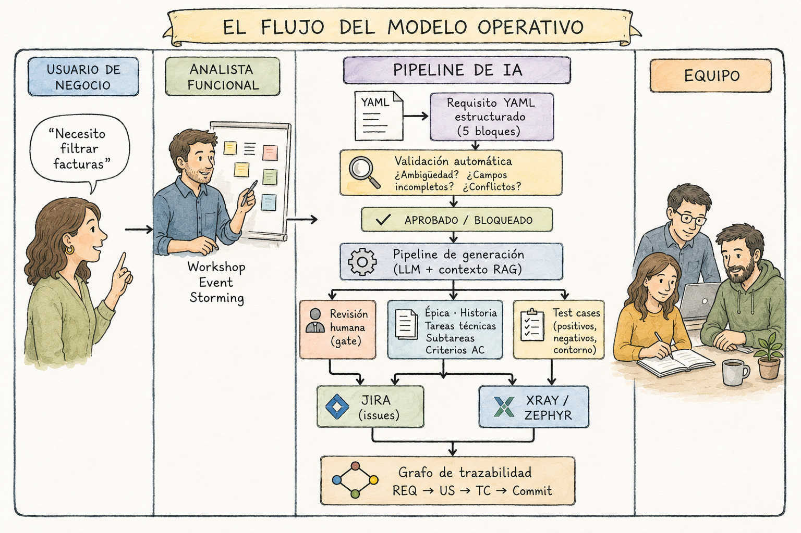

# Introducción

---

## El martes por la tarde de Carlos

Son las 16:47 del martes. La reunión de requisitos con Ana López, directora financiera de Meridian, ha terminado hace cuarenta minutos. Carlos Ruiz, analista funcional senior, cierra el bloc de notas donde ha garabateado tres páginas de apuntes y abre Jira.

Lo que viene ahora lo ha hecho cientos de veces.

Primero creará la historia de usuario. Luego las tareas técnicas, una por cada capa del sistema. Después los criterios de aceptación, que tendrá que formular de memoria intentando recordar exactamente lo que dijo Ana. Si tiene tiempo —y casi nunca lo tiene—, también creará los test cases. La semana pasada prometió al equipo de QA que esta vez sí los tendría listos antes del refinamiento.

Son las 19:20 cuando termina. Dos horas y media para un solo requisito. Y mañana tiene cuatro reuniones más.

En algún momento de ese martes por la tarde, Carlos se pregunta, como lleva haciéndolo meses, si tiene sentido que un profesional con diez años de experiencia en análisis funcional dedique su tiempo a rellenar campos en Jira. La respuesta siempre es la misma: no tiene sentido. Y sin embargo, sigue haciéndolo. Porque nadie ha diseñado todavía una alternativa que funcione de verdad en un proyecto real.

Este libro es esa alternativa.

---

## El problema que nadie nombra

Hay una conversación que ocurre en casi todos los equipos de desarrollo de software y que casi nadie tiene en voz alta. Va más o menos así: el análisis funcional es la fase más importante del proyecto —todos están de acuerdo en eso—, pero el analista funcional dedica entre el sesenta y el setenta por ciento de su tiempo a trabajo que no requiere ningún juicio experto. Formatear documentos. Copiar información de las notas de la reunión a la plantilla. Crear manualmente épicas, historias y tareas en Jira siguiendo siempre la misma estructura. Generar test cases desde cero repitiendo la misma lógica que ya aplicó en el proyecto anterior.

El resultado es predecible: el trabajo de valor —entender el negocio, detectar ambigüedades, anticipar conflictos entre requisitos, facilitar decisiones difíciles de alcance— queda comprimido en los márgenes del tiempo que deja el trabajo mecánico.

Y ese trabajo de valor no hecho se convierte en deuda. Requisitos que llegan al sprint con lagunas que nadie detectó a tiempo. Historias que el desarrollador interpreta de una forma y el usuario de negocio esperaba de otra. Bugs en producción cuya causa raíz, si alguien se molesta en investigarla, es siempre la misma: nadie definió con claridad qué debía ocurrir en ese caso concreto.

Los números son tozudos. Un bug detectado en la fase de análisis funcional cuesta en promedio diez veces menos corregir que uno detectado en testing y cien veces menos que uno detectado en producción. Y sin embargo, la mayoría de organizaciones invierte mucho más en testing que en mejorar la calidad del análisis que precede al desarrollo. Se vacuna al final de la cadena cuando el contagio ocurre al principio.

Este libro propone vacunar antes.

---

## Qué ha cambiado

Hace tres años, la idea de que un sistema de inteligencia artificial pudiera transformar un requisito funcional en una historia de usuario correctamente formateada, con sus criterios de aceptación en formato Dado/Cuando/Entonces, sus tareas técnicas descompuestas por capa y sus test cases listos para ejecutar, habría sonado a ciencia ficción de baja calidad.

Hoy no solo es posible: es reproducible, auditable y desplegable en la infraestructura que ya tienes.

Los modelos de lenguaje de última generación —en particular Claude de Anthropic y GPT-4o de OpenAI— han alcanzado un nivel de capacidad para seguir instrucciones estructuradas complejas que hace viable algo que antes no lo era: darle a la IA una especificación funcional bien formada y recibir a cambio artefactos Agile que un analista humano reconoce como correctos y útiles, y que necesitan revisión y ajuste fino, no reescritura desde cero.

La diferencia entre lo que era posible hace tres años y lo que es posible ahora no es de grado: es de naturaleza. Y esa diferencia abre una ventana de oportunidad que los equipos de análisis funcional que la aprovechen primero van a notar en sus métricas muy deprisa.

Pero —y este es el pero más importante del libro— que algo sea posible no significa que sea fácil ni que funcione sin diseño. La IA no transforma requisitos por arte de magia. La transforma cuando esos requisitos están escritos de una forma que la IA puede procesar. Y esa forma no es la que usa la mayoría de equipos hoy.

El punto de partida de este libro no es la IA. Es el requisito.

---

## De qué trata este libro

Este libro describe un modelo operativo completo para transformar el proceso de análisis funcional en organizaciones que trabajan con metodologías Agile. Un modelo que introduce inteligencia artificial desde las etapas más tempranas del proceso —la captura de requisitos con el usuario de negocio— y que automatiza los pasos mecánicos del camino desde el requisito aprobado hasta los artefactos en Jira y los test cases en la herramienta de QA.

El flujo completo tiene este aspecto:
<!--
┌─────────────────────────────────────────────────────────────────────────┐
│                     EL FLUJO DEL MODELO OPERATIVO                       │
├─────────────────────────────────────────────────────────────────────────┤
│                                                                         │
│  USUARIO DE       ANALISTA          PIPELINE DE IA        EQUIPO        │
│   NEGOCIO        FUNCIONAL                                              │
│                                                                         │
│  "Necesito         Workshop    ───►  Requisito YAML                     │
│   filtrar          Event             estructurado                       │
│   facturas"        Storming          (5 bloques)                        │
│       │                │                  │                             │
│       │                │                  ▼                             │
│       │                │         Validación automática                  │
│       │                │         ¿Ambigüedad? ¿Campos                   │
│       │                │         incompletos? ¿Conflictos?              │
│       │                │                  │                             │
│       │                │          APROBADO / BLOQUEADO                  │
│       │                │                  │                             │
│       │                │                  ▼                             │
│       │                │         Pipeline de generación                 │
│       │                │         (LLM + contexto RAG)                   │
│       │                │                  │                             │
│       │                │       ┌──────────┴──────────┐                  │
│       │                │       │                     │                  │
│       │                ▼       ▼                     ▼                  │
│                    Revisión  Épica · Historia    Test cases             │
│                    humana    Tareas técnicas     (positivos,            │
│                    (gate)    Subtareas           negativos,             │
│                       │      Criterios AC        contorno)              │
│                       │           │                  │                  │
│                       └─────┬─────┘                  │                  │
│                             ▼                        ▼                  │
│                           JIRA                     XRAY /               │
│                           (issues)                 ZEPHYR               │
│                             │                        │                  │
│                             └──────────┬─────────────┘                  │
│                                        ▼                                │
│                              Grafo de trazabilidad                      │
│                              REQ → US → TC → Commit                     │
│                                                                         │
└─────────────────────────────────────────────────────────────────────────┘
-->


Antes de que este diagrama parezca demasiado abstracto, déjame mostrarte lo que produce en concreto.

## Lo que el pipeline genera: un anticipo

Carlos Ruiz sale de la reunión con Ana López con esto en sus notas:

---

>*"Los gestores de facturación necesitan poder buscar facturas por fechas para agilizar el trabajo del cierre mensual."*

---

Una frase. Razonable, comprensible y completamente inutilizable para generar artefactos correctos en Jira.

Siguiendo el proceso que describe este libro, Carlos transforma esa frase en un requisito estructurado durante los cuarenta minutos siguientes a la reunión. Después ejecuta un único comando:

```bash
python orchestrator.py --req REQ-023
```

Lo que ocurre en los próximos cincuenta y cuatro segundos es esto:

```
  [1] Carga y parseo del requisito
      ✓ 'Filtrar facturas por rango de fechas'

  [2] Validación automática de calidad
      ✓ Score 84/100 · APROBADO

  [3] Recuperando contexto del repositorio (RAG)
      ✓ 7 requisitos relacionados recuperados

  [4] Generando artefactos Jira con IA
      ✓ Historia · 4 tareas · 3 criterios de aceptación

  [5] Generando test cases
      ✓ 9 test cases (2 positivos · 4 negativos · 3 contorno)

  [8] Revisión de artefactos — pendiente de aprobación humana
      ...

  [9] Push a Jira
      ✓ Historia FACT-47 · 4 tareas creadas

  [9b] Push test cases a Xray
      ✓ 9 test cases vinculados

  ✓ COMPLETADO en 54.2 segundos
    Historia:   FACT-47
    Tareas:     FACT-48, FACT-49, FACT-50, FACT-51
    Test cases: 9
```

En dos horas y media, Carlos solía producir esto para un solo requisito si todo iba bien y tenía tiempo de hacer los test cases, lo que casi nunca ocurría. En cincuenta y cuatro segundos de procesamiento más diez minutos de revisión humana, el sistema produce lo siguiente, listo para entrar al refinamiento:

**Una historia de usuario** en Jira con narrativa completa, tres criterios de aceptación en formato Dado/Cuando/Entonces, flujo principal, flujos de error y Definition of Done. Estimación sugerida en story points incluida.

**Cuatro tareas técnicas** descompuestas por capa —base de datos, backend, frontend y testing— con criterios técnicos verificables, estimación en horas y links de dependencia entre ellas ya creados en Jira.

**Nueve test cases** en Xray: dos que verifican el flujo feliz, cuatro que verifican los flujos de error y validación, y tres que verifican los valores límite del campo de rango de fechas (exactamente 365 días, 366 días, rango de un día). Los tres últimos son los que más frecuentemente se olvidan y más frecuentemente generan bugs en producción.

**Trazabilidad completa** registrada en el grafo: REQ-023 → US-047 → FACT-47 → nueve test cases. Cuando en tres meses aparezca un bug relacionado con el filtrado de facturas, cualquier miembro del equipo podrá navegar desde el bug hasta el requisito original en menos de treinta segundos.

¿El coste en tiempo para Carlos? Cuarenta minutos para escribir el requisito estructurado más diez minutos para revisar y aprobar el output del pipeline. Cincuenta minutos en total, frente a las dos horas y media que le costaba antes, y con test cases incluidos, que antes no hacía.

Esto no es una promesa de marketing. Es el output real del sistema que construiremos juntos a lo largo del libro, sobre el requisito real que usaremos como ejemplo en todos los capítulos.<br><br>

El modelo tiene doce componentes que se construyen en capas:

La **base conceptual** —los capítulos 4, 5 y 6— define cómo deben escribirse los requisitos para que la IA pueda procesarlos, cómo debe estructurarse el vocabulario del proyecto para garantizar coherencia, y cómo facilitar los workshops de Event Storming que producen la materia prima del sistema.

El **núcleo técnico** —los capítulos 7 al 12— construye el pipeline completo: el sistema de validación automática que detecta ambigüedades antes de que lleguen al sprint, los prompts de generación de artefactos Jira, la generación automática de test cases, la arquitectura RAG que da al sistema acceso al histórico del proyecto, y el orquestador que une todo en un único comando ejecutable.

La **capa de implantación** —los capítulos 13, 14 y 15— aborda el problema más difícil: hacer que un equipo real adopte el sistema, mantenerlo a lo largo del tiempo sin que se degrade, y medir el retorno de la inversión con métricas concretas.

El libro incluye código Python funcional, prompts probados en proyectos reales, plantillas YAML listas para adaptar, y un script orquestador que puede desplegarse en el entorno de tu organización con menos de una jornada de trabajo de configuración.

## Lo que este libro no es

Antes de continuar, tres aclaraciones sobre lo que no encontrarás aquí.

**Este libro no es un curso de inteligencia artificial.** No explica cómo funcionan los transformers, cómo se entrenan los modelos de lenguaje ni qué es la atención multi-cabeza. Todo el conocimiento de IA necesario para entender y usar el sistema se introduce de forma práctica en el momento en que hace falta. Si quieres teoría de modelos de lenguaje, hay libros excelentes para eso. Este no es uno de ellos.

**Este libro no promete automatización total.** El sistema que describe nunca empuja un artefacto a Jira sin que un humano lo haya revisado y aprobado. Esa decisión es intencional y no negociable. La IA propone; el analista decide. Si buscas un sistema que funcione sin supervisión humana, este libro te convencerá de por qué eso es una mala idea antes de llegar al capítulo 3.

**Este libro no dice que el analista funcional va a desaparecer.** Dice exactamente lo contrario. El analista que usa este sistema hace menos trabajo mecánico y más trabajo de valor. Los analistas que adopten primero estas herramientas van a producir más, mejor y en menos tiempo que los que no las adopten. No van a ser reemplazados por la IA: van a tener ventaja sobre los analistas que trabajen sin ella.

---

## Tres lectores, un libro

El libro está escrito para tres perfiles que leerán el mismo texto con necesidades distintas.

**Si eres analista funcional o Product Owner**, este libro es para ti de principio a fin. La Parte I te da el marco conceptual y la justificación. La Parte II te da las herramientas que usarás en tu trabajo diario: la plantilla de requisito, el glosario, la guía de Event Storming. La Parte III describe cómo funciona el sistema técnico que usarás, con suficiente detalle para entender por qué hace lo que hace aunque no tengas que implementarlo tú. La Parte IV te da el plan para llevarlo a tu equipo.

**Si eres responsable técnico**, arquitecto o desarrollador senior, puedes leer el libro completo o ir directamente a la Parte III, donde encontrarás los prompts, el código y la arquitectura. Los apéndices incluyen la referencia completa de la plantilla YAML, todos los prompts del pipeline en versión lista para producción, el esquema SQL de la base de datos y la guía de instalación paso a paso.

**Si eres directivo, Product Manager o Scrum Master**, la Parte I y la Parte IV son las más relevantes para ti. El Capítulo 3 describe el modelo completo con suficiente detalle para tomar decisiones de inversión. El Capítulo 15 tiene el modelo de ROI con los KPIs que justifican la implantación ante la dirección.

Si estás leyendo esto en papel, no te preocupes por saltarte capítulos: cada uno empieza con un resumen de lo que aprenderás y termina con los tres puntos clave que no debes perder. Puedes leer el libro en cualquier orden y encontrar lo que necesitas.

---

## Empresa Meridian y el módulo de Facturación

A lo largo de todo el libro, los ejemplos giran en torno a **Empresa Meridian**: una mediana empresa del sector servicios financieros con trescientos cincuenta empleados, tres equipos Scrum, cuatro analistas funcionales y el problema que conoces bien porque probablemente también es el tuyo.

No hemos elegido Meridian porque sea un caso especialmente difícil ni especialmente sencillo. La hemos elegido porque es representativa del noventa por ciento de organizaciones que tienen Jira, tienen Confluence, trabajan con Scrum y no han conseguido todavía que el proceso de análisis funcional funcione tan bien como debería.

Los personajes de Meridian aparecerán en todos los capítulos:

**Ana López**, directora financiera, es la voz del usuario de negocio. Sabe exactamente lo que necesita pero no sabe cómo expresarlo de una forma que sea útil para el equipo técnico. Sus requisitos son el punto de partida de todos los ejemplos.

**Carlos Ruiz**, analista funcional senior, es el protagonista del libro. Tiene experiencia, tiene criterio, y tiene el problema que este libro resuelve. Lo seguiremos desde su martes por la tarde hasta el momento en que el sistema funciona en producción y su trabajo ha cambiado de forma reconocible.

**María García**, desarrolladora frontend senior, representa la perspectiva del equipo técnico. Sus preguntas durante el refinamiento son el indicador más honesto de si los requisitos están bien escritos o no.

**David Sanz**, Product Owner, representa la perspectiva de gestión de producto. Sus decisiones de alcance y priorización son el contexto en el que todos los demás trabajan.

El módulo técnico que usamos como hilo conductor es **EP-04 Gestión de Facturación**: el sistema que permite al equipo financiero de Meridian recibir, revisar, aprobar y archivar facturas de proveedores. El requisito REQ-023 —filtrar el listado de facturas por rango de fechas— aparece en todos los capítulos técnicos como ejemplo recurrente. Lo verás nacer como una frase ambigua en la reunión de Ana, transformarse en un YAML estructurado en el Capítulo 4, pasar el validador en el Capítulo 7, convertirse en una historia Jira en el Capítulo 8, generar nueve test cases en el Capítulo 9 y quedar registrado en el grafo de trazabilidad en el Capítulo 11.

Cuando llegues al final del libro, REQ-023 te resultará tan familiar como un ejemplo de tu propio proyecto.

---

## Una nota sobre la honestidad

Los libros de tecnología tienen un vicio que este intenta evitar activamente: el hype.

El hype dice que la IA lo va a cambiar todo, que los procesos tradicionales son obsoletos, que los que no adopten esta tecnología ahora quedarán irremediablemente rezagados. El hype genera expectativas que los proyectos reales no pueden cumplir. Y cuando el proyecto real no cumple las expectativas del hype, la conclusión habitual no es que el hype estaba equivocado: es que el proyecto falló.

Este libro trabaja al revés. Cada componente del sistema viene acompañado de una descripción honesta de dónde falla, qué no puede hacer todavía y qué condiciones deben cumplirse para que funcione. Los errores frecuentes tienen secciones propias. Las limitaciones se nombran antes de que las descubras tú mismo en el proyecto piloto.

El resultado que este libro promete es concreto y medible: reducción superior al sesenta por ciento en el tiempo de creación de artefactos Jira, reducción superior al cuarenta por ciento en los bugs cuya causa raíz es una ambigüedad funcional, trazabilidad completa entre requisitos e historias sin que nadie la mantenga manualmente. Estos resultados son alcanzables con el sistema que describe este libro. No son garantizados ni instantáneos: requieren un proceso de implantación de entre cuatro y seis meses, y requieren que el equipo invierta en aprender a usar las herramientas correctamente.

Nada que merezca la pena es gratis. Pero el retorno de esta inversión es de los más rápidos que he visto en transformaciones de proceso en organizaciones tecnológicas.

---

## Lo que necesitas para empezar

Para leer este libro no necesitas nada especial. Para aplicar lo que describe, necesitas estas herramientas:

Un acceso a la API de Claude (Anthropic) o GPT-4o (OpenAI). Todos los prompts del libro están escritos y probados con Claude, y funcionan con ajustes menores con GPT-4o. El coste de API para procesar cien requisitos al mes es inferior a lo que cuesta una hora del tiempo de un analista funcional.

Jira como destino de los artefactos generados, con permiso para crear campos personalizados y usar la API REST. La mayoría de organizaciones que trabajan con Scrum ya cumplen este requisito.

Python 3.10 o superior para el orquestador y el pipeline técnico. Si tu equipo no tiene perfil técnico para esto, el Apéndice D incluye la guía de instalación paso a paso, y el Capítulo 13 describe cómo implantar el sistema en fases que permiten empezar a usar las partes conceptuales del modelo —la plantilla, el glosario, el Event Storming— antes de tener el pipeline técnico funcionando.

PostgreSQL con la extensión pgvector para el sistema RAG del Capítulo 10. Si ya usas PostgreSQL en tu organización, añadir pgvector es una operación de cinco minutos.

Y, lo más importante: un requisito real de tu proyecto con el que probar el sistema mientras lees. El aprendizaje más rápido que conozco para este tipo de herramientas no es leer sobre ellas: es aplicarlas sobre un problema propio mientras lees cómo funcionan.

---

## Por dónde empieza el viaje

El Capítulo 1 es el diagnóstico. Antes de presentar ninguna solución, vamos a entender con precisión qué está fallando en el proceso de análisis funcional actual y por qué esas fallas son sistémicas, no accidentales. Si llevas años en el sector ya conoces el diagnóstico. Pero ponerle números a los síntomas —cuánto tiempo, cuánto dinero, cuántos bugs, cuánto retraso— cambia la conversación de opinión a evidencia. Y la evidencia es lo que necesitas cuando llegue el momento de justificar la inversión ante tu organización.

El Capítulo 2 introduce la inteligencia artificial: qué puede hacer realmente en el contexto del análisis funcional, qué no puede hacer todavía, y cuál es la diferencia entre lo que promete el marketing de los proveedores de IA y lo que ocurre cuando ejecutas el primer prompt sobre un requisito de producción.

El Capítulo 3 presenta el modelo operativo completo: los doce componentes, su arquitectura, cómo se relacionan entre sí y qué resultado produce cada uno. Es el mapa del territorio que vas a recorrer en el resto del libro.

A partir del Capítulo 4, construimos el sistema pieza a pieza.

Son las 16:47 del martes. Carlos Ruiz cierra el bloc de notas y abre Jira.

Esta vez, las cosas van a ser diferentes.

---

> 💡 **Idea clave**
>
> La inteligencia artificial no transforma requisitos vagos en buenos artefactos. Transforma requisitos bien estructurados en artefactos listos para revisión en menos de dos minutos. El punto de partida no es la IA: es el requisito. El primer trabajo es aprender a escribirlos de una forma que la IA pueda procesar.

---

*Los tres puntos clave de esta introducción:*

1. El problema central del análisis funcional no es falta de metodología ni falta de herramientas: es que el sesenta por ciento del tiempo del analista se consume en trabajo mecánico que no requiere juicio experto, y ese trabajo mecánico desplaza el trabajo de valor que previene los bugs más costosos.

2. La inteligencia artificial hace viable automatizar ese trabajo mecánico hoy, con herramientas comercialmente disponibles y costes accesibles, siempre que los requisitos estén escritos con la estructura que el sistema necesita para procesarlos.

3. Este libro describe un modelo operativo completo —con plantillas, prompts, código y un plan de adopción— que cualquier organización con Jira, Agile y ganas de mejorar puede implantar gradualmente sin necesidad de reemplazar ninguna herramienta existente.

---

> 💡 **Pregunta de reflexión para tu equipo**
>
> ¿Cuánto tiempo dedicamos cada semana a crear artefactos en Jira que podríamos dedicar a entender mejor lo que el negocio necesita?

---

A continuación: [Capítulo 1. El análisis funcional en crisis silenciosa](./01_el_analisis_funcional_en_crisis_silenciosa.md)

---
