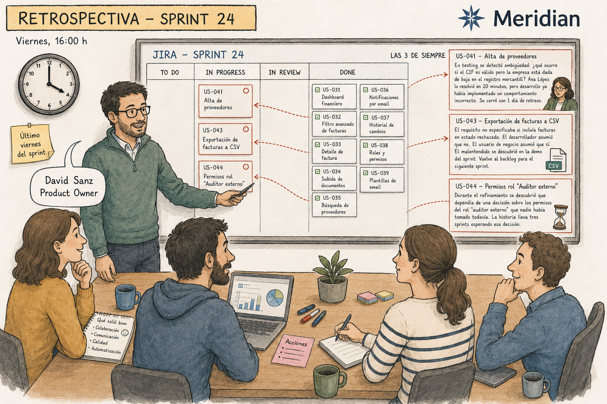

# Capítulo 1. El análisis funcional en crisis silenciosa

---

*En este capítulo aprenderás:*
- *Por qué el análisis funcional es la fase más crítica del proyecto y la que menos atención recibe*
- *Dónde va realmente el tiempo de un analista funcional y cuánto de ese tiempo genera valor*
- *Cuánto cuesta dejar pasar una ambigüedad funcional al sprint, y a producción*
- *Los cinco síntomas que indican que tu equipo tiene este problema, y por qué Agile por sí solo no los resuelve*

---

## La retrospectiva del viernes

Son las cuatro de la tarde del último viernes del sprint. El equipo de Meridian está en la retrospectiva. David Sanz, Product Owner, tiene delante el tablero de Jira con las historias del sprint terminado.

De las doce historias comprometidas, nueve están en estado Done. Las otras tres tienen una historia detrás, que es siempre la misma historia con nombres distintos.

La historia US-041 —el formulario de alta de proveedores— llegó al sprint con tres criterios de aceptación. En el día cuatro del sprint, durante una sesión de testing, María García descubrió que el criterio "el sistema valida el CIF del proveedor" no especificaba qué debía ocurrir cuando el CIF era formalmente válido pero pertenecía a una empresa dada de baja en el registro mercantil. El equipo convocó una reunión de urgencia con Ana López, que resolvió el caso en veinte minutos, pero el desarrollo ya llevaba dos días implementando un comportamiento que resultó ser incorrecto. La historia se cerró con un día de retraso.

La historia US-043 —la exportación de facturas a CSV— tuvo un problema diferente. El requisito decía que el sistema debía exportar "las facturas del período seleccionado". Nadie había especificado si eso incluía las facturas en estado rechazado. El desarrollador asumió que no. El usuario de negocio asumió que sí. El malentendido se descubrió en la demo del sprint. La historia volvió al backlog para el siguiente sprint.

La historia US-044 nunca llegó a empezar. Durante el refinamiento del sprint se descubrió que dependía de una decisión sobre los permisos del rol "auditor externo" que nadie había tomado todavía. La historia lleva tres sprints esperando esa decisión.

Carlos Ruiz escucha la retrospectiva en silencio. Conoce perfectamente el origen de cada uno de esos problemas porque los tres requisitos los escribió él. Y los escribió en la mejor forma que sabe hacerlo con el proceso que tiene disponible.

Eso es exactamente lo que hace que esta situación sea una crisis. No porque el equipo funcione mal. Sino porque funciona exactamente como debe funcionar un equipo que no tiene las herramientas correctas.

---

## La ilusión del proceso correcto

Pregúntale a cualquier equipo Agile si tiene un proceso de análisis funcional y la respuesta será casi invariablemente que sí. Tienen requisitos. Tienen historias de usuario. Tienen criterios de aceptación. Tienen Jira. Tienen refinamientos. Tienen Product Owner. Tienen Definition of Done.

Todo esto es verdad. Y a pesar de todo ello, los sprints se desestabilizan por cambios de alcance, los bugs tienen causa raíz funcional y nadie puede responder en menos de media hora a la pregunta de qué requisito de negocio originó este bug concreto.

La paradoja se resuelve cuando aceptas que tener un proceso de análisis funcional y tener un proceso de análisis funcional que funcione son dos cosas distintas. La mayoría de equipos tiene la primera. Pocos tienen la segunda.

El problema no está en las metodologías. Scrum, SAFe, Kanban, XP: cualquiera de ellos puede convivir perfectamente con un análisis funcional deficiente porque ninguno de ellos prescribe con suficiente precisión cómo deben escribirse los requisitos, qué información debe recogerse obligatoriamente, cómo debe estructurarse esa información para que el equipo técnico pueda trabajar sin adivinar, o cómo debe mantenerse la trazabilidad entre el requisito original y el código que lo implementa.

Las metodologías Agile resolvieron el problema de cómo organizar el desarrollo. No resolvieron el problema de cómo definir con precisión qué se va a desarrollar.

Ese hueco es donde vive la crisis silenciosa.

> 💡 **Idea clave**
>
> Las metodologías Agile mejoraron radicalmente la forma de organizar y ejecutar el desarrollo. No cambiaron de forma significativa la calidad con la que se definen los requisitos que alimentan ese desarrollo. El problema que este libro aborda no es un problema de metodología: es un problema de información estructurada.

---

## La auditoría que nadie hace

Hay un experimento que recomiendo hacer antes de seguir leyendo. No requiere ninguna herramienta: solo honestidad y un bloc de notas.

Durante una semana, registra cada bloque de treinta minutos de tu jornada laboral y clasifícalo en una de dos categorías: trabajo que requiere tu juicio experto como analista, o trabajo que cualquier sistema suficientemente bien instruido podría hacer en tu lugar.

En la primera categoría entran cosas como entender el problema de negocio que hay detrás de un requisito, detectar que dos requisitos tienen reglas contradictorias, anticipar las preguntas que va a hacer el equipo técnico en el refinamiento, o facilitar una conversación difícil entre el negocio y desarrollo sobre el alcance.

En la segunda categoría entran cosas como transcribir las notas de la reunión a una plantilla, crear la épica en Jira y rellenar sus campos, escribir la historia de usuario siguiendo la estructura "Como [rol] quiero [acción] para [beneficio]", crear las tareas técnicas repitiendo la misma descomposición por capas que ya hiciste en los últimos quince proyectos, formatear los criterios de aceptación en el formato Dado/Cuando/Entonces, o copiar los test cases de un requisito similar del proyecto anterior adaptando los nombres de los campos.

Cuando los equipos hacen este ejercicio por primera vez, el resultado suele ser incómodo. El porcentaje de tiempo en la segunda categoría ronda el sesenta por ciento en equipos que trabajan con procesos estándar. En equipos que además producen documentación funcional detallada para proyectos regulados o de alta complejidad, puede llegar al setenta y cinco.

En Meridian, Carlos hizo este ejercicio en octubre. El resultado fue el siguiente:

| Categoría de actividad | Horas semanales | % del total |
|---|---:|---:|
| Reuniones de captura de requisitos con negocio | 6 h | 15 % |
| Análisis, síntesis y toma de decisiones funcionales | 5 h | 12,5 % |
| Facilitación de refinamientos y resolución de dudas | 4 h | 10 % |
| **Subtotal trabajo de valor** | **15 h** | **37,5 %** |
| Redacción y formato de documentos funcionales | 7 h | 17,5 % |
| Creación manual de épicas, historias y tareas en Jira | 9 h | 22,5 % |
| Generación de test cases desde cero | 5 h | 12,5 % |
| Actualización manual de matrices de trazabilidad | 4 h | 10 % |
| **Subtotal trabajo mecánico** | **25 h** | **62,5 %** |
| **Total** | **40 h** | **100 %** |

La reacción habitual cuando alguien ve este tipo de tabla por primera vez es una mezcla de reconocimiento y malestar. Reconocimiento porque los números encajan con lo que el analista siente intuitivamente pero nunca había cuantificado. Y malestar porque el trabajo mecánico —ese 62,5%— no es trabajo menor o prescindible: es trabajo necesario que tiene que hacerlo alguien, y ese alguien es habitualmente el profesional mejor preparado para hacer el trabajo de valor.

El coste de oportunidad es doble. El tiempo que Carlos dedica a rellenar campos en Jira es tiempo que no dedica a entender mejor lo que Ana necesita. Y el trabajo que Carlos hace en Jira en dos horas y media podría hacerse en diez minutos de revisión si hubiera un sistema que generara el borrador.

> 🛠️ **En la práctica**
>
> El ejercicio de auditoría de tiempo es más revelador cuando se hace en equipo que de forma individual. Los analistas tienden a subestimar el tiempo en trabajo mecánico porque lo distribuyen a lo largo del día en pequeños fragmentos que parecen inevitables. Reservar treinta minutos en la próxima retrospectiva para que cada analista comparta su auditoría produce conversaciones que raramente ocurren de otra forma.

---

## El precio de la ambigüedad

Volvamos a la retrospectiva de Meridian. US-041, el formulario de alta de proveedores. Dos días de desarrollo sobre una implementación incorrecta porque nadie había especificado el comportamiento para un caso de contorno.

¿Cuánto costó ese error?

Si el analista hubiera detectado ese caso durante la fase de análisis —antes de que la historia entrara al sprint—, el coste habría sido una conversación de veinte minutos con Ana López y añadir un criterio de aceptación al requisito. Treinta minutos de trabajo.

En el sprint, el coste fue de dos días de desarrollo implementando el comportamiento incorrecto, más la reunión de urgencia, más el retrabajo, más el retraso en la entrega. Aproximadamente dieciséis horas entre el desarrollador y el analista. El problema costó treinta veces más resolverlo en el sprint que habría costado prevenirloen el análisis.

Si ese mismo error llega a producción sin ser detectado —lo que ocurre con más frecuencia de la que a nadie le gusta reconocer—, el coste incluye el tiempo de soporte para gestionar los incidentes, el esfuerzo de investigar la causa raíz, el parche de urgencia, la comunicación al usuario afectado, y en algunos contextos el impacto reputacional o regulatorio. En ese caso la ratio puede ser fácilmente de cien a uno.

Estas ratios no son invenciones de este libro. Son el resultado de décadas de investigación en ingeniería del software, desde los trabajos de Barry Boehm en los años setenta hasta los estudios más recientes del NIST y el Consortium for IT Software Quality. El número varía según el sector, la complejidad del sistema y la madurez del proceso, pero la dirección es siempre la misma: el coste de un defecto crece de forma exponencial cuanto más tarde se detecta en el ciclo de vida.

Lo que sí es relativamente reciente es la posibilidad de detectar sistemáticamente los defectos funcionales —la ambigüedad, los campos sin validación definida, los flujos de error no documentados, las reglas de negocio contradictorias— de forma automática, antes de que el requisito entre al sprint. No mediante revisión humana exhaustiva, que consume tiempo y depende de que el revisor sea más exhaustivo que el autor, sino mediante un sistema que aplica el mismo checklist completo a todos los requisitos, sin excepciones, sin fatiga y sin olvidos.

> ⚠️ **Error frecuente**
>
> La mayoría de equipos invierte más recursos en testing que en mejorar la calidad del análisis funcional, argumentando que el testing es la "red de seguridad" del proceso. Esta lógica es correcta en su premisa pero errónea en su conclusión. El testing atrapa los bugs después de que se han producido; el análisis correcto evita que se produzcan. Invertir en análisis no elimina la necesidad del testing: reduce drásticamente el número de bugs que el testing tiene que encontrar.

---

## Los cinco síntomas

Los equipos que tienen este problema no siempre lo reconocen como tal porque los síntomas son tan habituales que se han normalizado. Lo que sigue es un diagnóstico clínico en cinco puntos. Si reconoces tres o más en tu equipo, estás leyendo el libro correcto.

**Síntoma 1: Las historias cambian de alcance en el sprint.**

En cada sprint, hay al menos una historia que durante la ejecución revela que faltaba información: un caso de contorno no contemplado, una regla de negocio que nadie escribió, un comportamiento de error que el desarrollador tiene que inventar porque no está especificado. El equipo gestiona estos cambios como si fueran normales. No lo son. Son síntomas de requisitos incompletos que pasaron el filtro de validación porque ese filtro no existía o era insuficiente.

**Síntoma 2: Las preguntas en el refinamiento se repiten sprint tras sprint.**

"¿Qué pasa si el usuario no rellena este campo?" "¿Qué rol tiene acceso a esta funcionalidad?" "¿Cuál es el comportamiento esperado si el servicio externo no responde?" Estas preguntas no son señal de que el equipo sea curioso o riguroso. Son señal de que los requisitos llegan al refinamiento sin la información que el equipo necesita para trabajar. El refinamiento se convierte en una segunda fase de análisis en lugar de ser una sesión de planificación.

**Síntoma 3: El analista es el cuello de botella del sprint.**

Cuando los desarrolladores tienen dudas sobre el comportamiento esperado de una funcionalidad, van al analista. Cuando QA tiene dudas sobre si un comportamiento es correcto o un bug, van al analista. Cuando el Product Owner necesita decidir algo de alcance, va al analista. Este flujo tiene un nombre: dependencia de conocimiento tácito. El analista lleva en la cabeza información que debería estar escrita en el requisito. Mientras esa información no esté escrita, el analista es indispensable para que el sprint funcione, y eso es exactamente lo contrario de lo que debería ocurrir.

**Síntoma 4: Los bugs tienen causa raíz funcional.**

Cuando el equipo de QA abre un bug y etiqueta su causa raíz, ¿con qué frecuencia aparece alguna variante de "comportamiento no especificado", "regla de negocio no documentada" o "caso de contorno no contemplado"? En la mayoría de equipos que han hecho esta auditoría, la respuesta es entre el veinticinco y el cuarenta por ciento de los bugs. Estos bugs no son fallas de implementación: son fallas de especificación. No se arreglan en el código; se previenen en el análisis.

**Síntoma 5: La trazabilidad no existe o nadie la usa.**

Si ahora mismo te preguntaran qué requisito de negocio originó este bug concreto que está en producción, ¿podrías responderlo en menos de cinco minutos? En la mayoría de organizaciones, la respuesta honesta es no. La trazabilidad entre requisitos, historias, test cases y código es el tipo de artefacto que todo el mundo reconoce como valioso y nadie tiene tiempo de mantener. Su ausencia significa que cada bug en producción requiere una investigación arqueológica para entender de dónde vino, y que el equipo no puede aprender sistemáticamente de sus errores funcionales porque no tiene los datos para hacerlo.

> 🛠️ **En la práctica**
>
> Para hacer el diagnóstico de estos cinco síntomas en tu equipo, no necesitas ninguna herramienta especial. Necesitas revisar los últimos tres sprints en Jira y responder cinco preguntas: ¿Cuántas historias tuvieron cambios de alcance durante la ejecución? ¿Cuántas preguntas se abrieron como comentarios en los issues durante el refinamiento? ¿Cuántos bugs tienen alguna variante de "no especificado" en la causa raíz? ¿Cuántas veces el analista fue mencionado en comentarios de issues como fuente de clarificación? ¿Puedes navegar desde cualquier bug en producción hasta el requisito que lo originó en menos de cinco minutos? Las respuestas a estas cinco preguntas son más reveladoras que cualquier auditoría de proceso.

---

## Por qué Agile no resolvió esto

Si ya trabajas con Scrum o con cualquier otra metodología Agile, en este punto puede surgir una pregunta razonable: ¿no se supone que Agile resuelve precisamente estos problemas? Las iteraciones cortas, la colaboración continua con el negocio, el feedback rápido, la capacidad de adaptarse a los cambios. ¿No está todo eso diseñado para mitigar exactamente estas situaciones?

La respuesta honesta es: en parte, sí. En parte, no.

Agile resolvió el problema de la entrega tardía de valor. En lugar de definir el sistema completo antes de empezar a desarrollar, las metodologías iterativas permiten entregar funcionalidad parcial rápidamente y ajustar en función del feedback real. Eso es un avance genuino y enorme respecto al modelo en cascada.

Lo que Agile no cambió de forma significativa es la calidad de la información que alimenta cada iteración. El sprint planning y el refinamiento asumen que las historias que entran al sprint están suficientemente bien definidas para desarrollarse. Pero la metodología no prescribe con precisión suficiente qué significa "suficientemente bien definida". Cada equipo resuelve eso a su manera, con criterios que varían según el analista, el proyecto y el día de la semana.

El resultado es que Agile aceleró el ciclo de desarrollo sin necesariamente mejorar la calidad de los requisitos que entran en ese ciclo. Se hacen más sprints por año, se entregan más historias, y en la misma proporción se escapan más ambigüedades, más casos de contorno no contemplados, más reglas de negocio implícitas que el desarrollador tiene que adivinar.

La velocidad del ciclo Agile no es el problema. Es, paradójicamente, parte de lo que hace que el problema de análisis sea más urgente. Cuando el ciclo de desarrollo dura seis meses, una ambigüedad en el análisis puede detectarse y corregirse antes de que llegue a producción. Cuando el ciclo dura dos semanas, esa misma ambigüedad puede estar en producción antes de que nadie la haya identificado formalmente como un problema.

| Modelo en cascada | Modelo Agile | Con el sistema de este libro |
|---|---|---|
| Análisis completo antes de desarrollar (meses) | Análisis en refinamiento (horas) | Análisis estructurado con validación automática (minutos) |
| Requisitos detallados pero tardíos | Requisitos rápidos pero incompletos | Requisitos rápidos y estructurados |
| Trazabilidad documentada pero desactualizada | Trazabilidad inexistente o informal | Trazabilidad automática en tiempo real |
| Feedback del usuario: al final | Feedback del usuario: frecuente | Feedback del usuario: frecuente, con mejor input |
| Bugs de análisis: detectados tardíamente | Bugs de análisis: detectados en sprint o en producción | Bugs de análisis: detectados antes del sprint |

Hay otro factor que Agile no resolvió y que es relevante para entender por qué el problema persiste: la presión de velocidad. En un equipo Scrum que trabaja con sprints de dos semanas, el Product Owner necesita el backlog refinado constantemente. El analista produce historias a una velocidad que se mide en historias por semana, y esa velocidad tiene un coste en calidad que raramente se contabiliza. Las estimaciones del sprint se hacen sobre historias que todavía tienen ambigüedades porque no había tiempo para resolverlas. El refinamiento pasa de largo sobre casos de error porque el equipo tiene que avanzar. Los test cases no se escriben antes del sprint porque el analista ya está preparando el siguiente.

Este ciclo es tan habitual que la mayoría de equipos no lo percibe como un problema de proceso. Lo percibe como "la forma en que funciona el desarrollo ágil". No lo es. Es la consecuencia de no tener un sistema que apoye al analista para producir requisitos de calidad a la velocidad que el proceso Agile demanda.

> 💡 **Idea clave**
>
> Agile aceleró el ciclo de desarrollo sin cambiar de forma significativa la calidad de los requisitos que alimentan ese ciclo. La velocidad del sprint es, paradójicamente, un amplificador del problema de análisis: cuanto más rápido gira la rueda, más rápido llegan las ambigüedades a producción.

---

## Lo que esta crisis cuesta

Poner número al problema es incómodo pero necesario. Los equipos que quieren cambiar su proceso de análisis funcional necesitan justificar la inversión, y la única forma de hacerlo de forma convincente es comparar el coste actual del problema con el coste de la solución.

En Meridian, Carlos y David hicieron el cálculo a finales del año pasado. Estos son los números reales que obtuvieron:

**Coste del trabajo mecánico:**
Carlos y sus tres compañeros analistas dedican una media de 25 horas semanales cada uno a trabajo mecánico (creación de artefactos Jira, test cases, trazabilidad manual). Con un coste medio por hora de 45 euros, eso es 4.500 euros semanales, o aproximadamente 225.000 euros anuales en trabajo que podría automatizarse parcialmente.

**Coste de los bugs por ambigüedad funcional:**
En el último año, Meridian registró 340 bugs en producción. El equipo clasificó 94 de ellos (el 28%) como causados por especificaciones incompletas o ambiguas. El tiempo medio de resolución de esos bugs fue de 6 horas de trabajo entre análisis, desarrollo y QA. A 45 euros por hora, eso son aproximadamente 25.000 euros en retrabajo por ambigüedad funcional al año, sin contar el impacto en usuarios ni los costes de oportunidad de otros trabajos no realizados.

**Coste de las interrupciones en el sprint:**
En promedio, tres historias por sprint requieren clarificaciones urgentes con el analista durante la ejecución. Cada clarificación implica una reunión de treinta minutos con dos o tres personas. Son unas tres horas de interrupción no planificada por sprint, o 75 horas al año entre los cuatro analistas y los desarrolladores involucrados.

Sumado, el coste cuantificable del problema ronda los 250.000 euros anuales en Meridian, una empresa de tamaño medio. Y eso sin contar los costes más difíciles de medir: el impacto en la moral del equipo cuando los sprints se desestabilizan, la erosión de la confianza del negocio cuando las demos muestran comportamientos inesperados, o el tiempo directivo dedicado a gestionar incidencias que no deberían haber llegado a producción.

Estos números son los de Meridian. Los tuyos serán distintos. Pero la estructura del problema es la misma, y el ejercicio de calcularlo con datos reales es siempre revelador, y siempre produce sorpresa en los que lo hacen por primera vez.

> ⚠️ **Error frecuente**
>
> Al presentar este tipo de análisis de coste a la dirección, la tentación es usar los números más grandes posibles para maximizar el impacto del argumento. Resiste esa tentación. Un análisis conservador y metodológicamente riguroso es mucho más convincente que uno que infla las cifras. Si el retorno calculado de forma conservadora ya justifica la inversión —y casi siempre lo hace—, no necesitas exagerar. Y si alguien cuestiona tus números, una metodología sólida te protege mejor que un número inflado.

---

## Lo que bueno tiene este aspecto

La crisis silenciosa del análisis funcional tiene un rasgo que la hace abordable de formas en que otros problemas organizacionales no lo son: sus causas son técnicas más que culturales.

El problema no es que los analistas sean malos en su trabajo. La mayoría son muy buenos. El problema es que hacen su trabajo con herramientas pensadas para una época en la que automatizar la generación de artefactos funcionales era imposible. Un rotulador y post-its son perfectamente adecuados para un taller de Event Storming. Un documento Word en blanco es un instrumento inadecuado para capturar requisitos que después necesitan alimentar un pipeline de generación automática.

Cambiar las herramientas y el formato de los requisitos no requiere una transformación cultural de varios años. Requiere un proceso de adopción de varios meses, que es una escala de tiempo radicalmente diferente y un nivel de riesgo radicalmente menor.

La segunda razón por la que el problema es abordable es que los beneficios son inmediatos y medibles. No hay que esperar a "transformar la cultura" ni a "cambiar la mentalidad del equipo" para ver resultados. En las primeras dos semanas de usar el sistema que describe este libro, el analista piloto puede medir exactamente cuánto tiempo ha ahorrado en la creación de artefactos. Esa medición concreta es el argumento más poderoso para la adopción del resto del equipo.

El Capítulo 2 explora qué puede hacer la inteligencia artificial concretamente en este contexto: cuáles son sus capacidades reales hoy, cuáles son sus límites reales hoy, y por qué la combinación de un requisito bien estructurado con un sistema de IA bien configurado produce resultados que ninguno de los dos puede producir por separado.

---

## Lo que funciona en la práctica

Una observación para llevar a tu próximo día de trabajo: el problema del análisis funcional raramente se discute como tal en las organizaciones porque está normalizado. Los síntomas se discuten sprint a sprint como problemas individuales —"esta historia tenía una ambigüedad", "este bug era un caso no contemplado"— sin reconocer el patrón sistémico que los genera.

El primer paso práctico, antes de cambiar ningún proceso ni adoptar ninguna herramienta, es nombrar el problema. Compartir la auditoría de tiempo de la sección anterior con el equipo. Hacer el diagnóstico de los cinco síntomas sobre los últimos tres sprints. Calcular el coste aproximado del problema con los datos de Jira que ya tienes.

Ese ejercicio, en sí mismo, produce dos cosas valiosas: crea conciencia colectiva del problema como algo sistémico y no como una serie de accidentes individuales, y genera el argumento de negocio que necesitarás cuando llegue el momento de proponer la adopción del sistema.

---

*Los tres puntos clave de este capítulo:*

1. El análisis funcional es la fase más crítica del ciclo de desarrollo y la que menos inversión recibe en herramientas y proceso. La mayoría de equipos tiene un proceso de análisis, pero no un proceso que garantice la calidad de los requisitos que produce.

2. Entre el 60 y el 75 por ciento del tiempo de un analista funcional se consume en trabajo mecánico que no requiere juicio experto. Ese trabajo desplaza el trabajo de valor y deja pasar al sprint las ambigüedades que generan los bugs más caros.

3. Agile aceleró el ciclo de desarrollo sin resolver el problema de la calidad de los requisitos. La velocidad del sprint amplifica el problema: las ambigüedades llegan a producción más rápido, no más despacio.

---

*Pregunta para llevar a tu próxima reunión de equipo:*

Si revisamos los últimos tres sprints, ¿cuántas historias tuvieron cambios de alcance durante la ejecución, y cuánto tiempo costó resolver esos cambios? ¿Tenemos ese dato?
