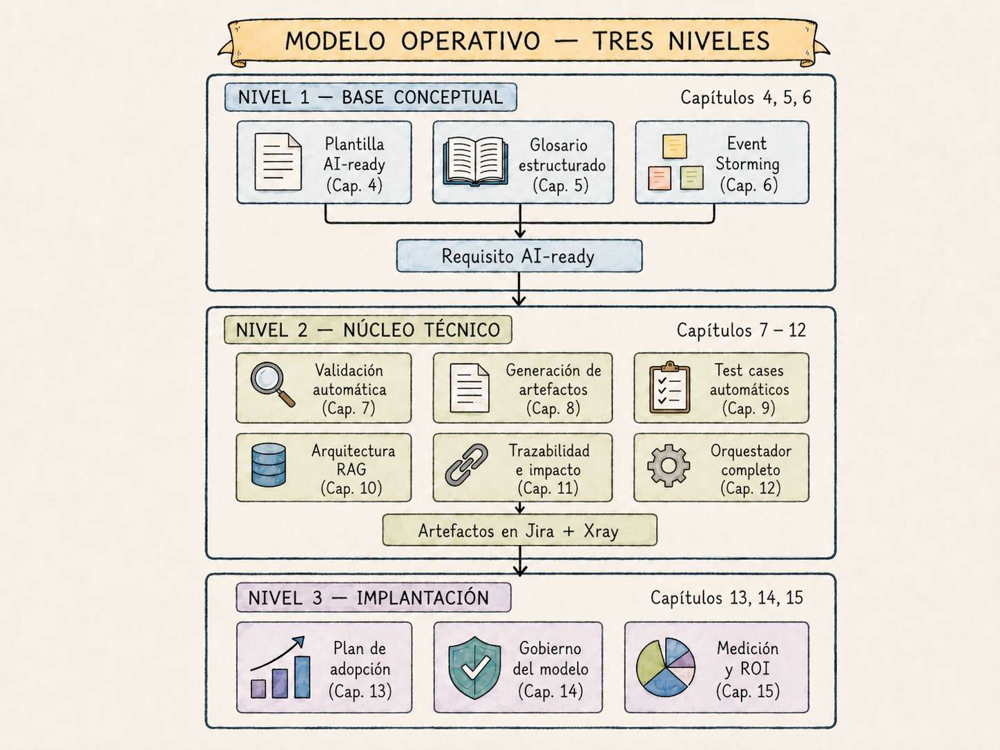
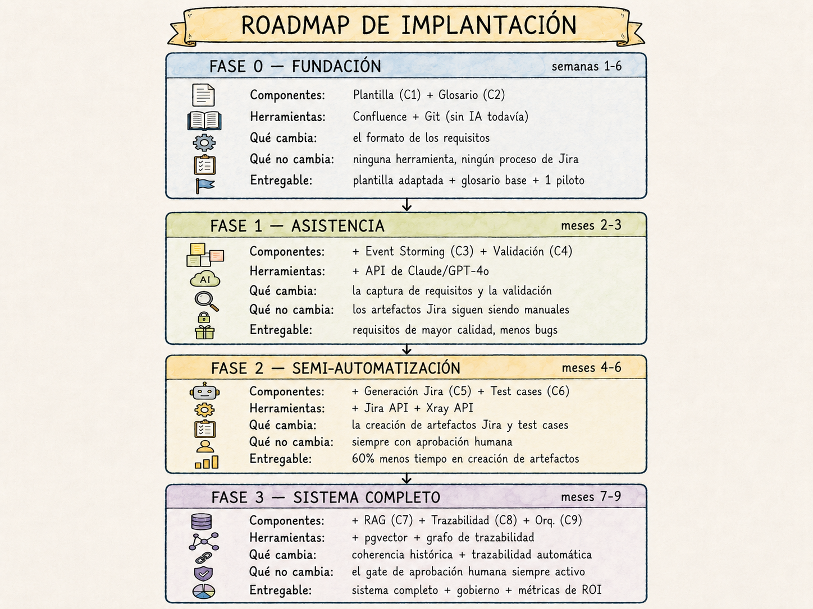

# Capítulo 3. Visión del modelo operativo

---

*En este capítulo aprenderás:*
- *Cómo está estructurado el modelo operativo completo y por qué sus componentes se construyen en ese orden*
- *Qué hace cada uno de los doce componentes del sistema y cómo se relacionan entre sí*
- *Cómo recorre un requisito real el sistema completo, desde la reunión con el usuario hasta los artefactos en Jira*
- *Qué puedes implantar en cada fase del roadmap sin esperar a tener el sistema completo*

---

## El mapa antes de la caminata

David Sanz tiene una costumbre cuando empieza un proyecto nuevo: antes de planificar el primer sprint, dibuja en la pizarra el destino. No el camino —eso vendrá después, y probablemente cambiará—, sino el estado final al que quiere llegar. El mapa antes de la caminata.

Cuando Carlos le presentó el modelo operativo para transformar el análisis funcional de Meridian, David hizo lo que hace siempre: pidió que lo pusieran en la pizarra. Completo. Con todas sus piezas. Antes de hablar de cuánto tiempo llevaría implantarlo o qué habría que cambiar en el proceso actual.

"Necesito ver adónde vamos antes de decidir cómo llegamos", dijo.

Ese es exactamente el propósito de este capítulo. Los capítulos siguientes construirán cada componente del sistema pieza a pieza, con todo el detalle necesario para implantarlo. Pero antes de entrar en ese nivel de detalle, necesitas el mapa completo. Necesitas ver cómo encajan las piezas, qué produce cada una, y cómo fluye el trabajo desde el usuario de negocio hasta los artefactos en Jira y los test cases en la herramienta de QA.

Sin ese mapa, los capítulos técnicos se leen como instrucciones de montaje de un mueble sin saber qué mueble se está montando.

---

## La arquitectura en tres niveles

El modelo operativo tiene doce componentes organizados en tres niveles que se construyen en secuencia. Cada nivel produce los resultados que necesita el siguiente para funcionar correctamente.

<!--
```
┌─────────────────────────────────────────────────────────────────┐
│                    MODELO OPERATIVO — TRES NIVELES              │
├─────────────────────────────────────────────────────────────────┤
│                                                                 │
│  NIVEL 1 — BASE CONCEPTUAL          Capítulos 4, 5, 6           │
│  ┌──────────────┐ ┌──────────────┐ ┌──────────────┐             │
│  │  Plantilla   │ │   Glosario   │ │    Event     │             │
│  │  AI-ready    │ │ estructurado │ │   Storming   │             │
│  │  (Cap. 4)    │ │   (Cap. 5)   │ │   (Cap. 6)   │             │
│  └──────────────┘ └──────────────┘ └──────────────┘             │
│         │                │                │                     │
│         └────────────────┴────────────────┘                     │
│                          │                                      │
│                   Requisito AI-ready                            │
│                          │                                      │
│                          ▼                                      │
│  NIVEL 2 — NÚCLEO TÉCNICO           Capítulos 7 – 12            │
│  ┌──────────────┐ ┌──────────────┐ ┌──────────────┐             │
│  │  Validación  │ │  Generación  │ │  Test cases  │             │
│  │  automática  │ │  artefactos  │ │  automáticos │             │
│  │   (Cap. 7)   │ │   (Cap. 8)   │ │   (Cap. 9)   │             │
│  └──────────────┘ └──────────────┘ └──────────────┘             │
│  ┌──────────────┐ ┌──────────────┐ ┌──────────────┐             │
│  │ Arquitectura │ │Trazabilidad  │ │Orquestador   │             │
│  │     RAG      │ │ e impacto    │ │  completo    │             │
│  │  (Cap. 10)   │ │  (Cap. 11)   │ │  (Cap. 12)   │             │
│  └──────────────┘ └──────────────┘ └──────────────┘             │
│                          │                                      │
│               Artefactos en Jira + Xray                         │
│                          │                                      │
│                          ▼                                      │
│  NIVEL 3 — IMPLANTACIÓN             Capítulos 13, 14, 15        │
│  ┌──────────────┐ ┌──────────────┐ ┌──────────────┐             │
│  │    Plan de   │ │  Gobierno    │ │  Medición    │             │
│  │   adopción   │ │ del modelo   │ │   y ROI      │             │
│  │  (Cap. 13)   │ │  (Cap. 14)   │ │  (Cap. 15)   │             │
│  └──────────────┘ └──────────────┘ └──────────────┘             │
│                                                                 │
└─────────────────────────────────────────────────────────────────┘
```
-->



El nivel 1 define la materia prima: cómo debe escribirse un requisito para que el pipeline pueda procesarlo, qué vocabulario debe usarse para garantizar coherencia, y cómo capturar los requisitos directamente desde los workshops con el usuario de negocio en un formato que el sistema entiende.

El nivel 2 construye el motor: el pipeline de transformación que convierte un requisito estructurado en artefactos Jira, test cases y trazabilidad. Este nivel es el más técnico del modelo y el que produce el mayor ahorro de tiempo.

El nivel 3 asegura que el sistema funciona en el mundo real y sigue funcionando con el tiempo: el plan de adopción que gestiona la resistencia al cambio, el gobierno que evita que el pipeline se degrade silenciosamente, y el modelo de ROI que justifica la inversión con métricas concretas.

El orden de construcción importa. El nivel 2 sin el nivel 1 produce outputs de baja calidad porque el motor no tiene buena materia prima. El nivel 1 sin el nivel 2 mejora la calidad de los requisitos pero no produce la automatización que justifica la inversión. Y el nivel 3 sin los otros dos no tiene nada que gobernar ni que medir.

> 💡 **Idea clave**
>
> Los tres niveles se construyen en secuencia, pero no se usan en secuencia: una vez que el sistema está operativo, los tres funcionan en paralelo en cada requisito. La base conceptual alimenta al núcleo técnico, que produce los artefactos que la capa de implantación mide y gobierna.

---

## Los doce componentes

Cada componente tiene un propósito específico y un output concreto. Esta sección los describe brevemente; los capítulos siguientes los desarrollan con todo el detalle necesario para implantarlos.

### Componente 1 — La plantilla AI-ready (Capítulo 4)

La plantilla es el formato en el que se escribe cada requisito. Tiene cinco bloques: identidad, contexto de negocio, comportamiento esperado, datos, y metadatos técnicos. Cada bloque tiene campos obligatorios, campos recomendados y campos opcionales. El bloque de comportamiento esperado —donde viven los criterios de aceptación en formato Dado/Cuando/Entonces— es el más crítico para la generación automática de test cases.

**Output:** Un requisito estructurado en YAML que el pipeline puede procesar sin ambigüedad.

### Componente 2 — El glosario estructurado (Capítulo 5)

El glosario define el vocabulario oficial del proyecto: los actores con sus nombres exactos y sus sinónimos prohibidos, las entidades con sus atributos y sus estados, las acciones con sus verbos oficiales, y las reglas de negocio globales que aplican a todos los módulos. Se inyecta como contexto en cada llamada al pipeline para garantizar que todos los artefactos usan el mismo vocabulario.

**Output:** Un YAML de términos canonizados que elimina la ambigüedad terminológica de los artefactos generados.

### Componente 3 — Event Storming para analistas (Capítulo 6)

El Event Storming es la técnica de workshop que permite capturar los requisitos directamente en el formato estructurado que necesita la plantilla. Produce los eventos de negocio que se convierten en eventos disparadores, los actores que se convierten en los actores del requisito, y las políticas que se convierten en reglas de negocio. El analista sale del workshop con la materia prima del nivel 1 ya capturada.

**Output:** Un mapa de eventos de negocio y una captura YAML provisional lista para completar.

### Componente 4 — Validación automática de calidad (Capítulo 7)

El validador es el gate que impide que los requisitos incompletos o ambiguos entren al pipeline de generación. Ejecuta cuatro tipos de validación en secuencia: estructural (¿están todos los campos obligatorios?), semántica (¿son verificables los criterios de aceptación?), consistencia (¿usa el vocabulario oficial y no contradice otros requisitos?), y completitud funcional (¿están documentados los flujos de error?). Produce un informe con los problemas encontrados, su severidad y cómo corregirlos.

**Output:** Un veredicto APROBADO / APROBADO CON ADVERTENCIAS / BLOQUEADO con diagnóstico detallado.

### Componente 5 — Generación de artefactos Jira (Capítulo 8)

El pipeline de generación transforma el YAML del requisito en los artefactos que el equipo necesita en Jira: la épica si no existe, la historia de usuario con criterios de aceptación y Definition of Done, las tareas técnicas descompuestas por capa (base de datos, backend, frontend, testing), y las subtareas si la tarea supera las ocho horas estimadas. Todo en formato JSON listo para el push a Jira via API.

**Output:** JSON con épica, historia, tareas técnicas y subtareas listos para revisión y push a Jira.

### Componente 6 — Generación automática de test cases (Capítulo 9)

El generador de test cases produce tres tipos de pruebas para cada historia: casos positivos que verifican el flujo feliz, casos negativos que verifican los flujos de error y las validaciones, y casos de contorno que verifican los valores límite de los campos con rangos. Produce también los scripts Gherkin correspondientes para los casos automatizables y la matriz de cobertura que relaciona cada criterio de aceptación con los test cases que lo verifican.

**Output:** Test cases estructurados listos para Xray o Zephyr, scripts Gherkin para automatización, y matriz de cobertura AC → TC.

### Componente 7 — Arquitectura RAG (Capítulo 10)

El sistema RAG (Retrieval-Augmented Generation) indexa todos los requisitos del repositorio en una base de datos vectorial y los recupera en tiempo real cuando se procesa un nuevo requisito. Antes de generar cualquier artefacto, el pipeline consulta el repositorio para detectar funcionalidad similar ya implementada, reglas de negocio potencialmente contradictorias, y criterios de aceptación posiblemente duplicados. Esto garantiza coherencia entre todos los requisitos del proyecto, no solo dentro de cada requisito individual.

**Output:** Contexto histórico relevante inyectado en cada llamada al pipeline, con alertas de posibles duplicados o contradicciones.

### Componente 8 — Trazabilidad automática e impacto de cambios (Capítulo 11)

El grafo de trazabilidad registra las relaciones entre todos los artefactos del proyecto: requisitos, historias, criterios de aceptación, test cases, tareas técnicas, issues Jira y commits de código. Se actualiza automáticamente cada vez que el pipeline genera o modifica un artefacto. Cuando un requisito cambia, el sistema analiza el grafo y produce un informe de impacto que lista exactamente qué historias, test cases y tareas técnicas se ven afectados y qué acción debe tomarse sobre cada uno.

**Output:** Grafo de trazabilidad en tiempo real e informes de impacto de cambios con plan de acción.

### Componente 9 — El orquestador (Capítulo 12)

El orquestador es el script Python que une todos los componentes del nivel 2 en un único flujo ejecutable. Gestiona el estado de cada ejecución para poder reanudar una ejecución interrumpida sin repetir pasos, implementa el gate de aprobación humana antes del push a Jira, y produce un informe de ejecución con los artefactos generados y las métricas del proceso. Se integra con CI/CD para procesar automáticamente los requisitos que cambian de estado en el repositorio.

**Output:** Un único comando que transforma un requisito YAML en artefactos Jira y test cases en Xray, con trazabilidad registrada y log de ejecución.

### Componente 10 — Plan de adopción (Capítulo 13)

El plan de adopción define cómo llevar el sistema a un equipo real gestionando la resistencia al cambio y demostrando valor en las primeras dos semanas. Tiene cuatro fases: preparación silenciosa, demo y enganche, piloto asistido con un analista, y expansión al resto del equipo. Incluye los materiales de formación diferenciados por audiencia (analistas, usuarios de negocio, equipo técnico) y el protocolo de seguimiento semanal durante el piloto.

**Output:** Equipos que usan el sistema de forma voluntaria y sostenida, con métricas de adopción que demuestran el valor producido.

### Componente 11 — Gobierno del modelo (Capítulo 14)

El gobierno define cómo mantener el sistema a lo largo del tiempo para que no se degrade silenciosamente. Tiene cinco pilares: observabilidad (métricas y alertas automáticas), gestión de prompts (versionado y proceso de cambio con evaluación automática), calidad del repositorio (auditorías periódicas), estructura de decisión (roles y responsabilidades), y gestión del riesgo (catálogo de riesgos con planes de contingencia).

**Output:** Un sistema que mejora con el tiempo en lugar de degradarse.

### Componente 12 — Medición del impacto y ROI (Capítulo 15)

El modelo de medición define los KPIs que demuestran el valor del sistema: reducción del tiempo de ciclo funcional, reducción de bugs por ambigüedad, cobertura de test cases, tasa de aprobación directa de artefactos, y satisfacción del equipo. Incluye el modelo financiero que traduce esas métricas en valor monetario para justificar la inversión ante la dirección, usando los datos de referencia de Meridian establecidos en el Capítulo 1.

**Output:** Un cuadro de mando con métricas de impacto y el argumento de ROI para la dirección.

---

## REQ-023 de principio a fin

La mejor forma de entender cómo funcionan los doce componentes juntos es seguir un requisito real a través de todo el sistema. Usaremos REQ-023, el filtrado de facturas por rango de fechas, que ya conocemos de la Introducción y del experimento del Capítulo 2.

Este es el viaje completo de REQ-023 desde la frase de Ana hasta la trazabilidad en el grafo:

---

**Paso 1 — Event Storming con Ana López (Componente 3)**

En la reunión con Ana, Carlos facilita un mini-workshop de Event Storming en lugar de tomar notas en Word. Usando el código de colores del Capítulo 6, identifica el evento de negocio ("Gestor busca facturas por período"), el actor ("Gestor de facturación"), el comando que lo activa ("Filtrar facturas por rango de fechas"), las políticas que lo restringen ("Solo facturas del ejercicio fiscal en curso", "Rango máximo 365 días") y el punto de dolor actual ("El cierre mensual tarda 30 minutos de búsqueda manual").

Al salir de la reunión, Carlos tiene los bloques 1, 2 y parte del bloque 3 de la plantilla ya capturados.

---

**Paso 2 — Completar el YAML (Componente 1)**

En los cuarenta minutos siguientes, Carlos completa el YAML de REQ-023 en Confluence. Rellena los datos de entrada (fecha_inicio: date, ISO-8601, requerido; fecha_fin: date, ISO-8601, requerido), los datos de salida (lista paginada, máximo 100 registros, campos: id_factura, fecha, importe, estado, proveedor), los criterios de aceptación en formato Dado/Cuando/Entonces (tres criterios: filtrado válido, rango excedido, sin resultados), y las excepciones (sin resultados con sugerencia de ampliar, timeout de base de datos).

El glosario del Componente 2 garantiza que Carlos escribe "Gestor de facturación" y no "usuario", "operador" o "gestor financiero", porque el glosario ya tiene definido cuál es el término oficial y cuáles son los sinónimos prohibidos.

---

**Paso 3 — Validación automática (Componente 4)**

Carlos mueve REQ-023 a estado "en-revisión" en Confluence. El webhook dispara automáticamente el validador, que ejecuta los cuatro niveles de validación:

- Estructural: todos los campos obligatorios presentes. ✓
- Semántica: los tres criterios de aceptación son verificables. El validador detecta que la descripción tiene solo 22 palabras (mínimo 30) y lo marca como advertencia.
- Consistencia: el actor "Gestor de facturación" existe en el glosario. Las reglas de negocio no contradicen ningún requisito validado del mismo módulo. ✓
- Completitud: faltan los flujos de error para timeout de base de datos y para usuario sin permiso. Se marcan como advertencias.

Carlos recibe el informe, añade los flujos de error que faltaban y amplía la descripción. El validador aprueba REQ-023 con puntuación 84/100.

---

**Paso 4 — Contexto RAG (Componente 7)**

Antes de generar los artefactos, el pipeline consulta el repositorio de requisitos indexado. Recupera siete requisitos relacionados con la gestión de facturas, detecta que REQ-019 ya implementa paginación en el módulo y extrae ese patrón como contexto, y alerta de que el criterio AC-023-01 tiene un 83% de similitud semántica con AC-019-02 (filtrado de proveedores por período). Carlos revisa y confirma que son criterios distintos sobre entidades distintas.

El contexto recuperado se inyecta en el prompt de generación para garantizar que la nueva historia es coherente con las ya existentes.

---

**Paso 5 — Generación de artefactos (Componente 5)**

El pipeline genera el JSON completo en 31 segundos:

- **Épica FACT-12**: reutilizada, ya existe en Jira. No se crea duplicado.
- **Historia FACT-47**: "Como gestor de facturación, quiero filtrar el listado de facturas por fecha de inicio y fecha de fin para localizar rápidamente documentos de un período contable". Story points: 5. Tres criterios de aceptación con datos concretos. Flujo principal en cinco pasos. Dos flujos de error. Definition of Done con cuatro criterios incluyendo validación de rendimiento con 10.000 registros.
- **Tarea FACT-48**: Crear índice de rendimiento en tabla facturas (base de datos, 3 horas).
- **Tarea FACT-49**: Implementar endpoint REST de filtrado (backend, 6 horas). Depende de FACT-48.
- **Tarea FACT-50**: Implementar componente de filtrado en el módulo Facturas (frontend, 8 horas). Depende de FACT-49.
- **Tarea FACT-51**: Ejecutar pruebas de integración y rendimiento (testing, 4 horas). Depende de FACT-49 y FACT-50.

---

**Paso 6 — Generación de test cases (Componente 6)**

En paralelo con la generación de artefactos Jira, el pipeline genera los test cases:

- **TC-111**: Filtrado válido devuelve resultados en menos de 2 segundos, ordenados por fecha descendente. (Positivo, crítico)
- **TC-112**: Rango superior a 365 días bloquea la búsqueda y muestra mensaje de error. (Negativo, alto)
- **TC-113**: Búsqueda sin fecha de inicio muestra campo obligatorio. (Negativo, alto)
- **TC-114**: Usuario sin rol gestor_facturacion no puede acceder al módulo. (Negativo, crítico)
- **TC-115**: Búsqueda válida sin resultados muestra estado vacío con acción. (Positivo, medio)
- **TC-116**: Rango de exactamente 365 días es aceptado. (Contorno, alto)
- **TC-117**: Rango de 366 días es rechazado. (Contorno, alto)
- **TC-118**: Rango de un día es aceptado. (Contorno, medio)
- **TC-119**: Fecha fin anterior a fecha inicio es rechazada. (Contorno, alto)

Los nueve test cases incluyen datos de prueba concretos, precondiciones, pasos detallados y resultado esperado por paso. Los cuatro de contorno son los que raramente se escriben manualmente por falta de tiempo y son los que más frecuentemente generan bugs en producción.

---

**Paso 7 — Revisión y aprobación humana**

El orquestador presenta el JSON completo a Carlos para revisión. Carlos dedica diez minutos a verificar que los criterios de aceptación reflejan fielmente lo que dijo Ana, que la descomposición en tareas tiene sentido para el equipo técnico, y que los test cases cubren los casos que él habría escrito manualmente. Aprueba sin cambios.

Tiempo total de Carlos en este requisito: 40 minutos de captura en la plantilla + 10 minutos de revisión = 50 minutos. Antes del sistema: 2 horas 30 minutos, sin test cases.

---

**Paso 8 — Push a Jira y Xray (Componente 9)**

El orquestador empuja los artefactos aprobados a Jira y los test cases a Xray. FACT-47 aparece en el backlog de EP-04 con todos sus campos, vinculada a la épica FACT-12 y con los links de dependencia entre tareas ya creados. Los nueve test cases aparecen en Xray vinculados a FACT-47 y referenciando REQ-023 como origen.

---

**Paso 9 — Trazabilidad en el grafo (Componente 8)**

El grafo de trazabilidad registra automáticamente todas las relaciones generadas:

```
REQ-023 ──genera──► US-047 (FACT-47)
REQ-023 ──deriva──► AC-023-01, AC-023-02, AC-023-03
US-047  ──descompone──► FACT-48, FACT-49, FACT-50, FACT-51
FACT-48 ──blocks──► FACT-49
FACT-49 ──blocks──► FACT-50, FACT-51
TC-111..TC-119 ──verifican──► US-047
AC-023-01 ──verificado_por──► TC-111, TC-116, TC-117, TC-118, TC-119
AC-023-02 ──verificado_por──► TC-112, TC-117
AC-023-03 ──verificado_por──► TC-115
```

Cuando en tres meses María García encuentre un bug relacionado con el comportamiento cuando no hay resultados, podrá navegar desde el bug hasta REQ-023, ver exactamente qué definió Ana en la reunión y qué criterio de aceptación (AC-023-03) describe el comportamiento esperado. Sin investigación arqueológica. Sin preguntar a Carlos.

---

Ese es el viaje completo de REQ-023. Nueve pasos, cincuenta minutos del analista, cincuenta y cuatro segundos de procesamiento automático, y un conjunto de artefactos que un equipo completo de cuatro analistas habría tardado entre dos y tres horas en producir manualmente, sin test cases de contorno.

> 🛠️ **En la práctica**
>
> La primera vez que un analista ve este flujo completo sobre un requisito de su propio proyecto —no sobre REQ-023, sino sobre algo que él mismo escribió— es el momento en que la adopción se vuelve inevitable. Nada en una presentación o en un libro produce el mismo efecto que ver el propio trabajo transformado en artefactos correctos en menos de un minuto. El Capítulo 13 describe cómo organizar esa demostración para maximizar su impacto.

---

## El roadmap de implantación

El modelo operativo completo no se implanta de golpe. Tiene un roadmap de cuatro fases diseñado para que cada fase entregue valor antes de que empiece la siguiente, y para que el equipo pueda adoptar el sistema gradualmente sin romper el flujo de trabajo existente.

<!--
```
FASE 0 — FUNDACIÓN (semanas 1-6)
┌─────────────────────────────────────────────────────────────┐
│ Componentes: Plantilla (C1) + Glosario (C2)                 │
│ Herramientas: Confluence + Git (sin IA todavía)             │
│ Qué cambia: el formato de los requisitos                    │
│ Qué no cambia: ninguna herramienta, ningún proceso de Jira  │
│ Entregable: plantilla adaptada + glosario base + 1 piloto   │
└─────────────────────────────────────────────────────────────┘
         │
         ▼
FASE 1 — ASISTENCIA (meses 2-3)
┌─────────────────────────────────────────────────────────────┐
│ Componentes: + Event Storming (C3) + Validación (C4)        │
│ Herramientas: + API de Claude/GPT-4o                        │
│ Qué cambia: la captura de requisitos y la validación        │
│ Qué no cambia: los artefactos Jira siguen siendo manuales   │
│ Entregable: requisitos de mayor calidad, menos bugs         │
└─────────────────────────────────────────────────────────────┘
         │
         ▼
FASE 2 — SEMI-AUTOMATIZACIÓN (meses 4-6)
┌─────────────────────────────────────────────────────────────┐
│ Componentes: + Generación Jira (C5) + Test cases (C6)       │
│ Herramientas: + Jira API + Xray API                         │
│ Qué cambia: la creación de artefactos Jira y test cases     │
│ Qué no cambia: siempre con aprobación humana                │
│ Entregable: 60% menos tiempo en creación de artefactos      │
└─────────────────────────────────────────────────────────────┘
         │
         ▼
FASE 3 — SISTEMA COMPLETO (meses 7-9)
┌─────────────────────────────────────────────────────────────┐
│ Componentes: + RAG (C7) + Trazabilidad (C8) + Orq. (C9)     │
│ Herramientas: + pgvector + grafo de trazabilidad            │
│ Qué cambia: coherencia histórica + trazabilidad automática  │
│ Qué no cambia: el gate de aprobación humana siempre activo  │
│ Entregable: sistema completo + gobierno + métricas de ROI   │
└─────────────────────────────────────────────────────────────┘
```
-->



La Fase 0 no requiere ninguna herramienta nueva ni ninguna integración técnica. Solo requiere diseñar la plantilla adaptada al contexto de la organización y construir el glosario base. Es el trabajo de seis semanas descrito en los Capítulos 4 y 5, y es el más importante del roadmap porque define la calidad del input que procesará todo lo que viene después.

La Fase 1 introduce la IA en el proceso, pero solo como asistente: el validador detecta problemas en los requisitos antes de que lleguen al sprint. El analista sigue creando los artefactos Jira manualmente. El beneficio en esta fase no es el ahorro de tiempo de creación, sino la reducción de bugs por ambigüedad, que empieza a ser medible a partir del segundo mes.

La Fase 2 es donde ocurre el cambio más visible para el equipo: la generación automática de artefactos Jira y test cases. Es también la fase donde la resistencia al cambio es mayor, porque implica confiar en el output del sistema lo suficiente como para usarlo como punto de partida en lugar de crearlo desde cero. El plan de adopción del Capítulo 13 está diseñado específicamente para gestionar esa transición.

La Fase 3 añade la inteligencia contextual del sistema RAG y la trazabilidad automática. Es la fase que diferencia un pipeline de generación puntual de un sistema que aprende y es coherente con todo el historial del proyecto.

La implantación por fases tiene una ventaja que va más allá de gestionar el riesgo: permite que el equipo vea el valor del sistema antes de haber construido el sistema completo. Un equipo que lleva tres meses en la Fase 1 y ha medido una reducción del 35% en bugs por ambigüedad tiene un argumento interno mucho más sólido para continuar con la Fase 2 que cualquier presentación de PowerPoint con proyecciones teóricas.

> ⚠️ **Error frecuente**
>
> La tentación más común al ver el modelo completo es querer implantarlo todo a la vez. Esta tentación es comprensible: el sistema completo es claramente más potente que cualquier fase individual. Pero la implantación en big bang tiene una tasa de fracaso muy superior a la gradual, porque acumula demasiados cambios simultáneos sin que el equipo haya tenido tiempo de calibrar la confianza en el sistema. Empieza siempre por la Fase 0, aunque tengas los recursos para ir más rápido.

---

## Lo que puedes hacer hoy

El mapa está sobre la mesa. Antes de continuar con los capítulos de construcción, vale la pena nombrar lo que puedes hacer con él hoy mismo, sin esperar a tener ningún componente técnico implantado.

El ejercicio más valioso que puedes hacer esta semana es tomar tres requisitos reales de tu backlog actual —no los mejores, sino tres representativos— y evaluarlos contra los cinco campos obligatorios del Componente 1 que veremos en el Capítulo 4: ¿tienen actor definido? ¿tienen evento disparador? ¿tienen criterios de aceptación verificables? ¿tienen al menos una excepción documentada? ¿tienen datos de entrada con tipo y formato especificados?

Lo que encontrarás en esa evaluación es la versión concreta, referida a tu proyecto, del problema que describe el Capítulo 1. Y esa versión concreta es el punto de partida más honesto para empezar a construir el sistema.

---

## Lo que funciona en la práctica

Una observación antes de entrar en los capítulos de construcción: el mayor riesgo de tener el mapa completo antes de empezar no es el abrumamiento —el roadmap de cuatro fases está diseñado exactamente para evitarlo—. El mayor riesgo es la perfección como enemiga del comienzo.

Conozco equipos que llevan meses analizando el modelo, ajustando los detalles de la plantilla, debatiendo qué campos son obligatorios y cuáles opcionales, diseñando el glosario perfecto antes de escribir el primer requisito con él. Y conozco equipos que diseñaron una plantilla razonablemente buena en dos días, la usaron en el proyecto piloto durante un mes, y la mejoraron con lo que aprendieron en ese mes. Los segundos siempre llegan antes al sistema funcional.

El modelo operativo de este libro es el resultado de muchas iteraciones sobre proyectos reales. No es perfecto ni está pensado para ser implantado sin adaptaciones. Está pensado para ser el punto de partida de tu propia versión, que mejorará con cada sprint que la uses.

El Capítulo 4 construye el primer componente. Empezamos con la plantilla.

---

*Los tres puntos clave de este capítulo:*

1. El modelo operativo tiene doce componentes organizados en tres niveles que se construyen en secuencia: base conceptual (plantilla, glosario, Event Storming), núcleo técnico (validación, generación de artefactos, test cases, RAG, trazabilidad, orquestador), y capa de implantación (adopción, gobierno, ROI). Cada nivel produce la materia prima que necesita el siguiente.

2. Un requisito real recorre nueve pasos desde la reunión con el usuario hasta el grafo de trazabilidad: captura en workshop, completado en plantilla, validación automática, contexto RAG, generación de artefactos, generación de test cases, revisión humana, push a Jira y Xray, y registro en el grafo. El tiempo del analista en ese recorrido es de cincuenta minutos frente a las dos horas y media del proceso manual, con test cases incluidos.

3. El roadmap de implantación tiene cuatro fases que entregan valor antes de que el sistema esté completo. La Fase 0 no requiere ninguna herramienta nueva: solo la plantilla y el glosario. Empezar por la Fase 0 no es ir despacio: es construir la base sin la cual las fases siguientes producen resultados de baja calidad.

---

> 💡 **Pregunta de reflexión para tu equipo**
>
> Si evaluamos tres requisitos del backlog actual contra los cinco campos obligatorios de la plantilla, ¿cuántos los cumplen todos? ¿Cuál es el campo que falla con más frecuencia?

---

A continuación: [Plantilla de cinco bloques para convertir un requisito en materia prima procesable por IA.](./04-requisito-ai-ready.md)

---
