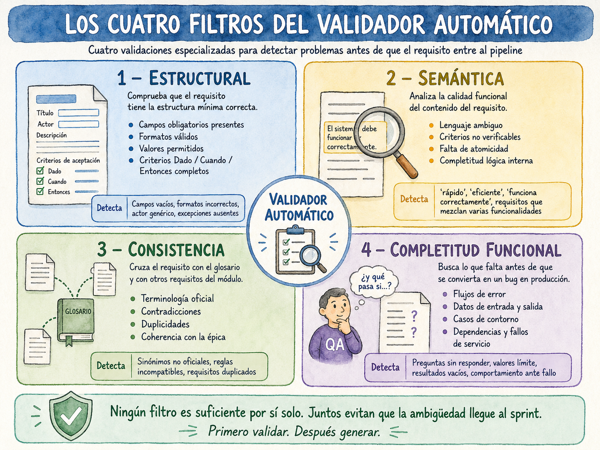
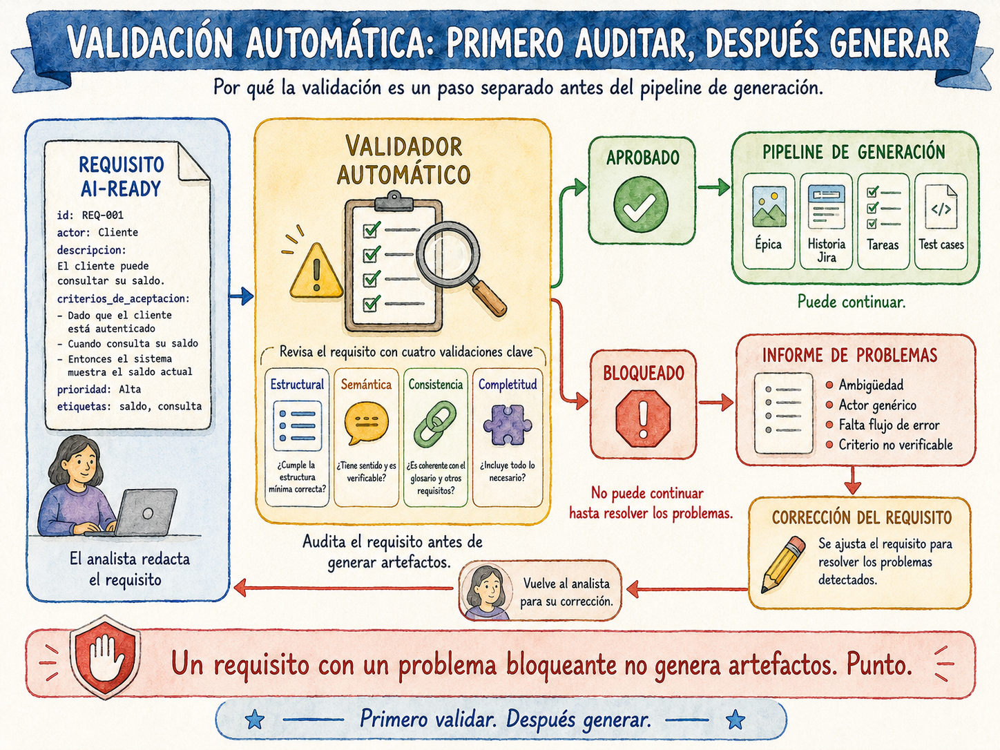

# Capítulo 7. Validación automática de calidad

Carlos tiene el requisito delante. Lo ha escrito en cuarenta minutos después de la reunión con Ana, mientras el café se enfriaba. El documento tiene actor, tiene descripción, tiene algo que se parece a unos criterios de aceptación. Lo cierra, lo mueve al estado *en revisión* y lo olvida hasta el próximo sprint planning.

Tres semanas después, María García le pregunta en el standup: «¿Qué pasa exactamente cuando el rango de fechas supera 365 días? El criterio dice "el sistema avisa" pero no especifica qué mensaje, dónde aparece ni si la consulta se ejecuta igualmente.» Carlos abre el documento. Tiene razón. El criterio es un boceto, no una especificación. La historia lleva dos días en desarrollo y ahora hay que parar, aclarar y posiblemente deshacer trabajo.

Este escenario se repite en casi todos los proyectos. No porque los analistas sean descuidados, sino porque detectar la ambigüedad en el propio texto que uno acaba de escribir es cognitivamente muy difícil. Somos malos auditores de nuestro propio trabajo. Completamos mentalmente lo que falta, damos por supuesto lo que no está escrito, y asumimos que el lector verá lo mismo que nosotros.

La validación automática resuelve exactamente este problema. No corrige los requisitos: los audita con la frialdad de quien no sabe nada del contexto y señala todo lo que un lector externo necesitaría para entenderlos sin hacer preguntas. Es el colega que siempre encuentra el hueco que tú no viste, pero que trabaja en menos de diez segundos y no necesita que lo convoques a una reunión.

---

*En este capítulo aprenderás:*

- *Por qué la validación debe ser un paso separado de la generación, y por qué ese orden importa.*
- *Los cuatro tipos de problema que el validador detecta: estructural, semántico, de consistencia y de completitud.*
- *Cómo construir y encadenar los prompts de validación para que el output sea diagnóstico accionable, no ruido.*
- *Cómo integrar la validación en el flujo de trabajo del analista sin que se convierta en un obstáculo.*
- *Los quince problemas más frecuentes en los requisitos de equipos Agile y cómo el sistema los detecta.*

---

## Por qué la validación es un paso separado

La tentación natural es incluir la validación como parte del mismo prompt que genera las historias de usuario. «Genera la historia y, si ves problemas en el requisito, indícalos al final.» Es un error con tres consecuencias predecibles.

La primera es que el modelo optimiza para generar algo, no para encontrar fallos. Cuando el objetivo del prompt es producir un artefacto, el LLM tenderá a completar los huecos con suposiciones razonables en lugar de señalarlos como problemas. El resultado es una historia bien formada que descansa sobre una asunción que nadie validó.

La segunda es que la validación necesita contexto externo que la generación no usa. Para detectar que el término «cliente» contradice el glosario del proyecto, el validador necesita el glosario. Para detectar que una regla de negocio contradice otro requisito del mismo módulo, necesita esos otros requisitos. Mezclar ambas responsabilidades en un solo prompt significa pasarle demasiado contexto, lo que degrada la calidad de ambas tareas.

La tercera es que los errores de validación deben bloquear el pipeline, no ser notas al pie de un JSON que nadie leerá. Un requisito con un problema bloqueante no debe generar historias. Punto. Si la validación ocurre después de la generación, ese bloqueo llega tarde y obliga a tirar trabajo ya hecho.

El orden correcto es siempre el mismo: primero validar, después generar. Un requisito que no pasa la validación no entra al pipeline de generación. Un requisito que pasa con advertencias entra al pipeline pero las advertencias viajan con él hasta la cola de aprobación humana.

---

## Los cuatro tipos de problema

El validador no es un único prompt: son cuatro llamadas especializadas que buscan tipos de problema distintos. Cada una tiene su propia lógica, su propio contexto y sus propias señales de alarma.

### Tipo 1: Problemas estructurales

Son los más fáciles de detectar porque no requieren comprensión del contenido. El validador estructural comprueba que los campos obligatorios existen, que tienen el formato correcto y que los vocabularios controlados son los definidos.

¿Tiene el requisito un `id` con el formato REQ-NNN? ¿Tiene `actor` y no está vacío? ¿El campo `prioridad` usa uno de los valores MoSCoW permitidos? ¿Los criterios de aceptación tienen los tres campos `dado`, `cuando` y `entonces`? ¿La `descripcion` tiene al menos treinta palabras?

Estos son los problemas que Carlos no puede tener en REQ-023 porque la plantilla del capítulo anterior obliga a rellenarlos. Pero en la práctica, los analistas toman atajos: ponen «TBD» en el actor, copian el campo de excepciones de otro requisito sin modificarlo, o dejan el `evento_disparador` con una frase de tres palabras que no dice nada. El validador estructural los detecta antes de que el pipeline empiece a trabajar.

### Tipo 2: Problemas semánticos

Son los más valiosos y los más difíciles de detectar sin IA. El validador semántico analiza el contenido del texto buscando cuatro categorías de problema.

**Ambigüedad lingüística.** Cuantificadores vagos como «rápido», «eficiente», «adecuado» o «correcto» que no tienen referencia medible. Verbos sin sujeto definido («se mostrará», «se enviará») donde no queda claro si actúa el sistema, el usuario o un proceso externo. Condiciones implícitas como «si es necesario» o «cuando corresponda» que delegan en el desarrollador la decisión de cuándo aplica la regla.

**Criterios de aceptación no verificables.** Un criterio que no puede responderse con verdadero o falso mediante una prueba concreta no es un criterio de aceptación: es una intención. «El sistema debe ser intuitivo» no es verificable. «El sistema debe mostrar el mensaje de error en menos de 500 milisegundos» sí lo es. El validador semántico distingue entre ambos.

**Falta de atomicidad.** Un requisito que mezcla dos funcionalidades distintas es imposible de estimar correctamente y genera historias que nadie sabe cómo partir en tareas. La señal más clara es un título con «y» o «también»: «Exportar facturas y configurar preferencias de exportación» son dos requisitos distintos con dos historias distintas y dos conjuntos de tareas técnicas distintos.

**Completitud lógica interna.** ¿Cada regla de negocio tiene al menos un criterio de aceptación que la verifica? ¿Los flujos de error están documentados o solo existe el flujo feliz? ¿Los datos de entrada tienen validaciones definidas para cuando no cumplen el formato esperado?

### Tipo 3: Problemas de consistencia

El validador de consistencia necesita contexto externo: el glosario y los otros requisitos del mismo módulo. Sin ese contexto, no puede detectar los problemas más costosos en producción: las contradicciones silenciosas entre requisitos que parecen independientes pero comparten datos o comportamientos.

**Terminología inconsistente.** Si el requisito usa el término «cliente» y el glosario del proyecto establece que el término oficial es «usuario autenticado», el validador lo detecta. Si no lo hace, el pipeline generará una historia con un actor diferente al de las otras historias del módulo, y el equipo de desarrollo implementará dos flujos de autorización distintos para el mismo rol sin que nadie lo haya decidido explícitamente.

**Contradicciones con otros requisitos.** REQ-018 establece que cada usuario tiene exactamente una dirección de facturación activa. REQ-035 dice que el usuario puede tener múltiples direcciones activas. Las dos reglas son incompatibles y generarán implementaciones contradictorias. El validador de consistencia cruza las reglas de negocio del requisito candidato con las de los requisitos ya validados del mismo módulo.

**Duplicidad.** El validador detecta cuando un requisito cubre funcionalidad que ya está cubierta por otro. Esto no siempre es un error: a veces hay matices que justifican dos requisitos separados. Pero el sistema señala la similitud para que el analista la evalúe conscientemente en lugar de crear un duplicado sin darse cuenta.

### Tipo 4: Problemas de completitud funcional

El validador de completitud actúa como el QA senior que siempre pregunta «¿y qué pasa si...?». No busca problemas en lo que está escrito: busca lo que no está escrito y que tendrá consecuencias en producción.

¿Qué pasa si el servicio de base de datos no responde durante la búsqueda? ¿Qué pasa si `fecha_fin` se omite: tiene valor por defecto o es obligatorio? ¿Qué pasa con un rango de exactamente 365 días, el valor límite exacto del campo? ¿Qué pasa con un resultado de cero registros?

Cada una de estas preguntas sin respuesta en el requisito se convierte en una decisión que tomará el desarrollador solo, en el momento en que se encuentra el caso, con la presión del sprint encima. El validador de completitud las surfacea antes de que eso ocurra.



---

## Los prompts del validador

Veamos cómo se construye cada llamada. Los prompts de validación siguen la misma arquitectura que los de generación: un system prompt base compartido y cuatro prompts especializados que se ejecutan en secuencia.

### El system prompt base

Establece el comportamiento del modelo para todas las llamadas de validación. Hay un parámetro crítico que diferencia este system prompt del de generación: el sesgo conservador.

---

📋 **Prompt de IA — System prompt base de validación**

```
Eres un auditor de calidad de requisitos funcionales con experiencia
en proyectos Agile enterprise. Tu función es detectar problemas en
requisitos funcionales ANTES de que entren en un pipeline de generación
de artefactos.

Tu sesgo debe ser conservador: ante la duda, marca el problema.
Es mejor un falso positivo que un requisito ambiguo en producción.

REGLAS DE COMPORTAMIENTO:

1. No generes contenido nuevo ni corrijas el requisito.
   Solo diagnostica. Las correcciones las hace el analista.

2. Para cada problema encontrado, indica:
   - Qué campo o sección lo contiene
   - Por qué es un problema (consecuencia concreta si no se resuelve)
   - Un ejemplo de cómo debería expresarse correctamente

3. Clasifica cada problema como:
   BLOQUEANTE → impide la generación correcta de artefactos
   ADVERTENCIA → degrada la calidad pero no impide la generación
   SUGERENCIA → mejora opcional que no afecta al pipeline

4. Un requisito con un solo problema BLOQUEANTE se rechaza completamente.
   No se genera ningún artefacto hasta que se resuelva.

5. El output es siempre JSON válido. Sin texto antes ni después del JSON.
   Sin bloques de código markdown envolviendo el JSON.

GLOSARIO OFICIAL DEL PROYECTO:
{{glosario_yaml}}

REQUISITOS DEL MISMO MÓDULO (para detectar contradicciones):
{{requisitos_mismo_modulo}}
```

---

El parámetro «ante la duda, marca el problema» es deliberado. Un validador que intenta ser amable y solo señala lo que está claramente mal es un validador inútil. El analista puede desestimar una advertencia si tiene contexto para hacerlo; lo que no puede es detectar una ambigüedad que el sistema no le señaló.

### Prompt 1: Validación estructural

Es la llamada más rápida. Verifica el esquema del requisito campo por campo.

---

📋 **Prompt de IA — Validación estructural**

```
Valida que el siguiente requisito tiene todos los campos obligatorios
con el formato correcto.

REQUISITO A VALIDAR:
{{requisito_yaml}}

CAMPOS OBLIGATORIOS Y SUS REGLAS:

id:
  formato: REQ-NNN (NNN numérico de 3 dígitos)
  regla: único, no reutilizable aunque el requisito se elimine

titulo:
  regla: máximo 80 caracteres
  verbos_prohibidos: [gestionar, administrar, mejorar, permitir,
                      optimizar, soportar, procesar, manejar,
                      controlar, facilitar]

epica:
  formato: EP-NN

actor:
  regla: debe existir en el glosario de actores del proyecto
  valor_prohibido: ["el usuario", "el cliente", "el sistema"]

prioridad:
  valores_permitidos: [must-have, should-have, could-have, wont-have]

estado:
  valores_permitidos: [borrador, en-revision, validado, rechazado,
                       deprecado]

descripcion:
  regla: mínimo 30 palabras

evento_disparador:
  regla: no vacío, debe describir una situación concreta

criterios_aceptacion:
  regla: mínimo 1 criterio
  cada_criterio:
    - id: formato AC-NNN-NN
    - dado: no vacío
    - cuando: no vacío
    - entonces: no vacío

excepciones:
  regla: mínimo 1 excepción documentada

Genera el siguiente JSON:
{
  "validacion_estructural": {
    "requisito_id": "{{req_id}}",
    "resultado": "APROBADO | BLOQUEADO",
    "problemas": [
      {
        "severidad": "BLOQUEANTE | ADVERTENCIA | SUGERENCIA",
        "campo": "nombre del campo afectado",
        "problema": "descripción del problema",
        "valor_actual": "valor que tiene el campo",
        "ejemplo_correcto": "cómo debería expresarse"
      }
    ],
    "campos_validados": N,
    "campos_con_problema": N
  }
}
```

---

Veamos qué produce este prompt con un requisito deficiente. Supongamos que un analista de Meridian escribe REQ-031 con estas carencias:

```yaml
id: REQ-031
titulo: Gestión de las notificaciones del usuario
actor: el usuario
prioridad: must-have
estado: en-revision
descripcion: >
  El usuario podrá gestionar sus notificaciones.
evento_disparador: "cuando lo necesite"
criterios_aceptacion:
  - id: AC-031-01
    dado: "El usuario está en su perfil"
    cuando: "Accede a las notificaciones"
    entonces: ""
excepciones: []
```

El output del validador para este requisito sería:

```json
{
  "validacion_estructural": {
    "requisito_id": "REQ-031",
    "resultado": "BLOQUEADO",
    "problemas": [
      {
        "severidad": "BLOQUEANTE",
        "campo": "titulo",
        "problema": "El título contiene el verbo prohibido 'gestionar',
                     que no especifica qué operación concreta se realiza.
                     La IA generará una historia igualmente ambigua.",
        "valor_actual": "Gestión de las notificaciones del usuario",
        "ejemplo_correcto": "Desactivar notificaciones por categoría
                             desde el perfil de usuario"
      },
      {
        "severidad": "BLOQUEANTE",
        "campo": "criterios_aceptacion[0].entonces",
        "problema": "El campo 'entonces' está vacío. Sin resultado
                     esperado, el criterio no es verificable y no
                     puede generar test cases.",
        "valor_actual": "",
        "ejemplo_correcto": "Entonces el sistema muestra el mensaje
                             'Notificaciones de Marketing desactivadas'
                             y el toggle aparece en posición OFF"
      },
      {
        "severidad": "BLOQUEANTE",
        "campo": "actor",
        "problema": "'el usuario' es demasiado genérico. No permite
                     determinar qué permisos aplican ni qué flujo
                     de autenticación corresponde.",
        "valor_actual": "el usuario",
        "ejemplo_correcto": "Usuario autenticado (según glosario del
                             proyecto)"
      },
      {
        "severidad": "BLOQUEANTE",
        "campo": "excepciones",
        "problema": "El campo excepciones está vacío. Sin flujos de
                     error documentados, el desarrollador decidirá
                     el comportamiento de fallo por su cuenta.",
        "valor_actual": "[]",
        "ejemplo_correcto": "- Si el usuario no tiene notificaciones
                             activas: mostrar mensaje informativo
                             sin mostrar toggles vacíos"
      },
      {
        "severidad": "ADVERTENCIA",
        "campo": "descripcion",
        "problema": "La descripción tiene 6 palabras, por debajo del
                     mínimo de 30. No hay contexto de negocio
                     suficiente para que la IA genere el 'para qué'
                     de la historia.",
        "valor_actual": "El usuario podrá gestionar sus notificaciones.",
        "ejemplo_correcto": "El usuario registrado necesita poder
                             desactivar categorías de notificaciones
                             desde su perfil para reducir las
                             interrupciones no deseadas durante su
                             jornada de trabajo..."
      }
    ],
    "campos_validados": 11,
    "campos_con_problema": 5
  }
}
```

Cuatro problemas bloqueantes. REQ-031 no entra al pipeline hasta que Carlos los resuelva. Cada problema tiene su diagnóstico, su campo exacto y un ejemplo de cómo quedaría bien. Carlos no tiene que adivinar qué falta: el sistema se lo dice.

> 💡 **Idea clave**
>
> El validador no escribe el requisito por el analista. Señala exactamente qué falta y por qué importa. La diferencia entre un validador que dice «el actor es incorrecto» y uno que dice «"el usuario" es demasiado genérico; sin un actor específico, el equipo de desarrollo no sabe qué permisos implementar» es la diferencia entre un feedback que genera preguntas y uno que genera acción.

### Prompt 2: Validación semántica

Este es el prompt más valioso del sistema. Necesita más tiempo de proceso que el estructural porque razona sobre el contenido, no sobre el formato. En proyectos con muchos requisitos, conviene ejecutarlo solo sobre los que han pasado la validación estructural.

---

📋 **Prompt de IA — Validación semántica**

```
Analiza el contenido semántico del siguiente requisito en busca de
ambigüedades, inconsistencias internas y problemas de calidad funcional.

REQUISITO A VALIDAR:
{{requisito_yaml}}

ANÁLISIS REQUERIDO:

BLOQUE A — Ambigüedad lingüística
Busca en TODOS los campos de texto:
- Cuantificadores vagos: rápido, eficiente, adecuado, correcto, fácil,
  intuitivo, robusto, escalable, flexible, suficiente, apropiado
- Verbos sin sujeto definido: "se podrá", "se mostrará", "se enviará"
  (¿quién lo hace? ¿el sistema, el usuario, un proceso batch?)
- Condiciones implícitas: "si es necesario", "cuando corresponda",
  "según proceda", "en su caso"
- Plurales sin cuantificar: "los documentos", "los registros"
  (¿todos? ¿algunos? ¿cuántos máximo?)

BLOQUE B — Verificabilidad de criterios de aceptación
Para cada criterio Dado/Cuando/Entonces verifica:
- ¿Puede responderse con PASS o FAIL mediante una prueba concreta?
- ¿El 'dado' describe un ESTADO del sistema, no una acción?
- ¿El 'cuando' describe UNA sola acción concreta?
- ¿El 'entonces' describe algo OBSERVABLE externamente?
- ¿Hay datos concretos o usa placeholders vagos como "un valor válido"?

BLOQUE C — Atomicidad
- ¿El requisito mezcla más de una funcionalidad diferente?
  (señal: el título tiene "y", "también", "además", "así como")
- ¿Un único criterio de aceptación verifica más de una cosa sin relación?
  (señal: el 'entonces' tiene más de 3 condiciones sin nexo causal)

BLOQUE D — Completitud lógica interna
- ¿Cada regla de negocio tiene su criterio de aceptación correspondiente?
- ¿Están documentados los flujos de error, no solo el flujo feliz?
- ¿Los datos de entrada tienen validaciones para cuando no cumplen
  el formato esperado?

Genera el siguiente JSON:
{
  "validacion_semantica": {
    "requisito_id": "{{req_id}}",
    "resultado": "APROBADO | APROBADO_CON_ADVERTENCIAS | BLOQUEADO",
    "puntuacion_calidad": N,
    "escala_puntuacion": "0-100 donde 100 es calidad perfecta",
    "analisis_por_bloque": {
      "ambiguedad": {
        "resultado": "LIMPIO | PROBLEMAS_ENCONTRADOS",
        "problemas": []
      },
      "verificabilidad": {
        "resultado": "LIMPIO | PROBLEMAS_ENCONTRADOS",
        "problemas": []
      },
      "atomicidad": {
        "resultado": "LIMPIO | PROBLEMAS_ENCONTRADOS",
        "problemas": []
      },
      "completitud_logica": {
        "resultado": "LIMPIO | PROBLEMAS_ENCONTRADOS",
        "problemas": []
      }
    },
    "problemas_consolidados": [
      {
        "severidad": "BLOQUEANTE | ADVERTENCIA | SUGERENCIA",
        "bloque": "ambiguedad | verificabilidad | atomicidad |
                   completitud_logica",
        "ubicacion": "campo exacto y fragmento de texto problemático",
        "problema": "descripción y consecuencia concreta",
        "ejemplo_correcto": "cómo debería expresarse"
      }
    ]
  }
}
```

---

Apliquemos este prompt al REQ-023 de Carlos, esta vez en una versión ligeramente descuidada que podría haberse enviado antes de revisar:

```yaml
# Versión con problemas semánticos (antes de corregir)
criterios_aceptacion:
  - id: AC-023-01
    dado: "El gestor está en el módulo de Facturas"
    cuando: "Filtra y busca y ordena los resultados"
    entonces: "El sistema funciona correctamente y muestra las facturas"
```

El output del validador semántico señalaría:

```json
{
  "validacion_semantica": {
    "requisito_id": "REQ-023",
    "resultado": "BLOQUEADO",
    "puntuacion_calidad": 41,
    "problemas_consolidados": [
      {
        "severidad": "BLOQUEANTE",
        "bloque": "verificabilidad",
        "ubicacion": "criterios_aceptacion[0].cuando",
        "problema": "El 'cuando' describe tres acciones distintas
                     (filtrar, buscar, ordenar). Un criterio de
                     aceptación verifica una sola acción. Con tres
                     acciones mezcladas, el test case no puede
                     determinar cuál de las tres falló.",
        "ejemplo_correcto": "Cuando introduce fecha_inicio=2024-01-01
                             y fecha_fin=2024-03-31 y pulsa el botón
                             Buscar"
      },
      {
        "severidad": "BLOQUEANTE",
        "bloque": "verificabilidad",
        "ubicacion": "criterios_aceptacion[0].entonces",
        "problema": "'El sistema funciona correctamente' no es un
                     resultado observable. No hay forma de escribir
                     un test que distinga entre pasar y fallar este
                     criterio.",
        "ejemplo_correcto": "Entonces el sistema devuelve las facturas
                             del período en menos de 2 segundos,
                             ordenadas por fecha descendente, con el
                             contador de resultados visible"
      }
    ]
  }
}
```

> ⚠️ **Error frecuente**
>
> El error más común en los criterios de aceptación no es escribirlos mal: es escribirlos con la buena intención de «ya se entiende qué queremos decir». «El sistema funciona correctamente» se entiende perfectamente en el contexto de quien lo escribe. El problema es que María García, dos sprints después, tiene que escribir un test que lo verifique. Y «funciona correctamente» no le dice nada sobre qué estado exacto debe tener la pantalla, qué datos deben aparecer, ni en cuánto tiempo debe responder.

### Prompt 3: Validación de consistencia

Este prompt requiere el contexto del glosario y de los otros requisitos del módulo. Si el repositorio tiene implementada la arquitectura RAG del capítulo 10, el sistema recupera automáticamente los requisitos relevantes antes de ejecutar esta llamada. Sin RAG, el analista puede pasar manualmente los requisitos del mismo módulo como contexto.

---

📋 **Prompt de IA — Validación de consistencia**

```
Valida que el siguiente requisito es consistente con el resto del
proyecto: el glosario oficial y los requisitos ya validados del
mismo módulo.

REQUISITO A VALIDAR:
{{requisito_yaml}}

GLOSARIO OFICIAL (términos y definiciones canónicas):
{{glosario_yaml}}

REQUISITOS VALIDADOS DEL MÓDULO {{epica_id}}:
{{requisitos_mismo_modulo}}

ANÁLISIS REQUERIDO:

BLOQUE A — Consistencia terminológica
¿Se usan los términos del glosario con sus nombres exactos?
¿Aparecen sinónimos no oficiales que crearán entidades distintas
en las historias y en el código?

BLOQUE B — Contradicciones con otros requisitos
¿Alguna regla de negocio de este requisito contradice la de otro?
¿Algún comportamiento definido aquí entra en conflicto con el de
otro requisito del mismo módulo?

BLOQUE C — Duplicidad
¿Existe ya un requisito que cubre total o parcialmente la misma
funcionalidad? Si es similar pero no idéntico, ¿son realmente
distintos o pueden fusionarse?

BLOQUE D — Coherencia con la épica
¿La funcionalidad descrita pertenece realmente al módulo {{epica_id}}?
¿Debería estar en una épica diferente?

Genera el JSON con la misma estructura de problemas, usando:
"resultado": "APROBADO | APROBADO_CON_ADVERTENCIAS | BLOQUEADO"
```

---

El valor de este prompt se ve mejor con un ejemplo de lo que detecta. Imagina que el equipo de Meridian tiene ya validado REQ-018, que establece:

```yaml
reglas_negocio:
  - "Cada usuario tiene exactamente una dirección de facturación
     activa en cada momento"
```

Y ahora llega REQ-035 con esta regla:

```yaml
reglas_negocio:
  - "El usuario puede tener múltiples direcciones de facturación
     activas simultáneamente"
```

Sin validación de consistencia, estas dos reglas contradictorias conviven en el repositorio. El equipo de backend implementa la lógica de REQ-018 y el equipo de frontend implementa la interfaz de REQ-035. El bug que nace de esa contradicción llega a producción en el sprint 12, cuando nadie recuerda que REQ-018 y REQ-035 se tocaban.

El validador de consistencia lo detecta en el momento en que REQ-035 se envía a revisión. No cuando llega a producción.

### Prompt 4: Validación de completitud funcional

El último de los cuatro prompts busca los huecos que el propio analista no ve: los casos que nadie documenta porque parecen obvios hasta que ocurren en producción.

---

📋 **Prompt de IA — Validación de completitud funcional**

```
Analiza si el requisito está funcionalmente completo para que pueda
generar artefactos sin lagunas que se conviertan en bugs.

REQUISITO A VALIDAR:
{{requisito_yaml}}

ANÁLISIS DE COMPLETITUD:

BLOQUE A — Cobertura de flujos
¿Está documentado el flujo principal (happy path)?
¿Está documentado qué ocurre cuando cada campo obligatorio está vacío?
¿Está documentado qué ocurre cuando los datos tienen formato inválido?
¿Está documentado qué ocurre si un servicio dependiente falla?
¿Está documentado el comportamiento para usuarios sin permiso?

BLOQUE B — Completitud de datos de entrada
Para cada dato de entrada, ¿se especifica:
- Tipo de dato (string, integer, date, boolean, enum)?
- Si es obligatorio u opcional?
- Rango de valores válidos (para numéricos y fechas)?
- Longitud máxima (para texto)?
- Formato esperado (para fechas, códigos, identificadores)?
- Valor por defecto si existe?

BLOQUE C — Completitud de datos de salida
¿Se especifican los campos que devuelve el sistema?
¿Se especifica el comportamiento de paginación si aplica?
¿Se especifica el orden por defecto si aplica?
¿Se especifica el tiempo máximo de respuesta si es relevante?

BLOQUE D — Casos de contorno
¿Se ha documentado el comportamiento con el valor mínimo y máximo
de cada campo con restricción?
¿Se ha documentado qué pasa con un conjunto de resultados vacío?
¿Se ha documentado qué pasa con el volumen máximo de datos?

Para cada laguna detectada, indica qué pregunta sin respuesta
generaría un bug o comportamiento indefinido en producción.

Genera el JSON con la misma estructura de problemas, añadiendo:
"preguntas_sin_responder": [
  {
    "pregunta": "¿Qué pasa si...?",
    "consecuencia": "comportamiento indefinido o bug concreto",
    "severidad": "BLOQUEANTE | ADVERTENCIA"
  }
]
```

---

Aplicado a REQ-023 tal como lo escribió Carlos inicialmente, este prompt identifica varias preguntas sin respuesta:

¿Qué pasa si el servicio de base de datos no responde durante la búsqueda? ¿Qué pasa si `fecha_fin` se omite: tiene valor por defecto o es obligatorio? ¿El rango de exactamente 365 días está permitido o no, dado que la regla dice «máximo 365 días»? ¿Qué orden tienen los resultados si hay dos facturas con la misma fecha?

Ninguna de estas preguntas invalida REQ-023 como requisito bien formado. Son advertencias, no bloqueos. Pero cada una de ellas, sin respuesta explícita, se convierte en una decisión que tomará el desarrollador durante la implementación. El validador las saca a la superficie para que Carlos decida conscientemente si responderlas en el requisito o aceptar que el desarrollador elegirá.

---

## El informe consolidado

Las cuatro llamadas producen cuatro JSONs independientes. El quinto y último prompt los agrega en un único informe accionable que es lo que ve el analista.

---

📋 **Prompt de IA — Informe consolidado de validación**

```
Consolida los resultados de las cuatro validaciones del requisito en un
informe único, ordenado por prioridad de resolución.

RESULTADOS DE LAS CUATRO VALIDACIONES:
{{validacion_estructural_json}}
{{validacion_semantica_json}}
{{validacion_consistencia_json}}
{{validacion_completitud_json}}

Genera el informe consolidado:
{
  "informe_validacion": {
    "requisito_id": "{{req_id}}",
    "titulo_requisito": "{{titulo}}",
    "timestamp": "{{timestamp}}",
    "analista_responsable": "{{analista}}",
    "veredicto_final": "APROBADO | APROBADO_CON_ADVERTENCIAS | BLOQUEADO",
    "puede_entrar_al_pipeline": true | false,
    "resumen_ejecutivo": "2-3 frases describiendo el estado del requisito",
    "puntuacion_global": {
      "valor": N,
      "escala": "0-100",
      "desglose": {
        "estructura": N,
        "semantica": N,
        "consistencia": N,
        "completitud": N
      }
    },
    "problemas_por_prioridad": {
      "bloqueantes": [
        {
          "id_problema": "P001",
          "origen_validacion": "estructural | semantica |
                                consistencia | completitud",
          "campo": "campo exacto",
          "problema": "descripción del problema",
          "accion_requerida": "qué debe hacer el analista",
          "ejemplo_correcto": "cómo debería quedar"
        }
      ],
      "advertencias": [],
      "sugerencias": []
    },
    "checklist_rapido": {
      "tiene_id_valido": true | false,
      "tiene_actor_definido": true | false,
      "tiene_ac_verificables": true | false,
      "sin_ambiguedad_bloqueante": true | false,
      "sin_contradicciones": true | false,
      "flujos_error_documentados": true | false,
      "datos_entrada_completos": true | false,
      "usa_glosario_oficial": true | false
    },
    "proximos_pasos": [
      "Acción concreta 1 ordenada por urgencia",
      "Acción concreta 2"
    ],
    "estimacion_tiempo_correccion": "X-Y minutos para resolver los bloqueantes"
  }
}
```

---

El campo `puede_entrar_al_pipeline` es el único que el pipeline consulta antes de continuar. Si es `false`, el proceso se detiene. Si es `true`, el proceso continúa con los artefactos de advertencias y sugerencias incluidos como contexto en la cola de aprobación humana.

> 🛠️ **En la práctica**
>
> En los primeros meses de uso, el equipo de Meridian decidió que los requisitos con `APROBADO_CON_ADVERTENCIAS` y más de tres advertencias también necesitaban revisión humana antes de continuar. El umbral lo define cada equipo según su tolerancia al riesgo. Lo importante es que el umbral esté documentado y sea consistente: si cambia según el sprint o la urgencia, el equipo aprende a sortear el validador en lugar de mejorar los requisitos.



---

## Los quince problemas más frecuentes

Después de aplicar este sistema a docenas de proyectos reales, hay quince patrones que aparecen una y otra vez. Conocerlos permite ajustar los prompts para que los detecten con más precisión en el contexto específico de cada organización.

| # | Problema | Tipo | Consecuencia real si no se detecta |
|---|---|---|---|
| 1 | Verbos ambiguos en el título (gestionar, administrar) | Semántico | Historias demasiado amplias, imposibles de estimar |
| 2 | «El sistema debe ser rápido/eficiente» sin umbral medible | Semántico | QA no sabe qué medir; cualquier implementación pasa |
| 3 | Criterio de aceptación con múltiples condiciones en el «entonces» | Semántico | Falsos PASS porque el test verifica solo una de las condiciones |
| 4 | Actor genérico («el usuario», «el cliente») | Estructural | El desarrollo implementa permisos incorrectos |
| 5 | Sin flujo de error documentado | Completitud | El comportamiento en fallo lo decide el desarrollador |
| 6 | Datos de entrada sin tipo ni formato | Completitud | Desajuste frontend/backend difícil de diagnosticar |
| 7 | Sinónimos del glosario mezclados en el mismo módulo | Consistencia | Dos entidades Jira para el mismo concepto de negocio |
| 8 | Requisito que mezcla dos funcionalidades | Atomicidad | Historia irrompible, sprint bloqueado |
| 9 | Contradicción con otro requisito del módulo | Consistencia | Dos implementaciones contradictorias en producción |
| 10 | «El sistema funciona correctamente» como criterio | Verificabilidad | Imposible escribir un test válido |
| 11 | Regla de negocio sin criterio de aceptación asociado | Completitud | La regla existe en el papel pero nunca se prueba |
| 12 | Campo `excepciones` vacío | Estructural | Flujos de error no implementados |
| 13 | Casos de contorno no documentados | Completitud | Bugs en valores límite que solo aparecen en producción |
| 14 | «Si es necesario», «cuando corresponda» | Semántico | El desarrollador decide cuándo aplica la condición |
| 15 | Dependencia de otro requisito no documentada | Consistencia | Historias implementadas en orden incorrecto |

La lista no es exhaustiva, pero cubre el 80% de los problemas que generan bugs de origen funcional en producción. Añadir estos patrones como ejemplos en el system prompt base mejora significativamente la tasa de detección, especialmente los más sutiles (8, 13 y 14).

---

## Integrar la validación en el flujo real

El validador solo tiene valor si se ejecuta en el momento adecuado y si el analista actúa sobre sus resultados. Integrado mal, se convierte en un obstáculo burocrático que la gente aprende a sortear.

Hay tres momentos posibles para ejecutar la validación, con diferentes niveles de intervención:

**Durante la escritura, en tiempo real.** Si el requisito vive en Confluence, un script puede ejecutar la validación estructural cada vez que el analista guarda el documento y mostrar un panel de estado en la barra lateral. Es el feedback más rápido y el que más cambia el comportamiento, porque el analista ve el problema cuando todavía tiene el contexto fresco. La validación semántica completa es demasiado lenta para ejecutarse en tiempo real; la estructural, no.

**Al cambiar de estado, como gate automático.** Cuando el analista mueve el requisito de `borrador` a `en-revision`, el pipeline ejecuta la validación completa. Si hay bloqueantes, el estado vuelve a `borrador` automáticamente y se notifica al analista con el informe. Este es el gate más crítico: impide que requisitos deficientes lleguen al refinamiento sin que nadie los haya revisado.

**Al entrar al pipeline de generación, como última línea de defensa.** Antes del primer prompt de generación, una comprobación simple verifica que el requisito tiene estado `validado`. Si no lo tiene, el pipeline se detiene y muestra un mensaje claro. Este gate no sustituye a los anteriores: es la red de seguridad para los casos en que alguien ejecuta el pipeline manualmente saltándose el flujo habitual.

---

📋 **Prompt de IA — Comprobación rápida de estado antes del pipeline**

```
Verifica si el siguiente requisito puede entrar al pipeline de
generación de artefactos.

REQUISITO:
{{requisito_yaml}}

Comprueba únicamente:
1. estado = "validado"
2. Presencia de los 11 campos mínimos bloqueantes
3. Al menos 1 criterio de aceptación con los tres campos completos

Responde solo con:
{
  "puede_procesar": true | false,
  "motivo": "descripción en una frase si es false"
}
```

---

## Lo que funciona en la práctica

La validación automática es la pieza del modelo que más resistencia inicial genera y la que más rápido gana aceptación una vez que el equipo ve lo que detecta en sus propios requisitos. Hay tres observaciones de la implantación real que vale la pena compartir.

**El primer informe es el más valioso.** La primera vez que un analista pasa sus últimos diez requisitos por el validador, el resultado suele ser perturbador: entre el 30% y el 50% tienen al menos un problema bloqueante que pasó inadvertido. Ese primer informe convierte la validación de un obstáculo burocrático en una herramienta que el analista quiere usar porque le ahorra conversaciones incómodas en el sprint planning.

**Los falsos positivos son aceptables; los falsos negativos no.** El validador cometerá errores. Marcará como ambiguo algo que el analista considera perfectamente claro en el contexto del proyecto. Eso está bien: el analista puede desestimar esa advertencia y documentar por qué. Lo que no puede ocurrir es que el validador deje pasar una ambigüedad real. El sesgo conservador del system prompt es deliberado.

**El umbral de bloqueo se ajusta con el tiempo.** En los primeros meses, el equipo de Meridian bloqueó requisitos con más de un problema bloqueante. A los cuatro meses, ajustaron el umbral: solo bloquean los que tienen problemas en la verificabilidad de los criterios de aceptación, porque esos son los que más directamente generan bugs. Los problemas de completitud se convirtieron en advertencias que viajan con el requisito hasta el refinamiento. Este ajuste es normal y saludable: el sistema debe adaptarse al contexto del equipo, no al revés.

---

## Tres puntos clave

El validador automático no corrige requisitos: los audita con la frialdad de un lector externo que no puede completar mentalmente lo que falta. Su valor no está en el porcentaje de problemas que detecta, sino en que los detecta antes de que entren al pipeline de generación, cuando corregirlos cuesta minutos en lugar de días.

Los cuatro tipos de validación —estructural, semántica, de consistencia y de completitud— cubren dimensiones distintas del mismo problema: asegurarse de que el requisito es completo, claro, coherente con el resto del proyecto y suficientemente detallado para que la IA genere artefactos fiables. Ninguno de los cuatro es suficiente por sí solo.

La integración del validador en el flujo de trabajo es más importante que la sofisticación de los prompts. Un validador técnicamente perfecto que el equipo sortea porque ralentiza demasiado no aporta valor. Un validador más sencillo integrado como gate automático al cambiar de estado sí lo aporta.

---

> 💡 **Pregunta de reflexión para tu equipo**
>
> Tomad los cinco últimos requisitos que entraron a un sprint de vuestro proyecto. Pasadlos por el checklist de ocho puntos del informe consolidado: actor definido, criterios verificables, sin ambigüedad bloqueante, sin contradicciones, flujos de error documentados, datos de entrada completos, glosario usado. ¿Cuántos los pasan todos? La respuesta define por dónde empezar la implantación.

---

El siguiente capítulo construye sobre lo que el validador garantiza: que el input es suficientemente bueno para que la IA genere artefactos fiables. El capítulo 8 describe los cuatro prompts que transforman un YAML validado en la épica, la historia de usuario, las tareas técnicas y las subtareas que aparecen en Jira antes de que el analista haya terminado el café.*
