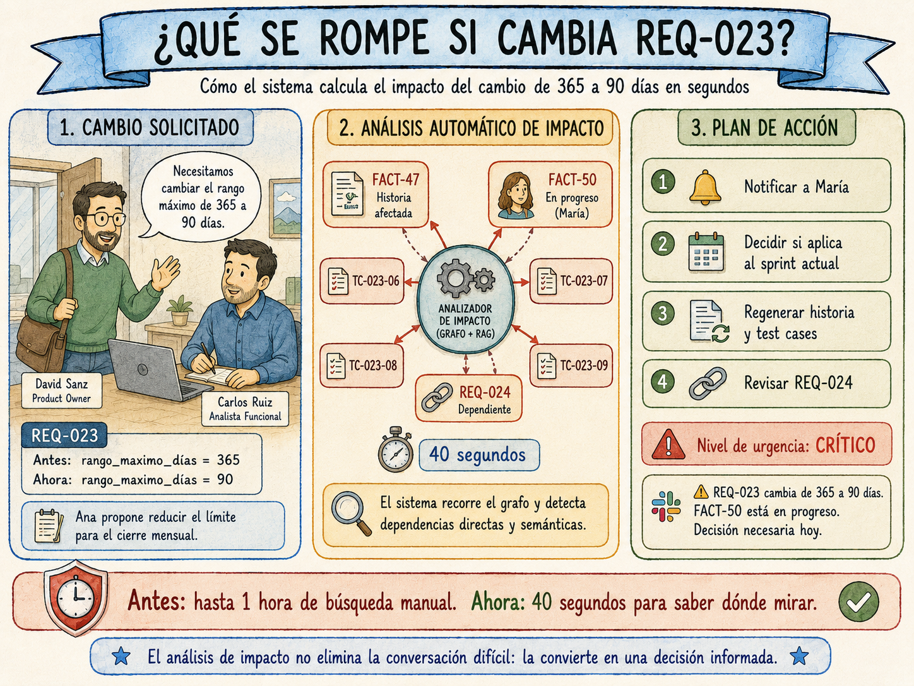
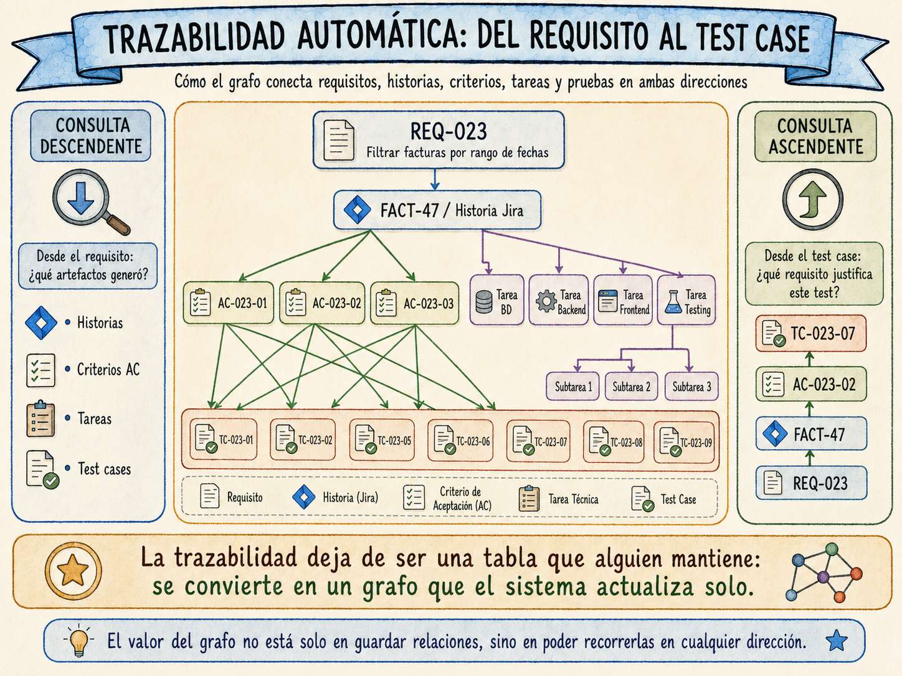

# Capítulo 11. Trazabilidad automática e impacto de cambios

---

*En este capítulo aprenderás:*

- *Por qué la trazabilidad manual siempre fracasa y qué la hace diferente cuando es automática*
- *El modelo de datos del grafo de trazabilidad y cómo construirlo*
- *Cómo navegar la cadena completa desde un bug hasta el requisito que lo originó*
- *Cómo el sistema detecta qué artefactos rompe un cambio antes de que lo haga el equipo*

---

Era el miércoles de la semana once del proyecto cuando David Sanz entró en la sala de reuniones con una expresión que Carlos Ruiz había aprendido a reconocer. No era la cara de «tenemos un problema». Era la cara de «tenemos un problema y necesito saber si es tuyo o mío antes de la siguiente reunión».

«Ana ha pedido cambiar la regla del rango máximo de fechas», dijo David. «De 365 días a 90. Dice que nadie busca facturas de más de un trimestre en el cierre mensual y que el límite actual confunde al equipo.»

Carlos miró la pantalla. REQ-023. El requisito que había recorrido todo el pipeline: validado, aprobado, con su historia en Jira, sus cuatro tareas técnicas y sus nueve test cases en Xray. María García llevaba tres días implementando la tarea de frontend. Lucía había aprobado TC-023-06 y TC-023-07 la tarde anterior, los dos casos de contorno del límite de 365 días.

«¿Cuánto nos afecta?», preguntó David.

En el modelo anterior, Carlos habría necesitado entre veinte minutos y una hora para responder esa pregunta con precisión: buscar manualmente qué historias dependían de REQ-023, revisar qué test cases tocaban la regla del rango, comprobar si había otros requisitos del módulo que mencionaran fechas. Y probablemente se le habría escapado algo.

Con el sistema, la respuesta llegó en cuarenta segundos.

«Un cambio bloqueante», dijo Carlos. «Afecta a la historia FACT-47, que María tiene en progreso ahora mismo. A TC-023-06, TC-023-07, TC-023-08 y TC-023-09, los cuatro casos de contorno, que quedan obsoletos. Y hay un requisito dependiente, REQ-024, que hereda la misma regla y necesita revisión.»

David asintió. «¿Cuánto tarda en regenerar?»

«Depende de lo que decida Ana. Pero si confirma el cambio hoy, mañana por la mañana tenemos la historia actualizada, las tareas técnicas revisadas y los test cases corregidos. María puede continuar con las especificaciones correctas desde el jueves.»

Esa conversación habría sido imposible seis meses antes.



---

## El problema que la trazabilidad manual no puede resolver

Antes de construir el sistema, conviene entender exactamente por qué la alternativa manual está condenada al fracaso desde el principio. No por falta de disciplina ni de buena intención. Por una razón estructural.

La trazabilidad manual tiene coste fijo de creación y coste variable de mantenimiento. Crear la matriz inicial cuando el proyecto arranca cuesta entre cuatro y ocho horas dependiendo del tamaño del backlog. Pero mantenerla actualizada requiere que alguien recuerde actualizarla cada vez que cambia un requisito, se crea una historia, se añade un test case o se vincula un commit. En un equipo Agile con dos o tres sprints activos en paralelo, eso ocurre docenas de veces a la semana.

El resultado predecible es uno de estos tres: la matriz se abandona en el sprint cuatro cuando nadie tiene tiempo de mantenerla; se mantiene con semanas de retraso y refleja el estado de tres sprints atrás; o se convierte en el trabajo de una persona que pasa horas copiando información entre Jira, Excel y Confluence mientras el resto del equipo avanza.

En los tres casos, la trazabilidad existe en el papel pero no responde las preguntas que importan en el momento que importan.

Las preguntas que importan son siempre urgentes y siempre llegan en el peor momento:

- Un test case falla en el pipeline de CI/CD a las 11 de la noche del día anterior a la demo. ¿Qué requisito de negocio está roto?
- El equipo de negocio pide cambiar una regla en un requisito validado. ¿Qué historias en progreso o comprometidas en el sprint actual se ven afectadas?
- Llega una auditoría de calidad y necesitan demostrar que cada historia implementada tiene al menos un test case aprobado. ¿Qué cobertura real tiene el sprint?
- Un bug crítico llega de producción. ¿Qué historia lo implementó, qué criterio de aceptación debería haberlo detectado, y por qué el test case correspondiente no lo atrapó?

El sistema de trazabilidad automática del pipeline responde todas estas preguntas en tiempo real porque no depende de que nadie la actualice: se actualiza sola cada vez que el pipeline genera un artefacto, cada vez que Jira reporta un cambio de estado y cada vez que Xray registra el resultado de una ejecución de pruebas.

---

## El grafo de trazabilidad

La pieza central del sistema de trazabilidad no es una tabla. Es un grafo.

Una tabla plana puede mostrar que REQ-023 se corresponde con FACT-47 y que FACT-47 tiene los test cases TC-023-01 a TC-023-09. Eso es útil. Pero no puede responder preguntas como «¿qué test cases debo ejecutar si modifico el índice de la tabla de facturas en la base de datos?» ni «¿qué requisitos de negocio quedan sin cobertura de pruebas en el sprint actual?». Para esas preguntas necesitas recorrer relaciones en múltiples direcciones, cruzar tipos de artefacto diferentes y aplicar condiciones sobre los nodos intermedios.

Un grafo hace exactamente eso. Los nodos son los artefactos: requisitos, épicas, historias, criterios de aceptación, tareas técnicas, test cases, issues de Jira, commits. Las aristas son las relaciones tipadas entre ellos: `genera`, `verifica`, `implementa`, `descompone`, `depende_de`, `pertenece_a`, `reemplaza`.

```
EPICA EP-04
   │
   │ pertenece_a ←── REQ-023 ──→ genera ──→ US-047 (FACT-47)
   │                    │                      │
   │              deriva_de                 genera ──→ AC-023-01
   │                    │                      │         │
   │                    ↓                      │    verifica ←── TC-023-01
   │              REQ-024 (dependencia)        │
   │                                       descompone ──→ FACT-48 (BD)
   │                                           │    ──→ FACT-49 (backend)
   │                                           │    ──→ FACT-50 (frontend)
   │                                           └──→ FACT-51 (testing)
   │
   └── (otros requisitos del módulo)
```

Lo que hace útil el grafo no es solo almacenar estas relaciones, sino poder recorrerlas eficientemente en ambas direcciones. Desde un requisito hacia abajo para saber qué artefactos generó. Desde un test case hacia arriba para saber qué requisito justifica su existencia. Y desde cualquier punto hacia los lados para detectar inconsistencias con artefactos relacionados del mismo nivel.



### El modelo de datos

El grafo se implementa con dos tablas en PostgreSQL. La elección deliberada es usar la misma base de datos que ya aloja el vector store del capítulo anterior, evitando añadir infraestructura adicional.

```sql
-- Tabla de nodos: cualquier artefacto del proyecto
-- Un nodo puede ser un requisito, una historia, un test case,
-- una tarea técnica, un issue de Jira o un commit
CREATE TABLE nodos_trazabilidad (
    id              TEXT PRIMARY KEY,
    -- Formato según el tipo: REQ-023, US-047, FACT-47, TC-023-01, abc1234...
    tipo            TEXT NOT NULL,
    -- requisito | historia | test_case | tarea | criterio_ac |
    -- issue_jira | commit | epic
    titulo          TEXT,
    estado          TEXT,
    -- El estado refleja el último conocido: To Do, En progreso, Hecho...
    metadatos       JSONB,
    -- Campos específicos por tipo: sprint, story_points, assignee,
    -- componente, rama de código, etc.
    fecha_creacion  TIMESTAMP DEFAULT NOW(),
    fecha_actualizacion TIMESTAMP DEFAULT NOW(),
    activo          BOOLEAN DEFAULT TRUE
    -- FALSE para nodos deprecados: se conservan para trazabilidad histórica
    -- pero no participan en análisis de estado actual
);

-- Tabla de aristas: relaciones tipadas entre artefactos
-- La dirección de la arista tiene semántica: origen → destino
CREATE TABLE aristas_trazabilidad (
    id              SERIAL PRIMARY KEY,
    origen_id       TEXT REFERENCES nodos_trazabilidad(id),
    destino_id      TEXT REFERENCES nodos_trazabilidad(id),
    tipo_relacion   TEXT NOT NULL,
    -- genera | verifica | implementa | descompone | depende_de |
    -- pertenece_a | reemplaza | deriva_de
    confianza       FLOAT DEFAULT 1.0,
    -- 1.0 = relación explícita documentada por el pipeline
    -- 0.7-0.9 = inferida por el sistema RAG con alta similitud
    -- 0.5-0.7 = inferida con similitud media: marcar para revisión
    origen_relacion TEXT,
    -- pipeline_generacion | rag_inference | webhook_jira | manual
    metadatos       JSONB,
    fecha_creacion  TIMESTAMP DEFAULT NOW(),
    activo          BOOLEAN DEFAULT TRUE,
    UNIQUE (origen_id, destino_id, tipo_relacion)
    -- Una relación del mismo tipo entre los mismos nodos no puede existir
    -- dos veces: el pipeline es idempotente gracias a esta restricción
);

-- Índices para recorrer el grafo eficientemente en ambas direcciones
-- Sin estos índices, las consultas de trazabilidad serían lentas
-- a partir de unos pocos cientos de nodos
CREATE INDEX idx_aristas_origen
    ON aristas_trazabilidad (origen_id, tipo_relacion)
    WHERE activo = TRUE;

CREATE INDEX idx_aristas_destino
    ON aristas_trazabilidad (destino_id, tipo_relacion)
    WHERE activo = TRUE;

-- Índice para filtrar nodos por tipo y estado: consultas frecuentes
-- en los informes de cobertura y detección de gaps
CREATE INDEX idx_nodos_tipo_estado
    ON nodos_trazabilidad (tipo, estado)
    WHERE activo = TRUE;

-- Índice GIN sobre metadatos para filtrar por campos arbitrarios
-- como epica, sprint, componente o assignee sin columnas adicionales
CREATE INDEX idx_nodos_metadatos
    ON nodos_trazabilidad USING gin (metadatos)
    WHERE activo = TRUE;
```

> 💡 **Idea clave — Por qué un grafo y no una tabla**
>
> Una tabla de trazabilidad tradicional tiene filas del tipo «REQ-023 → FACT-47 → TC-023-01». Funciona para informes estáticos. Un grafo permite preguntas como «¿qué test cases debo ejecutar si cambio este componente técnico?» o «¿qué requisitos de negocio no tienen ningún test case aprobado en el sprint actual?». Esas preguntas requieren recorrer el grafo en múltiples saltos, cruzar tipos de nodo diferentes y filtrar por estado. Con una tabla plana son inviables en tiempo real.

### Registrar la trazabilidad durante la generación

El motor de trazabilidad se llama automáticamente al final de cada ejecución del pipeline. No requiere ninguna acción manual del analista.

```python
# motor_trazabilidad.py
# Este módulo se llama desde el paso s7_traceability del orquestador
# (Cap. 12). Registra todas las relaciones generadas por el pipeline
# en una única transacción para garantizar consistencia.

import psycopg2
import json
from dataclasses import dataclass
from typing import Optional


@dataclass
class Nodo:
    """Representa cualquier artefacto del proyecto en el grafo."""
    id: str
    tipo: str
    titulo: str = ""
    estado: str = "activo"
    metadatos: dict = None


@dataclass
class Arista:
    """Representa una relación tipada entre dos artefactos."""
    origen_id: str
    destino_id: str
    tipo_relacion: str
    confianza: float = 1.0
    origen_relacion: str = "pipeline_generacion"
    metadatos: dict = None


class MotorTrazabilidad:
    """
    Gestiona el grafo de trazabilidad del proyecto.
    Se llama desde el pipeline de generación y desde los webhooks
    de Jira y Xray para mantener el grafo sincronizado en tiempo real.
    """

    # Tipos de relación válidos con su semántica
    # Documentarlos aquí evita errores de tipeo en el código
    TIPOS_RELACION = {
        "genera":      "Un artefacto origina otro (REQ→US, US→AC, US→TC)",
        "verifica":    "Un test case verifica una historia o criterio AC",
        "implementa":  "Un commit o tarea técnica implementa una historia",
        "descompone":  "Una historia se descompone en tareas técnicas",
        "depende_de":  "Un artefacto requiere que otro esté completado primero",
        "pertenece_a": "Un artefacto pertenece a un módulo o épica",
        "reemplaza":   "Un artefacto nuevo sustituye a uno deprecado",
        "deriva_de":   "Un criterio AC deriva de un requisito concreto",
    }

    def __init__(self, db_config: dict):
        self.db = psycopg2.connect(**db_config)

    def registrar_nodo(self, nodo: Nodo) -> bool:
        """
        Registra o actualiza un nodo en el grafo.
        Usa UPSERT para ser idempotente: llamar dos veces con
        el mismo nodo actualiza el estado, no crea un duplicado.
        """
        with self.db.cursor() as cur:
            cur.execute("""
                INSERT INTO nodos_trazabilidad
                    (id, tipo, titulo, estado, metadatos)
                VALUES (%s, %s, %s, %s, %s)
                ON CONFLICT (id) DO UPDATE SET
                    titulo              = EXCLUDED.titulo,
                    estado              = EXCLUDED.estado,
                    metadatos           = EXCLUDED.metadatos,
                    fecha_actualizacion = NOW()
                RETURNING (xmax = 0) AS es_nuevo
            """, (
                nodo.id,
                nodo.tipo,
                nodo.titulo,
                nodo.estado,
                json.dumps(nodo.metadatos or {})
            ))
            es_nuevo = cur.fetchone()[0]
            self.db.commit()
            return es_nuevo

    def registrar_arista(self, arista: Arista) -> bool:
        """
        Registra una relación entre dos nodos.
        Si ya existe con menor confianza, actualiza al valor más alto.
        Una relación explícita del pipeline (1.0) nunca se degrada
        a una inferida por RAG (0.7-0.9).
        """
        if arista.tipo_relacion not in self.TIPOS_RELACION:
            raise ValueError(
                f"Tipo '{arista.tipo_relacion}' no reconocido. "
                f"Válidos: {list(self.TIPOS_RELACION.keys())}"
            )
        with self.db.cursor() as cur:
            cur.execute("""
                INSERT INTO aristas_trazabilidad
                    (origen_id, destino_id, tipo_relacion,
                     confianza, origen_relacion, metadatos)
                VALUES (%s, %s, %s, %s, %s, %s)
                ON CONFLICT (origen_id, destino_id, tipo_relacion)
                DO UPDATE SET
                    confianza       = GREATEST(
                        aristas_trazabilidad.confianza,
                        EXCLUDED.confianza
                    ),
                    origen_relacion = EXCLUDED.origen_relacion,
                    fecha_creacion  = NOW()
            """, (
                arista.origen_id,
                arista.destino_id,
                arista.tipo_relacion,
                arista.confianza,
                arista.origen_relacion,
                json.dumps(arista.metadatos or {})
            ))
            self.db.commit()
            return True

    def registrar_generacion_completa(
        self,
        requisito_id: str,
        historia_id: str,
        criterios_ac: list[str],
        tareas: list[str],
        test_cases: list[str],
        issue_jira_key: str,
        epica_id: str
    ):
        """
        Registra en una única transacción todas las relaciones
        generadas por el pipeline para un requisito completo.
        Este es el método que llama el orquestador al final
        del paso s7_registro_trazabilidad.
        """
        with self.db.cursor() as cur:
            try:
                # REQ → épica: el requisito pertenece a la épica
                self._upsert_arista(cur,
                    requisito_id, epica_id, "pertenece_a"
                )

                # REQ → historia: el requisito genera la historia
                self._upsert_arista(cur,
                    requisito_id, historia_id, "genera"
                )

                # Historia → épica: la historia también pertenece
                self._upsert_arista(cur,
                    historia_id, epica_id, "pertenece_a"
                )

                # Historia → issue Jira: la historia se vincula al issue
                if issue_jira_key and issue_jira_key != historia_id:
                    self._upsert_arista(cur,
                        historia_id, issue_jira_key, "genera"
                    )

                # Historia → criterios AC: la historia genera los criterios
                for ac_id in criterios_ac:
                    self._upsert_arista(cur,
                        historia_id, ac_id, "genera"
                    )
                    # REQ → criterio: el requisito origina el criterio
                    self._upsert_arista(cur,
                        requisito_id, ac_id, "deriva_de"
                    )

                # Historia → tareas técnicas: se descompone en tareas
                for tarea_id in tareas:
                    self._upsert_arista(cur,
                        historia_id, tarea_id, "descompone"
                    )

                # Test cases → historia: los TCs verifican la historia
                for tc_id in test_cases:
                    self._upsert_arista(cur,
                        tc_id, historia_id, "verifica"
                    )

                self.db.commit()

            except Exception as e:
                self.db.rollback()
                raise RuntimeError(
                    f"Error registrando trazabilidad de {requisito_id}: {e}"
                )

    def _upsert_arista(
        self,
        cur,
        origen: str,
        destino: str,
        tipo: str
    ):
        """Inserta o actualiza una arista dentro de una transacción abierta."""
        cur.execute("""
            INSERT INTO aristas_trazabilidad
                (origen_id, destino_id, tipo_relacion,
                 confianza, origen_relacion)
            VALUES (%s, %s, %s, 1.0, 'pipeline_generacion')
            ON CONFLICT (origen_id, destino_id, tipo_relacion)
            DO UPDATE SET
                confianza       = GREATEST(
                    aristas_trazabilidad.confianza, 1.0
                ),
                fecha_creacion  = NOW()
        """, (origen, destino, tipo))
```

---

## Consultar la trazabilidad: las preguntas que responde el grafo

Con el grafo construido, el sistema puede responder en tiempo real las preguntas que antes requerían búsquedas manuales. Hay tres categorías de consulta que cubren el 90% de los casos de uso reales.

### Consultas descendentes: desde el requisito hacia los artefactos

La más frecuente. David o Carlos quieren saber qué se ha generado a partir de un requisito concreto.

```python
# consultor_trazabilidad.py
# Motor de consulta del grafo. Cada método responde una pregunta
# concreta del equipo sin que el llamador necesite conocer SQL.

class ConsultorTrazabilidad:

    def __init__(self, db_config: dict):
        self.db = psycopg2.connect(**db_config)

    def traza_completa_requisito(self, requisito_id: str) -> dict:
        """
        Retorna la cadena descendente completa de un requisito:
        REQ → US → AC → TC → ejecuciones
             └──→ TK → issue Jira → commit

        Usa un CTE recursivo para recorrer el grafo en profundidad.
        El campo 'nivel' indica a cuántos saltos está cada nodo
        del requisito original.
        """
        with self.db.cursor() as cur:
            cur.execute("""
                WITH RECURSIVE grafo AS (
                    -- Nodo raíz: el requisito de origen
                    SELECT
                        id, tipo, titulo, estado, metadatos,
                        0                   AS nivel,
                        ARRAY[id]           AS camino,
                        NULL::TEXT          AS relacion_con_padre
                    FROM nodos_trazabilidad
                    WHERE id = %s AND activo = TRUE

                    UNION ALL

                    -- Expansión recursiva: seguir todas las aristas
                    -- salientes del nodo actual
                    SELECT
                        n.id, n.tipo, n.titulo, n.estado, n.metadatos,
                        g.nivel + 1,
                        g.camino || n.id,
                        a.tipo_relacion
                    FROM grafo g
                    JOIN aristas_trazabilidad a
                        ON a.origen_id = g.id AND a.activo = TRUE
                    JOIN nodos_trazabilidad n
                        ON n.id = a.destino_id AND n.activo = TRUE
                    WHERE
                        -- Evitar ciclos: no visitar nodos ya visitados
                        NOT (n.id = ANY(g.camino))
                        -- Limitar profundidad a 6 saltos para evitar
                        -- explosión combinatoria en grafos grandes
                        AND g.nivel < 6
                )
                SELECT id, tipo, titulo, estado, metadatos,
                       nivel, relacion_con_padre
                FROM grafo
                ORDER BY nivel, tipo, id
            """, (requisito_id,))

            filas = cur.fetchall()

        return self._estructurar_traza(requisito_id, filas)

    def _estructurar_traza(
        self,
        requisito_id: str,
        filas: list
    ) -> dict:
        """
        Convierte las filas planas del CTE en una estructura jerárquica
        agrupada por tipo de artefacto, con métricas de cobertura.
        """
        resultado = {
            "requisito_id":       requisito_id,
            "epicas":             [],
            "historias":          [],
            "criterios_ac":       [],
            "tareas_tecnicas":    [],
            "test_cases":         [],
            "issues_jira":        [],
            "commits":            [],
        }

        # Mapa de tipo de nodo a clave en el resultado
        mapa_tipo = {
            "epic":         "epicas",
            "historia":     "historias",
            "criterio_ac":  "criterios_ac",
            "tarea":        "tareas_tecnicas",
            "test_case":    "test_cases",
            "issue_jira":   "issues_jira",
            "commit":       "commits",
        }

        for fila in filas:
            nodo_id, tipo, titulo, estado, meta, nivel, relacion = fila
            if nodo_id == requisito_id:
                continue  # El nodo raíz no se incluye en sus propios hijos

            entrada = {
                "id":       nodo_id,
                "titulo":   titulo,
                "estado":   estado,
                "nivel":    nivel,
                "relacion": relacion,
                "meta":     meta,
            }
            clave = mapa_tipo.get(tipo)
            if clave:
                resultado[clave].append(entrada)

        # Calcular métricas de cobertura
        n_ac = len(resultado["criterios_ac"])
        n_tc = len(resultado["test_cases"])

        resultado["metricas"] = {
            "total_criterios_ac":   n_ac,
            "total_test_cases":     n_tc,
            "ratio_tc_por_ac":      round(n_tc / n_ac, 1) if n_ac else 0,
            "tiene_cobertura_test": n_tc > 0,
            "cobertura_estimada": (
                "completa"     if n_tc >= n_ac * 2 else
                "parcial"      if n_tc >= n_ac     else
                "insuficiente"
            ),
        }

        return resultado
```

Para REQ-023, la traza completa produce este resultado:

```
REQ-023 — Filtrar facturas por rango de fechas
│
├── ÉPICA: FACT-12 (EP-04 Gestión de Facturación)
│
├── HISTORIA: FACT-47 — Como gestor de facturación, quiero filtrar...
│   │   estado: En progreso · 5 story points
│   │
│   ├── CRITERIO AC-023-01 — Filtrado válido devuelve resultados
│   │   └── TC-023-01 · TC-023-06 · TC-023-07 · TC-023-08 · TC-023-09
│   │
│   ├── CRITERIO AC-023-02 — Rango >365d bloquea la búsqueda
│   │   └── TC-023-02 · TC-023-07
│   │
│   ├── CRITERIO AC-023-03 — Sin resultados muestra estado vacío
│   │   └── TC-023-05
│   │
│   ├── TAREA FACT-48 — Índice en tabla facturas (BD)
│   ├── TAREA FACT-49 — Endpoint REST de filtrado (backend)
│   ├── TAREA FACT-50 — Componente de filtro por fechas (frontend)
│   │   ├── SUBTAREA — Maqueta y estructura HTML del filtro
│   │   ├── SUBTAREA — Validación client-side del rango
│   │   └── SUBTAREA — Estados de carga y vacío
│   └── TAREA FACT-51 — Pruebas de integración y rendimiento (testing)
│
└── Métricas: 3 AC · 9 TC · ratio 3,0 · cobertura completa
```

### Consultas ascendentes: desde el artefacto hacia el requisito

La segunda categoría es igualmente frecuente pero ocurre en el peor momento posible: cuando hay un fallo.

```python
    def origen_de_test_case(self, tc_id: str) -> dict:
        """
        Dado un test case que ha fallado (por ejemplo en CI/CD),
        retorna la cadena ascendente hasta el requisito de negocio.

        Responde la pregunta: ¿qué requisito justifica este test
        y qué criterio de aceptación ha fallado?
        """
        with self.db.cursor() as cur:
            cur.execute("""
                WITH RECURSIVE ascendente AS (
                    SELECT id, tipo, titulo, estado,
                           0 AS nivel, ARRAY[id] AS camino
                    FROM nodos_trazabilidad
                    WHERE id = %s AND activo = TRUE

                    UNION ALL

                    SELECT n.id, n.tipo, n.titulo, n.estado,
                           a.nivel + 1, a.camino || n.id
                    FROM ascendente a
                    -- En dirección ascendente: seguimos las aristas
                    -- donde el nodo actual es el DESTINO
                    JOIN aristas_trazabilidad ar
                        ON ar.destino_id = a.id AND ar.activo = TRUE
                    JOIN nodos_trazabilidad n
                        ON n.id = ar.origen_id AND n.activo = TRUE
                    WHERE
                        NOT (n.id = ANY(a.camino))
                        AND a.nivel < 5
                )
                SELECT id, tipo, titulo, estado, nivel
                FROM ascendente
                ORDER BY nivel
            """, (tc_id,))

            cadena = cur.fetchall()

        # Extraer el requisito y la historia del resultado
        requisito = next(
            (f[0] for f in cadena if f[1] == "requisito"), None
        )
        historia = next(
            (f[0] for f in cadena if f[1] == "historia"), None
        )

        return {
            "test_case_id":      tc_id,
            "cadena_ascendente": [
                {"id": f[0], "tipo": f[1], "titulo": f[2],
                 "estado": f[3], "nivel": f[4]}
                for f in cadena
            ],
            "requisito_origen":  requisito,
            "historia_origen":   historia,
        }

    def test_cases_de_componente(
        self,
        componente: str,
        solo_fallidos: bool = False
    ) -> dict:
        """
        Dado un componente técnico ('api-facturacion', 'frontend-facturas'),
        retorna todos los test cases que verifican funcionalidad
        implementada en ese componente.

        Responde: ¿qué tests debo ejecutar si modifico este componente?
        """
        with self.db.cursor() as cur:
            filtro_estado = (
                "AND n_tc.estado = 'fallido'" if solo_fallidos else ""
            )
            cur.execute(f"""
                SELECT DISTINCT
                    n_tc.id, n_tc.titulo, n_tc.estado,
                    n_tc.metadatos,
                    n_us.id, n_us.titulo,
                    n_req.id, n_req.titulo
                FROM nodos_trazabilidad n_tk
                -- Tareas que pertenecen al componente buscado
                JOIN aristas_trazabilidad a_us_tk
                    ON a_us_tk.destino_id = n_tk.id
                    AND a_us_tk.tipo_relacion = 'descompone'
                JOIN nodos_trazabilidad n_us
                    ON n_us.id = a_us_tk.origen_id
                    AND n_us.tipo = 'historia'
                -- Test cases que verifican esa historia
                JOIN aristas_trazabilidad a_tc_us
                    ON a_tc_us.destino_id = n_us.id
                    AND a_tc_us.tipo_relacion = 'verifica'
                JOIN nodos_trazabilidad n_tc
                    ON n_tc.id = a_tc_us.origen_id
                    AND n_tc.tipo = 'test_case'
                    {filtro_estado}
                -- Requisito que originó la historia
                JOIN aristas_trazabilidad a_req_us
                    ON a_req_us.destino_id = n_us.id
                    AND a_req_us.tipo_relacion = 'genera'
                JOIN nodos_trazabilidad n_req
                    ON n_req.id = a_req_us.origen_id
                    AND n_req.tipo = 'requisito'
                WHERE
                    n_tk.tipo = 'tarea'
                    AND n_tk.metadatos->>'componente' = %s
                    AND n_tk.activo = TRUE
                ORDER BY n_req.id, n_us.id, n_tc.id
            """, (componente,))

            filas = cur.fetchall()

        return {
            "componente":       componente,
            "total_test_cases": len(filas),
            "test_cases": [
                {
                    "tc_id":              f[0],
                    "titulo":             f[1],
                    "estado":             f[2],
                    "automatizable":      (f[3] or {}).get(
                                              "automatizable", False
                                          ),
                    "historia_id":        f[4],
                    "historia_titulo":    f[5],
                    "requisito_id":       f[6],
                    "requisito_titulo":   f[7],
                }
                for f in filas
            ],
        }
```

### Detección de gaps: lo que falta

La tercera categoría es la que más valora David Sanz: saber qué falta antes de que lo encuentre la auditoría.

```python
    def gaps_de_trazabilidad(self, epica_id: str) -> dict:
        """
        Identifica todos los gaps de trazabilidad en una épica:
        requisitos sin historia, historias sin test cases,
        criterios sin cobertura, historias sin issue Jira.

        Esta consulta se ejecuta automáticamente al inicio de cada
        sprint como parte del informe de estado de la épica.
        """
        gaps = {
            "epica_id":                  epica_id,
            "requisitos_sin_historia":   [],
            "historias_sin_test_cases":  [],
            "criterios_sin_test_case":   [],
            "historias_sin_issue_jira":  [],
        }

        with self.db.cursor() as cur:

            # Gap 1: requisitos sin historia generada
            # Son los requisitos validados que nunca entraron al pipeline
            # o que el pipeline procesó pero no generó historia por error
            cur.execute("""
                SELECT n.id, n.titulo, n.estado
                FROM nodos_trazabilidad n
                WHERE n.tipo = 'requisito'
                  AND n.activo = TRUE
                  AND n.metadatos->>'epica' = %s
                  AND n.estado IN ('en-revision', 'validado')
                  AND NOT EXISTS (
                      SELECT 1 FROM aristas_trazabilidad a
                      WHERE a.origen_id = n.id
                        AND a.tipo_relacion = 'genera'
                        AND a.activo = TRUE
                  )
            """, (epica_id,))
            gaps["requisitos_sin_historia"] = [
                {"id": f[0], "titulo": f[1], "estado": f[2]}
                for f in cur.fetchall()
            ]

            # Gap 2: historias sin test cases
            # Son las historias que se generaron y se empujaron a Jira
            # pero no tienen ningún test case asociado todavía
            cur.execute("""
                SELECT n.id, n.titulo, n.estado,
                       n.metadatos->>'sprint' AS sprint
                FROM nodos_trazabilidad n
                WHERE n.tipo = 'historia'
                  AND n.activo = TRUE
                  AND n.metadatos->>'epica' = %s
                  AND NOT EXISTS (
                      SELECT 1 FROM aristas_trazabilidad a
                      WHERE a.destino_id = n.id
                        AND a.tipo_relacion = 'verifica'
                        AND a.activo = TRUE
                  )
            """, (epica_id,))
            gaps["historias_sin_test_cases"] = [
                {"id": f[0], "titulo": f[1],
                 "estado": f[2], "sprint": f[3]}
                for f in cur.fetchall()
            ]

            # Gap 3: criterios de aceptación sin test case
            # Son los criterios escritos en los requisitos que no se
            # han cubierto todavía con ningún test case
            cur.execute("""
                SELECT n_ac.id, n_ac.titulo, n_req.id AS req_id
                FROM nodos_trazabilidad n_ac
                JOIN aristas_trazabilidad a
                    ON a.destino_id = n_ac.id
                    AND a.tipo_relacion = 'deriva_de'
                JOIN nodos_trazabilidad n_req
                    ON n_req.id = a.origen_id
                    AND n_req.metadatos->>'epica' = %s
                WHERE n_ac.tipo = 'criterio_ac'
                  AND n_ac.activo = TRUE
                  AND NOT EXISTS (
                      SELECT 1 FROM aristas_trazabilidad a2
                      WHERE a2.origen_id = n_ac.id
                        AND a2.tipo_relacion = 'verifica'
                        AND a2.activo = TRUE
                  )
            """, (epica_id,))
            gaps["criterios_sin_test_case"] = [
                {"ac_id": f[0], "titulo": f[1], "requisito_id": f[2]}
                for f in cur.fetchall()
            ]

            # Gap 4: historias sin issue de Jira vinculado
            # Indica que el pipeline generó la historia pero el push
            # a Jira falló o no se ejecutó todavía
            cur.execute("""
                SELECT n.id, n.titulo
                FROM nodos_trazabilidad n
                WHERE n.tipo = 'historia'
                  AND n.activo = TRUE
                  AND n.metadatos->>'epica' = %s
                  AND NOT EXISTS (
                      SELECT 1 FROM aristas_trazabilidad a
                      WHERE a.origen_id = n.id
                        AND a.tipo_relacion = 'genera'
                        AND a.activo = TRUE
                  )
            """, (epica_id,))
            gaps["historias_sin_issue_jira"] = [
                {"id": f[0], "titulo": f[1]}
                for f in cur.fetchall()
            ]

        # Calcular el nivel de riesgo global para el informe
        total_gaps = sum(len(v) for v in gaps.values() if isinstance(v, list))
        gaps["resumen"] = {
            "total_gaps":      total_gaps,
            "nivel_riesgo": (
                "critico"  if total_gaps > 10 else
                "alto"     if total_gaps > 5  else
                "medio"    if total_gaps > 2  else
                "bajo"
            ),
            "gap_principal": (
                "Requisitos sin historia"
                if gaps["requisitos_sin_historia"] else
                "Criterios AC sin test case"
                if gaps["criterios_sin_test_case"] else
                "Historias sin test cases"
                if gaps["historias_sin_test_cases"] else
                "Sin gaps críticos"
            ),
        }

        return gaps
```

---

## La detección de impacto de cambios

La trazabilidad permite reconstruir el pasado. La detección de impacto de cambios permite anticipar el futuro. Cuando el negocio pide modificar un requisito validado, el sistema calcula automáticamente qué artefactos quedan afectados antes de que nadie tenga que buscarlos manualmente.

La conversación entre Carlos y David con la que abría este capítulo es el resultado de este mecanismo funcionando en producción.

### Por qué el impacto de los cambios es difícil de calcular manualmente

El problema no es encontrar los artefactos directamente vinculados a un requisito. Esos están en la traza descendente y se pueden recuperar en segundos. El problema son las dependencias indirectas.

Cuando REQ-023 cambia el rango máximo de 365 días a 90 días, los efectos directos son evidentes: la historia FACT-47 cambia, los test cases de contorno TC-023-06 a TC-023-09 quedan obsoletos. Pero también puede ocurrir que REQ-024, otro requisito del mismo módulo, tenga una regla de negocio que dice «el rango de exportación no puede superar el rango de búsqueda». Si nadie ha documentado esa dependencia explícitamente, el analista la descubre tres días después, en el refinamiento del siguiente sprint.

El sistema combina el grafo de trazabilidad explícita con las consultas de similitud semántica del sistema RAG del capítulo anterior para detectar exactamente estos casos.

### El motor de análisis de impacto

```python
# analizador_impacto.py
# Se ejecuta automáticamente cuando el estado de un requisito
# cambia a 'en-revision' con una versión mayor que la anterior.

from dataclasses import dataclass
from typing import Optional
import asyncio


@dataclass
class ArtefactoAfectado:
    """
    Describe un artefacto que puede verse afectado por un cambio
    en un requisito. Incluye el motivo y la acción recomendada.
    """
    tipo:               str  # historia | test_case | requisito | tarea
    id:                 str
    titulo:             str
    razon_impacto:      str
    accion_recomendada: str
    urgencia:           str  # inmediata | proxima_iteracion | monitorizar
    similitud:          float  # 1.0 si es dependencia directa, 0.7-0.9 si es inferida


class AnalizadorImpacto:
    """
    Combina el grafo de trazabilidad (relaciones explícitas) y el
    sistema RAG (similitud semántica) para calcular el impacto completo
    de un cambio en un requisito validado.
    """

    def __init__(self, consultor: ConsultorTrazabilidad, motor_rag):
        self.consultor  = consultor
        self.motor_rag  = motor_rag

    async def analizar(
        self,
        requisito_id: str,
        campo_modificado: str,
        valor_anterior: str,
        valor_nuevo: str,
        yaml_nuevo: dict
    ) -> dict:
        """
        Punto de entrada del análisis.
        Retorna el informe de impacto con todos los artefactos afectados
        y el plan de acción priorizado.
        """
        # Ejecutar los tres análisis en paralelo para reducir latencia
        historias, test_cases, requisitos_dependientes = await asyncio.gather(
            self._historias_afectadas(
                requisito_id, campo_modificado, valor_nuevo
            ),
            self._test_cases_afectados(
                requisito_id, campo_modificado, valor_anterior
            ),
            self._requisitos_dependientes(
                requisito_id, campo_modificado, valor_nuevo
            ),
        )

        # Verificar si hay issues en el sprint activo: máxima urgencia
        issues_sprint = self._issues_en_sprint_activo(requisito_id)

        # Generar el plan de acción con el LLM
        plan = await self._generar_plan_accion(
            requisito_id, campo_modificado,
            valor_anterior, valor_nuevo,
            historias, test_cases, requisitos_dependientes,
            issues_sprint
        )

        return self._ensamblar_informe(
            requisito_id, campo_modificado,
            valor_anterior, valor_nuevo,
            historias, test_cases, requisitos_dependientes,
            issues_sprint, plan
        )

    async def _historias_afectadas(
        self,
        requisito_id: str,
        campo_modificado: str,
        valor_nuevo: str
    ) -> list[ArtefactoAfectado]:
        """
        Combina dos estrategias para encontrar historias afectadas:
        1. Búsqueda directa por referencia al requisito en el grafo
        2. Búsqueda semántica por similitud con el cambio en el RAG
        """
        afectadas = []
        vistas = set()

        # Estrategia 1: dependencia directa en el grafo
        traza = self.consultor.traza_completa_requisito(requisito_id)
        for historia in traza.get("historias", []):
            if historia["id"] not in vistas:
                vistas.add(historia["id"])
                afectadas.append(ArtefactoAfectado(
                    tipo="historia",
                    id=historia["id"],
                    titulo=historia["titulo"],
                    razon_impacto=(
                        f"Historia generada directamente desde {requisito_id}. "
                        f"El campo '{campo_modificado}' ha cambiado a: {valor_nuevo}"
                    ),
                    accion_recomendada="Regenerar historia automáticamente",
                    urgencia="inmediata",
                    similitud=1.0,
                ))

        # Estrategia 2: similitud semántica en el RAG
        # Busca historias de otros requisitos que compartan contexto
        # con el cambio realizado
        query_cambio = (
            f"Historia que implementa la regla: {campo_modificado} = {valor_nuevo}"
        )
        resultados_rag = self.motor_rag.buscar_por_similitud(
            query_texto=query_cambio,
            filtros={"chunk_tipo": "identidad", "estado": "validado"},
            top_k=5
        )
        for r in resultados_rag:
            req_id_r = r.metadatos.get("requisito_id")
            if req_id_r != requisito_id and r.similitud > 0.80:
                if r.chunk_id not in vistas:
                    vistas.add(r.chunk_id)
                    afectadas.append(ArtefactoAfectado(
                        tipo="historia",
                        id=req_id_r,
                        titulo=r.texto[:100],
                        razon_impacto=(
                            f"Semánticamente relacionada con el cambio "
                            f"en '{campo_modificado}'"
                        ),
                        accion_recomendada=(
                            "Revisar manualmente antes del próximo refinamiento"
                        ),
                        urgencia="proxima_iteracion",
                        similitud=r.similitud,
                    ))

        return sorted(afectadas, key=lambda x: x.similitud, reverse=True)

    async def _test_cases_afectados(
        self,
        requisito_id: str,
        campo_modificado: str,
        valor_anterior: str
    ) -> list[ArtefactoAfectado]:
        """
        Identifica los test cases que verificaban el comportamiento anterior.
        Son los que quedarán obsoletos si se aprueba el cambio.
        """
        afectados = []
        traza = self.consultor.traza_completa_requisito(requisito_id)

        for tc in traza.get("test_cases", []):
            # Un test case queda potencialmente obsoleto si:
            # - Menciona el valor anterior del campo en sus datos de prueba
            # - O está vinculado a un criterio AC que toca el campo cambiado
            metadatos = tc.get("meta") or {}
            datos_prueba = str(metadatos.get("datos_prueba", ""))

            if (
                str(valor_anterior) in datos_prueba or
                campo_modificado in tc.get("titulo", "").lower()
            ):
                afectados.append(ArtefactoAfectado(
                    tipo="test_case",
                    id=tc["id"],
                    titulo=tc["titulo"],
                    razon_impacto=(
                        f"Los datos de prueba referencian el valor "
                        f"anterior de '{campo_modificado}': {valor_anterior}"
                    ),
                    accion_recomendada=(
                        "Regenerar test case desde el criterio actualizado"
                    ),
                    urgencia="inmediata",
                    similitud=1.0,
                ))

        return afectados

    async def _requisitos_dependientes(
        self,
        requisito_id: str,
        campo_modificado: str,
        valor_nuevo: str
    ) -> list[ArtefactoAfectado]:
        """
        Busca requisitos que declararon dependencia explícita con el
        modificado O que comparten reglas de negocio similares.
        """
        dependientes = []
        vistas = set()

        # Dependencias explícitas en el grafo
        with self.consultor.db.cursor() as cur:
            cur.execute("""
                SELECT DISTINCT metadatos->>'requisito_id', texto
                FROM nodos_trazabilidad n
                WHERE n.metadatos->'dependencias'->'requisitos' ? %s
                  AND n.activo = TRUE
            """, (requisito_id,))
            for req_id_dep, texto in cur.fetchall():
                if req_id_dep not in vistas:
                    vistas.add(req_id_dep)
                    dependientes.append(ArtefactoAfectado(
                        tipo="requisito",
                        id=req_id_dep,
                        titulo=texto[:100],
                        razon_impacto=(
                            f"Declara dependencia explícita con {requisito_id}"
                        ),
                        accion_recomendada=(
                            "Revisar si el cambio en "
                            f"'{campo_modificado}' afecta a sus criterios AC"
                        ),
                        urgencia="proxima_iteracion",
                        similitud=1.0,
                    ))

        # Similitud semántica en reglas de negocio
        resultados_rag = self.motor_rag.buscar_por_similitud(
            query_texto=f"regla de negocio: {campo_modificado} = {valor_nuevo}",
            filtros={"chunk_tipo": "reglas_negocio", "estado": "validado"},
            top_k=4
        )
        for r in resultados_rag:
            req_id_r = r.metadatos.get("requisito_id")
            if req_id_r and req_id_r != requisito_id and req_id_r not in vistas:
                if r.similitud > 0.80:
                    vistas.add(req_id_r)
                    dependientes.append(ArtefactoAfectado(
                        tipo="requisito",
                        id=req_id_r,
                        titulo=r.texto[:100],
                        razon_impacto=(
                            f"Reglas de negocio similares al campo cambiado: "
                            f"'{campo_modificado}'"
                        ),
                        accion_recomendada=(
                            "Verificar coherencia con la nueva regla"
                        ),
                        urgencia="proxima_iteracion",
                        similitud=r.similitud,
                    ))

        return sorted(dependientes, key=lambda x: x.similitud, reverse=True)

    def _issues_en_sprint_activo(self, requisito_id: str) -> list[dict]:
        """
        Consulta Jira para verificar si hay issues del sprint activo
        vinculados al requisito modificado. Si los hay, el impacto
        es crítico: el equipo puede estar trabajando sobre información
        desactualizada en este momento.
        """
        # En producción: llamada a la Jira API con JQL
        # jql: project = FACT AND sprint in openSprints()
        #      AND "Requisito Origen" ~ "REQ-023"
        # Por brevedad se omite el código de la llamada HTTP
        # (idéntico al patrón del Cap. 10 y Cap. 12)
        return []

    def _ensamblar_informe(
        self,
        requisito_id: str,
        campo_modificado: str,
        valor_anterior,
        valor_nuevo,
        historias: list,
        test_cases: list,
        requisitos: list,
        issues_sprint: list,
        plan: dict
    ) -> dict:
        """Construye el JSON del informe de impacto."""
        nivel = (
            "CRITICO"  if issues_sprint and (historias or test_cases) else
            "ALTO"     if historias or test_cases else
            "MEDIO"    if requisitos else
            "BAJO"
        )
        return {
            "informe_impacto": {
                "requisito_id":        requisito_id,
                "campo_modificado":    campo_modificado,
                "valor_anterior":      str(valor_anterior),
                "valor_nuevo":         str(valor_nuevo),
                "nivel_urgencia":      nivel,
                "issues_en_sprint":    issues_sprint,
                "artefactos_afectados": {
                    "historias":               [
                        {"id": a.id, "razon": a.razon_impacto,
                         "accion": a.accion_recomendada,
                         "urgencia": a.urgencia}
                        for a in historias
                    ],
                    "test_cases":              [
                        {"id": a.id, "razon": a.razon_impacto,
                         "accion": a.accion_recomendada,
                         "urgencia": a.urgencia}
                        for a in test_cases
                    ],
                    "requisitos_dependientes": [
                        {"id": a.id, "razon": a.razon_impacto,
                         "accion": a.accion_recomendada}
                        for a in requisitos
                    ],
                },
                "plan_accion": plan,
                "estadisticas": {
                    "total_artefactos_afectados": (
                        len(historias) + len(test_cases) + len(requisitos)
                    ),
                    "requiere_decision_po": nivel in ("CRITICO", "ALTO"),
                },
            }
        }
```

### El prompt de plan de acción

Cuando el analizador tiene la lista de artefactos afectados, llama al LLM para generar el plan de acción en lenguaje natural. El LLM no analiza el código ni los artefactos: sintetiza los datos que el sistema ya ha calculado y los convierte en pasos concretos con responsables y plazos.

---

📋 **Prompt de IA — Plan de acción para impacto de cambios**

```
Eres un gestor de proyectos Agile senior. Se ha detectado un cambio
en el requisito {{requisito_id}}: el campo '{{campo_modificado}}'
cambia de '{{valor_anterior}}' a '{{valor_nuevo}}'.

ARTEFACTOS AFECTADOS (calculados por el sistema de trazabilidad):
- Historias afectadas: {{n_historias}} ({{urgencia_historias}})
- Test cases afectados: {{n_test_cases}} ({{urgencia_test_cases}})
- Requisitos dependientes: {{n_requisitos}}
{{#issues_sprint}}
⚠ HAY ISSUES EN EL SPRINT ACTIVO: {{issues_sprint}}
{{/issues_sprint}}

Genera el plan de acción en JSON con esta estructura:

{
  "resumen_ejecutivo": "[2-3 frases del impacto. Sin tecnicismos.]",
  "nivel_riesgo": "critico | alto | medio | bajo",
  "acciones": [
    {
      "orden": 1,
      "tipo": "notificar | regenerar | revisar | decidir",
      "descripcion": "[Qué hacer exactamente]",
      "responsable": "analista | product_owner | tech_lead | qa_lead",
      "plazo": "inmediato | antes_del_siguiente_sprint | proxima_iteracion",
      "como_hacerlo": "[Instrucción concreta]"
    }
  ],
  "decision_requerida": {
    "necesaria": true | false,
    "pregunta": "[La pregunta que debe responder el PO]",
    "opciones": ["[Opción A]", "[Opción B]"],
    "impacto_de_no_decidir": "[Qué ocurre si no se decide]"
  },
  "mensaje_slack": "[2 líneas para el canal del equipo. Sin tecnicismos.]"
}

REGLAS:
- Si hay issues en el sprint activo, la primera acción siempre es notificar
  a la persona asignada.
- Las acciones van ordenadas por urgencia, no por tipo.
- El mensaje de Slack es para el channel #desarrollo: breve y accionable.
```

---

Para el caso de REQ-023 con el cambio de 365 a 90 días, el informe completo que recibió Carlos en cuarenta segundos era este:

```json
{
  "informe_impacto": {
    "requisito_id": "REQ-023",
    "campo_modificado": "rango_maximo_dias",
    "valor_anterior": "365",
    "valor_nuevo": "90",
    "nivel_urgencia": "CRITICO",
    "issues_en_sprint": [
      {
        "key":         "FACT-50",
        "summary":     "Implementar componente de filtrado por fechas",
        "status":      "En progreso",
        "asignado_a":  "María García"
      }
    ],
    "artefactos_afectados": {
      "historias": [
        {
          "id":       "FACT-47",
          "razon":    "Historia generada directamente desde REQ-023. El campo 'rango_maximo_dias' cambia a 90",
          "accion":   "Regenerar historia automáticamente",
          "urgencia": "inmediata"
        }
      ],
      "test_cases": [
        { "id": "TC-023-06", "razon": "Datos de prueba referencian valor anterior: 364 días", "accion": "Regenerar", "urgencia": "inmediata" },
        { "id": "TC-023-07", "razon": "Datos de prueba referencian valor anterior: 366 días", "accion": "Regenerar", "urgencia": "inmediata" },
        { "id": "TC-023-08", "razon": "Datos de prueba referencian valor anterior: 365 días", "accion": "Regenerar", "urgencia": "inmediata" },
        { "id": "TC-023-09", "razon": "Datos de prueba referencian valor anterior: -1 días",  "accion": "Revisar",   "urgencia": "proxima_iteracion" }
      ],
      "requisitos_dependientes": [
        {
          "id":     "REQ-024",
          "razon":  "Regla de negocio similar: 'rango de exportación ≤ rango de búsqueda'",
          "accion": "Verificar coherencia con la nueva regla de 90 días"
        }
      ]
    },
    "plan_accion": {
      "resumen_ejecutivo": "El cambio de 365 a 90 días es bloqueante para el sprint actual. María García está implementando FACT-50 con el límite anterior. Necesitamos una decisión del PO sobre si el cambio aplica al sprint actual o al siguiente antes del final del día.",
      "nivel_riesgo": "critico",
      "acciones": [
        {
          "orden": 1,
          "tipo": "notificar",
          "descripcion": "Informar a María García del cambio antes de que avance en la implementación",
          "responsable": "analista",
          "plazo": "inmediato",
          "como_hacerlo": "Comentar en FACT-50 con el texto: '[CAMBIO EN REQUISITO] REQ-023 cambia el rango máximo de 365 a 90 días. Esperar confirmación del PO antes de continuar.'"
        },
        {
          "orden": 2,
          "tipo": "decidir",
          "descripcion": "El PO decide si el cambio aplica al sprint actual o al siguiente",
          "responsable": "product_owner",
          "plazo": "inmediato",
          "como_hacerlo": "Consulta rápida de 15 minutos con Ana López. Registrar la decisión en REQ-023 como nota de cambio de versión."
        },
        {
          "orden": 3,
          "tipo": "regenerar",
          "descripcion": "Regenerar FACT-47 y los test cases TC-023-06, TC-023-07 y TC-023-08 con el nuevo límite de 90 días",
          "responsable": "analista",
          "plazo": "antes_del_siguiente_sprint",
          "como_hacerlo": "python orchestrator.py --req REQ-023 --desde s4_generacion_artefactos"
        },
        {
          "orden": 4,
          "tipo": "revisar",
          "descripcion": "Verificar REQ-024: su regla 'rango de exportación ≤ rango de búsqueda' puede heredar el nuevo límite de 90 días",
          "responsable": "analista",
          "plazo": "proxima_iteracion",
          "como_hacerlo": "Revisar REQ-024 con Ana López en la próxima sesión de refinamiento."
        }
      ],
      "decision_requerida": {
        "necesaria": true,
        "pregunta": "¿El cambio del rango máximo de 365 a 90 días aplica al sprint actual o entra en el siguiente sprint?",
        "opciones": [
          "Sprint actual: pausar FACT-50 hasta regenerar los artefactos (impacta la velocidad del sprint)",
          "Siguiente sprint: María continúa con 365 días; el cambio entra en el sprint siguiente"
        ],
        "impacto_de_no_decidir": "María puede entregar FACT-50 implementando el límite de 365 días, que QA rechazará en cuanto se actualicen los test cases."
      },
      "mensaje_slack": "⚠ REQ-023 cambia el rango de búsqueda de 365 a 90 días. FACT-50 está en progreso (María). Necesito decisión de @david_sanz antes del mediodía: ¿sprint actual o siguiente? @maria_garcia espera antes de avanzar."
    },
    "estadisticas": {
      "total_artefactos_afectados": 6,
      "requiere_decision_po": true
    }
  }
}
```

> 🛠️ **En la práctica — La decisión de David y lo que ocurrió después**
>
> David eligió la opción B: el cambio entraría en el sprint siguiente. María continuó implementando FACT-50 con el límite de 365 días tal como estaba especificado. Carlos actualizó REQ-023, ejecutó `python orchestrator.py --req REQ-023 --desde s4_generacion_artefactos` para regenerar los artefactos y los añadió al backlog del sprint siguiente.
>
> Total de tiempo empleado en gestionar el cambio: 22 minutos, incluyendo la conversación con David. En el modelo anterior, la misma situación habría costado al menos dos horas y casi con certeza habría producido test cases desactualizados en Xray que nadie habría detectado hasta el sprint siguiente.

---

## La matriz de trazabilidad: el informe que nadie actualiza manualmente

La matriz de trazabilidad es el artefacto que más tiempo consume cuando se mantiene a mano y el primero que se abandona en cuanto el proyecto acelera. Con el grafo siempre actualizado, generarla es una consulta, no un proyecto.

```python
# generador_matriz.py
# Genera la matriz de trazabilidad completa de una épica
# en formato Markdown o CSV exportable a Confluence y Excel.

class GeneradorMatriz:

    def __init__(self, consultor: ConsultorTrazabilidad):
        self.consultor = consultor

    def generar_tabla_epica(self, epica_id: str) -> list[dict]:
        """
        Genera la tabla plana de la matriz con una fila por
        criterio de aceptación. Formato exportable a CSV y Confluence.
        """
        # Obtener todos los requisitos de la épica
        with self.consultor.db.cursor() as cur:
            cur.execute("""
                SELECT id FROM nodos_trazabilidad
                WHERE tipo = 'requisito'
                  AND metadatos->>'epica' = %s
                  AND activo = TRUE
                ORDER BY id
            """, (epica_id,))
            req_ids = [f[0] for f in cur.fetchall()]

        filas = []
        for req_id in req_ids:
            traza = self.consultor.traza_completa_requisito(req_id)
            issue_jira = next(
                (i["id"] for i in traza.get("issues_jira", [])), "❌ Sin issue"
            )

            if not traza.get("historias"):
                # El requisito no tiene historia: gap de trazabilidad
                filas.append({
                    "requisito_id":  req_id,
                    "historia_id":   "❌ Sin historia",
                    "criterio_ac":   "—",
                    "test_case_id":  "—",
                    "estado_tc":     "—",
                    "issue_jira":    "—",
                    "cobertura":     "sin_historia",
                })
                continue

            for historia in traza["historias"]:
                if not traza.get("criterios_ac"):
                    # La historia existe pero no tiene criterios de aceptación
                    filas.append({
                        "requisito_id": req_id,
                        "historia_id":  historia["id"],
                        "criterio_ac":  "❌ Sin AC",
                        "test_case_id": "—",
                        "estado_tc":    "—",
                        "issue_jira":   issue_jira,
                        "cobertura":    "sin_ac",
                    })
                    continue

                for ac in traza["criterios_ac"]:
                    # Test cases que verifican este criterio específico
                    tcs_del_ac = [
                        tc for tc in traza["test_cases"]
                        if ac["id"] in str(
                            (tc.get("meta") or {}).get("criterio_origen", "")
                        )
                    ]

                    if not tcs_del_ac:
                        filas.append({
                            "requisito_id": req_id,
                            "historia_id":  historia["id"],
                            "criterio_ac":  ac["id"],
                            "test_case_id": "❌ Sin TC",
                            "estado_tc":    "—",
                            "issue_jira":   issue_jira,
                            "cobertura":    "sin_test",
                        })
                    else:
                        for tc in tcs_del_ac:
                            filas.append({
                                "requisito_id": req_id,
                                "historia_id":  historia["id"],
                                "criterio_ac":  ac["id"],
                                "test_case_id": tc["id"],
                                "estado_tc":    tc.get("estado", "pendiente"),
                                "issue_jira":   issue_jira,
                                "cobertura":    "completa",
                            })

        return filas

    def exportar_markdown(self, epica_id: str) -> str:
        """
        Genera la matriz en formato Markdown para publicar
        en Confluence o en el repositorio Git del proyecto.
        """
        tabla = self.generar_tabla_epica(epica_id)
        gaps  = self.consultor.gaps_de_trazabilidad(epica_id)

        iconos_cobertura = {
            "completa":    "✅",
            "sin_historia": "❌",
            "sin_ac":      "⚠️",
            "sin_test":    "🔴",
        }

        # Cabecera de la tabla
        md = f"# Matriz de trazabilidad — {epica_id}\n\n"
        md += (
            "| Requisito | Historia | Criterio AC | "
            "Test Case | Estado TC | Issue Jira | Cobertura |\n"
        )
        md += "|---|---|---|---|---|---|---|\n"

        for fila in tabla:
            icono = iconos_cobertura.get(fila["cobertura"], "?")
            md += (
                f"| {fila['requisito_id']} "
                f"| {fila['historia_id']} "
                f"| {fila['criterio_ac']} "
                f"| {fila['test_case_id']} "
                f"| {fila['estado_tc']} "
                f"| {fila['issue_jira']} "
                f"| {icono} {fila['cobertura']} |\n"
            )

        # Resumen de gaps al pie de la tabla
        resumen = gaps["resumen"]
        md += f"\n**Nivel de riesgo:** `{resumen['nivel_riesgo'].upper()}`"
        md += f" · **Gap principal:** {resumen['gap_principal']}\n"

        return md
```

La matriz generada para EP-04 con cuatro requisitos tiene este aspecto en Confluence:

```
# Matriz de trazabilidad — EP-04

| Requisito | Historia  | Criterio AC | Test Case  | Estado TC | Issue Jira | Cobertura    |
|-----------|-----------|-------------|------------|-----------|------------|--------------|
| REQ-021   | US-045    | AC-021-01   | TC-021-01  | pasado    | FACT-41    | ✅ completa  |
| REQ-021   | US-045    | AC-021-02   | TC-021-02  | pasado    | FACT-41    | ✅ completa  |
| REQ-021   | US-045    | AC-021-03   | ❌ Sin TC  | —         | FACT-41    | 🔴 sin_test  |
| REQ-022   | US-046    | AC-022-01   | TC-022-01  | pasado    | FACT-44    | ✅ completa  |
| REQ-022   | US-046    | AC-022-02   | TC-022-02  | fallido   | FACT-44    | ✅ completa  |
| REQ-023   | FACT-47   | AC-023-01   | TC-023-01  | pasado    | FACT-47    | ✅ completa  |
| REQ-023   | FACT-47   | AC-023-02   | TC-023-02  | pasado    | FACT-47    | ✅ completa  |
| REQ-023   | FACT-47   | AC-023-03   | TC-023-05  | pasado    | FACT-47    | ✅ completa  |
| REQ-024   | US-049    | AC-024-01   | ❌ Sin TC  | —         | FACT-51    | 🔴 sin_test  |
| REQ-024   | US-049    | AC-024-02   | ❌ Sin TC  | —         | FACT-51    | 🔴 sin_test  |

**Nivel de riesgo:** `MEDIO` · **Gap principal:** Criterios AC sin test case
```

> ⚠️ **Error frecuente — Confundir el estado de la historia con la cobertura de pruebas**
>
> Es habitual que el equipo entienda que una historia en estado «Hecho» en Jira implica cobertura de pruebas. La matriz hace visible lo contrario: una historia puede estar cerrada en Jira y tener criterios de aceptación sin ningún test case. El campo `cobertura` de la matriz no viene de Jira sino del grafo: solo marca `completa` cuando existe al menos un test case que verifica ese criterio específico y cuya última ejecución fue `pasado`.

---

## Integración con Jira: mantener el grafo sincronizado

El grafo de trazabilidad tiene valor solo si refleja el estado real del proyecto. Para eso necesita recibir actualizaciones de Jira y Xray cada vez que ocurre algo relevante: un issue cambia de estado, un desarrollador cierra una tarea, un test case falla en el pipeline de CI/CD.

Esta sincronización ocurre mediante webhooks: Jira y Xray llaman a un endpoint del sistema cada vez que ocurre un evento relevante.

```python
# webhook_receptor.py
# FastAPI recibe los webhooks de Jira y Xray y actualiza el grafo.
# Configurar en: Jira Settings → System → WebHooks.
# Eventos a suscribir: jira:issue_updated, jira:issue_deleted,
# sprint_started, sprint_closed.

from fastapi import FastAPI
app = FastAPI()

@app.post("/webhook/jira")
async def recibir_webhook_jira(
    payload: dict,
    motor: MotorTrazabilidad
):
    """
    Jira llama a este endpoint cuando un issue cambia.
    Actualizamos el nodo en el grafo para que la matriz refleje
    el estado real en todo momento.
    """
    evento    = payload.get("webhookEvent")
    issue     = payload.get("issue", {})
    issue_key = issue.get("key")
    fields    = issue.get("fields", {})

    if not issue_key:
        return {"status": "ignorado", "motivo": "sin issue key"}

    if evento == "jira:issue_updated":
        cambio = payload.get("changelog", {})
        for item in cambio.get("items", []):
            if item.get("field") == "status":
                # El estado del issue cambió: actualizar el nodo en el grafo
                motor.registrar_nodo(Nodo(
                    id=issue_key,
                    tipo=_inferir_tipo(
                        fields.get("issuetype", {}).get("name", "")
                    ),
                    titulo=fields.get("summary", ""),
                    estado=item.get("toString", ""),
                    metadatos={
                        "sprint":   _extraer_sprint(fields),
                        "assignee": (
                            fields.get("assignee") or {}
                        ).get("displayName", ""),
                    }
                ))

    elif evento == "jira:issue_deleted":
        # No eliminamos del grafo: marcamos como inactivo
        # para conservar la trazabilidad histórica
        with motor.db.cursor() as cur:
            cur.execute(
                "UPDATE nodos_trazabilidad SET activo = FALSE WHERE id = %s",
                (issue_key,)
            )
            motor.db.commit()

    return {"status": "procesado", "issue": issue_key}


def _inferir_tipo(issuetype_name: str) -> str:
    return {
        "Epic":    "epic",
        "Story":   "historia",
        "Task":    "tarea",
        "Subtask": "subtarea",
        "Bug":     "bug",
    }.get(issuetype_name, "issue_jira")


def _extraer_sprint(fields: dict) -> str:
    sprints = fields.get("customfield_10020", [])
    return sprints[-1].get("name", "") if sprints else ""
```

---

## Lo que funciona en la práctica

El sistema de trazabilidad y detección de impacto es el que más cambia la dinámica del equipo una vez en producción. Pero hay tres cosas que solo se aprenden usándolo.

**La primera ejecución del análisis de impacto siempre sorprende al equipo.** No por lo que encuentra, sino por lo que encuentra que nadie había considerado. En Meridian, el primer cambio analizado con el sistema reveló que REQ-024 compartía una regla de negocio con REQ-023 que nadie había documentado como dependencia explícita. El sistema la detectó por similitud semántica en el RAG con una confianza de 0,83. Carlos la confirmó en dos minutos de lectura. Sin el sistema, esa relación habría emergido como un bug tres sprints después.

**Los gaps de trazabilidad que más incomodan son los que el equipo ya sabía.** Cuando la matriz de EP-04 mostró que AC-021-03 no tenía ningún test case, Lucía recordó inmediatamente que había decidido «dejarlo para la siguiente iteración» seis semanas antes y nunca había vuelto. La trazabilidad automática no descubre problemas ocultos: hace visibles los problemas que todos conocían pero nadie había documentado formalmente.

**El análisis de impacto no elimina las conversaciones difíciles, las facilita.** David y Carlos todavía necesitaron hablar. La diferencia es que la conversación duró cuatro minutos en lugar de cuarenta, empezó con datos concretos en lugar de intuiciones, y terminó con una decisión documentada en lugar de un acuerdo verbal que nadie recordaría igual la semana siguiente.

> ⚠️ **Error frecuente — Tratar el grafo como una fuente de verdad absoluta**
>
> El grafo refleja lo que el pipeline ha generado y lo que Jira y Xray han reportado. No refleja las conversaciones informales, las decisiones tomadas en Slack que nunca llegaron a un issue, ni las dependencias implícitas que el analista tiene en la cabeza pero no ha escrito. La trazabilidad automática no elimina la necesidad del analista: la amplifica. El analista sigue siendo quien decide qué cambios son significativos y quién valida que el análisis de impacto ha capturado todo lo relevante.

---

## Lo que el sistema no hace (todavía)

**No detecta el impacto en el código.** El grafo conecta requisitos con tareas técnicas y tareas con commits, pero no analiza qué clases o funciones cambian cuando se modifica un requisito. Para eso hacen falta herramientas de análisis estático de código que están fuera del alcance de este libro.

**No prioriza automáticamente el backlog después de un cambio.** El sistema detecta qué artefactos se ven afectados y genera el plan de acción, pero no reordena el backlog de Jira ni mueve historias entre sprints. Esas decisiones requieren el juicio del product owner y del equipo.

**No aprende de los patrones de cambio del proyecto.** Si el mismo tipo de cambio ocurre repetidamente (por ejemplo, reglas de negocio que siempre se refinan en el tercer sprint), el sistema no lo detecta ni lo anticipa. Esa capacidad requeriría fine-tuning sobre los datos del propio proyecto, algo que está en la hoja de ruta pero no en el alcance de la versión actual.

---

## Tres puntos clave

El grafo de trazabilidad convierte las relaciones implícitas entre requisitos, historias, tareas y test cases en estructuras explícitas que el sistema puede recorrer y analizar. Eso hace posible responder en segundos preguntas que antes requerían horas de búsqueda manual.

La detección de impacto de cambios combina el grafo explícito con el sistema RAG del capítulo anterior: las dependencias documentadas aparecen en el grafo; las dependencias semánticas no documentadas las detecta el RAG por similitud. Juntos cubren una proporción mucho mayor del impacto real de un cambio que cualquiera de los dos por separado.

La trazabilidad automática no sustituye el juicio del analista: lo amplifica. El sistema sabe qué artefactos cambiar; el analista decide qué cambios son importantes, valida que el análisis es completo y toma las decisiones que requieren entender el negocio. Esa división del trabajo es exactamente la que prometía el capítulo dos.

---

> 💡 **Pregunta de reflexión para tu equipo**
>
> ¿Cuánto tiempo tardaría tu equipo hoy en responder esta pregunta con precisión: «si cambiamos esta regla de negocio, ¿qué historias en progreso y qué test cases quedan afectados?». ¿Ese tiempo cambia algo sobre cómo priorizáis los cambios durante el sprint?

---

*En el capítulo siguiente uniremos todo lo construido en los capítulos siete al once en un único script ejecutable: el orquestador. Un comando que recibe un YAML de requisito y entrega, cuarenta y siete segundos después, una historia en Jira, cuatro tareas técnicas, nueve test cases en Xray, y el grafo de trazabilidad actualizado.*
