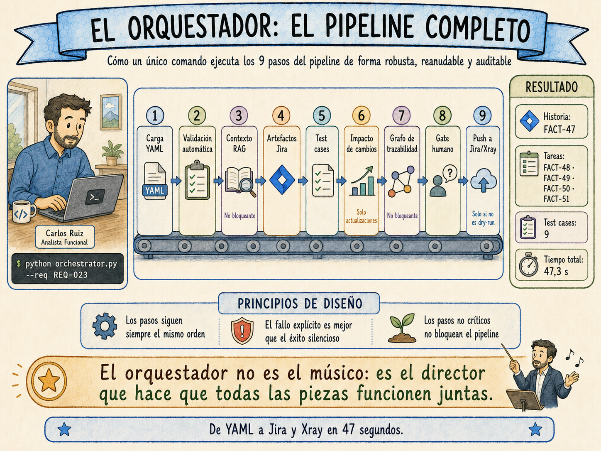

# Capítulo 12. El orquestador: el pipeline completo

> *«La diferencia entre una colección de herramientas y un sistema es que las herramientas se usan por separado. El sistema funciona solo.»*

---

*En este capítulo aprenderás:*

- *Cómo el orquestador une en un único comando ejecutable los nueve pasos del pipeline*
- *Qué decisiones de diseño garantizan que el sistema sea robusto, reanudable y auditable*
- *Cómo configurar el entorno para ejecutar el pipeline por primera vez*
- *Qué ocurre exactamente cuando escribes `python orchestrator.py --req REQ-023`*
- *Cómo integrar el orquestador en el ciclo de trabajo diario del equipo*

---

## La mañana del primer despliegue

Carlos llegó al martes con una sola tarea en su lista: ejecutar el pipeline completo sobre REQ-023 y que el resultado llegara a Jira sin que él tocara nada entre medio. No el dry-run de la semana anterior. No el test sobre un entorno ficticio. El pipeline real, con el Jira real de Meridian, con el módulo EP-04 que Ana López y su equipo usarían en producción dentro de cinco semanas.

Había pasado las últimas semanas construyendo las piezas por separado: la plantilla YAML en el Capítulo 4, el glosario en el 5, el Event Storming en el 6, la validación en el 7, la generación de artefactos en el 8, los test cases en el 9 y el sistema RAG en el 10. Cada pieza funcionaba. Pero una colección de piezas que funcionan por separado no es un sistema: es un trastero bien organizado.

El orquestador es la pieza que convierte el trastero en una cadena de montaje.

A las 9:17 Carlos escribió en el terminal:

```bash
python orchestrator.py --req REQ-023
```

A las 9:18:04, cuarenta y siete segundos después, el terminal mostró:

```
✓ COMPLETADO en 47.3s
  Historia:   FACT-47
  Tareas:     FACT-48, FACT-49, FACT-50, FACT-51
  Test cases: 9
```

Abrió Jira. FACT-47 existía. Tenía los tres criterios de aceptación en el formato exacto del equipo. Las cuatro tareas con sus dependencias ya enlazadas. Abrió Xray. Los nueve test cases estaban ahí, con sus pasos, sus datos de prueba y los scripts Gherkin listos para importar al framework de automatización.

Cuarenta y siete segundos.

Lo que este capítulo describe es cómo funciona ese comando por dentro, cómo configurarlo para tu organización y cómo integrarlo en el flujo de trabajo del equipo.

---

## 12.1 Qué es el orquestador y qué no es

Antes de entrar en el código, conviene aclarar qué responsabilidad tiene el orquestador y cuál no.

El orquestador **es** el componente que:

- Define el orden de ejecución de los nueve pasos del pipeline
- Persiste el estado de cada ejecución para poder reanudarla si falla
- Gestiona los errores de cada paso y decide si son bloqueantes o recuperables
- Presenta los artefactos generados al analista para su revisión y aprobación
- Coordina el push a Jira y Xray una vez aprobados
- Registra métricas de cada ejecución para el sistema de gobierno del Capítulo 14

El orquestador **no es**:

- El prompt que genera las historias (eso es el Capítulo 8)
- El sistema RAG que recupera contexto (eso es el Capítulo 10)
- El validador de calidad (eso es el Capítulo 7)
- El conector con Jira API (eso es parte del Capítulo 11)

El orquestador no sabe nada de análisis funcional. Sabe cuándo llamar a cada pieza, en qué orden, qué hacer cuando una falla y cómo presentar el resultado al analista. Es el director de orquesta, no el músico.



---

## 12.2 Los nueve pasos del pipeline

El orquestador ejecuta siempre los mismos nueve pasos en el mismo orden. Algunos se omiten automáticamente cuando no aplican (un requisito nuevo no necesita análisis de impacto de cambios). Ninguno puede ejecutarse antes que el anterior.

```
┌──────────────────────────────────────────────────────────────────┐
│  PIPELINE DE UN REQUISITO — NUEVE PASOS                          │
├─────┬──────────────────────────────────┬─────────────────────────┤
│  1  │ Carga y parseo del YAML          │ Siempre                 │
│  2  │ Validación automática            │ Siempre                 │
│  3  │ Recuperación de contexto RAG     │ Siempre (no bloqueante) │
│  4  │ Generación de artefactos Jira    │ Siempre                 │
│  5  │ Generación de test cases         │ Siempre                 │
│  6  │ Análisis de impacto de cambios   │ Solo en actualizaciones │
│  7  │ Registro en el grafo             │ Siempre (no bloqueante) │
│  8  │ Gate de aprobación humana        │ Siempre                 │
│  9  │ Push a Jira y Xray               │ Solo si no es dry-run   │
└─────┴──────────────────────────────────┴─────────────────────────┘
```

Dos principios guían el diseño de estos pasos:

**El fracaso explícito es mejor que el éxito silencioso.** Si el paso 2 (validación) detecta bloqueantes, el pipeline se detiene con un informe claro. No continúa generando artefactos sobre un requisito con problemas graves esperando que el analista los detecte más tarde.

**Los pasos no críticos no bloquean el pipeline.** El RAG (paso 3) y el registro en el grafo (paso 7) son pasos cuyo fallo no impide generar artefactos útiles. Si la base de datos vectorial no está disponible, el pipeline continúa sin contexto histórico con una advertencia visible. Si el grafo falla, los artefactos llegan a Jira aunque la trazabilidad automática no se registre.

---

## 12.3 La gestión de estado: por qué el orquestador tiene memoria

El problema de los pipelines sin gestión de estado es que cuando fallan a mitad de camino, no hay forma de saber cuánto se completó. La solución habitual es reiniciar desde cero, lo que en un pipeline de nueve pasos con llamadas a APIs externas significa pagar el coste de las llamadas repetidas y arriesgarse a crear duplicados en Jira.

El orquestador de este sistema persiste el estado de cada paso en un archivo JSON local que actúa como diario de a bordo. Cada vez que comienza una ejecución, el sistema busca si existe un run anterior para ese mismo requisito con el mismo contenido YAML. Si lo encuentra y no está completado, lo reanuda desde el primer paso pendiente.

```python
# state.py — Fragmento del gestor de estado
# Cada requisito tiene su propio archivo de estado en la carpeta /runs/

@dataclass
class EstadoRun:
    run_id: str              # REQ-023_20250512_091732
    requisito_id: str        # REQ-023
    hash_yaml: str           # MD5 del YAML — detecta si el contenido cambió
    inicio: str              # ISO 8601
    fin: Optional[str]       # Nulo hasta que completa o falla
    estado: EstadoEjecucion  # iniciada | completado | fallido | rechazado
    pasos: dict              # Estado de cada uno de los nueve pasos
    artefactos_generados: Optional[dict]   # Resultado del paso 4
    test_cases_generados: Optional[list]   # Resultado del paso 5
    resultado_jira: Optional[dict]         # Keys de Jira del paso 9
```

El hash del YAML garantiza que si el analista modifica el requisito entre una ejecución fallida y la siguiente, el sistema lo detecta y comienza desde cero en lugar de reanudar con datos obsoletos.

### Cómo funciona la reanudación

Imagina que el pipeline de REQ-023 falla en el paso 5 (generación de test cases) por un timeout de la API. El analista lo reintenta diez minutos después:

```
[10:23:15]  ↩ Run anterior encontrado para REQ-023. Reanudando desde el paso fallido.

[--] s1_carga         (ya completado, omitiendo)
[--] s2_validacion    (ya completado, omitiendo)
[--] s3_rag_contexto  (ya completado, omitiendo)
[--] s4_generacion    (ya completado, omitiendo)
[ 5] Generando test cases...
     ✓ 9 TCs (2 pos · 4 neg · 3 contorno)
...
```

Los pasos ya completados no se repiten. La historia generada en el paso 4 no se regenera (lo que eliminaría el riesgo de obtener un output diferente). La ejecución continúa exactamente donde se quedó.

---

## 12.4 Configuración del entorno

Antes de ejecutar el pipeline por primera vez, hay que configurar tres grupos de variables: las credenciales de las APIs externas, las rutas del repositorio y el comportamiento del pipeline.

El sistema usa un archivo `.env` en la carpeta raíz del proyecto. Nunca se sube al repositorio Git (debe estar en `.gitignore`).

```bash
# .env — Configuración del entorno del pipeline
# NUNCA subir este archivo a un repositorio público

# ── Modelo de lenguaje ────────────────────────────────────────────────
LLM_PROVIDER=anthropic                          # anthropic | openai
LLM_MODEL=claude-sonnet-4-20250514              # Modelo de referencia del libro
ANTHROPIC_API_KEY=sk-ant-...                    # Tu API key de Anthropic

# ── Jira ─────────────────────────────────────────────────────────────
JIRA_BASE_URL=https://tu-empresa.atlassian.net
JIRA_USER_EMAIL=tu-usuario@empresa.com
JIRA_API_TOKEN=...                              # Generar en id.atlassian.com
JIRA_PROJECT_KEY=FACT                           # El prefijo de tus issues

# Campos personalizados de tu instancia Jira
# Obtener via: curl -u email:token https://empresa.atlassian.net/rest/api/3/field
JIRA_FIELD_REQ_ORIGEN=customfield_10100         # Campo "Requisito Origen"
JIRA_FIELD_STORY_POINTS=customfield_10016       # Story Points (estándar en la mayoría)
JIRA_FIELD_EPIC_LINK=customfield_10014          # Epic Link (puede variar)
JIRA_FIELD_EPIC_NAME=customfield_10011          # Epic Name

# ── Base de datos (pgvector para el RAG) ──────────────────────────────
DB_HOST=localhost
DB_PORT=5432
DB_NAME=pipeline_ai
DB_USER=pipeline
DB_PASSWORD=...

# ── Xray (opcional) ───────────────────────────────────────────────────
XRAY_ACTIVO=true                                # false para desactivar
XRAY_BASE_URL=https://tu-empresa.atlassian.net
XRAY_CLIENT_ID=...
XRAY_CLIENT_SECRET=...
```

> 💡 **Idea clave — Los campos personalizados de Jira son específicos de tu instancia.** El campo `customfield_10016` para Story Points es el más estándar, pero `Epic Link` y `Epic Name` varían según la versión de Jira y los plugins instalados. La forma más rápida de encontrarlos es hacer una petición GET a `/rest/api/3/field` y buscar el nombre del campo en la respuesta.

Una vez configurado el `.env`, el archivo `config.py` lo lee y expone un objeto `PipelineConfig` que todos los pasos del pipeline usan para acceder a la configuración. Esto centraliza el acceso a las variables de entorno en un único lugar y facilita el testing.

```python
# config.py — Configuración centralizada del pipeline
# Todos los pasos importan PipelineConfig; nadie accede a os.getenv directamente

from dataclasses import dataclass, field
from pathlib import Path
import os
from dotenv import load_dotenv

load_dotenv()  # Carga el archivo .env

@dataclass
class PipelineConfig:
    # ── Rutas del repositorio ─────────────────────────────────────────
    repo_requisitos: Path = Path("requisitos")  # Carpeta con los YAMLs
    repo_glosario: Path   = Path("glosario.yaml")
    repo_prompts: Path    = Path("prompts/v1.1")  # Versión activa de prompts
    carpeta_runs: Path    = Path("runs")           # Estado de ejecuciones
    carpeta_reports: Path = Path("reports")        # Informes generados

    # ── Comportamiento del pipeline ───────────────────────────────────
    dry_run: bool = False
    # True → genera artefactos pero no push a Jira/Xray
    # Útil para calibrar la calidad del output antes del primer despliegue real

    modo_interactivo: bool = True
    # False → aprobación automática sin intervención humana
    # Solo para CI/CD con revisión post-hoc; nunca en el flujo normal

    score_minimo_validacion: int = 65
    # Requisitos con score < 65 se bloquean aunque no tengan
    # problemas bloqueantes explícitos en el informe del Cap. 7

    similitud_duplicado_umbral: float = 0.90
    # Umbral a partir del cual el RAG alerta de posible duplicado
    # (ver Cap. 10; no bloquea el pipeline, solo avisa)

    # ── Subcomponentes (se construyen desde las variables de entorno) ─
    llm: LLMConfig    = field(default_factory=LLMConfig)
    jira: JiraConfig  = field(default_factory=JiraConfig)
    db: DBConfig      = field(default_factory=DBConfig)
    xray: XrayConfig  = field(default_factory=XrayConfig)

    def validar(self) -> list[str]:
        """Devuelve la lista de errores de configuración antes de arrancar."""
        errores = []
        if not self.llm.api_key:
            errores.append("ANTHROPIC_API_KEY no configurada")
        if not self.dry_run:
            if not self.jira.base_url:
                errores.append("JIRA_BASE_URL no configurada")
            if not self.jira.api_token:
                errores.append("JIRA_API_TOKEN no configurada")
        if not self.repo_glosario.exists():
            errores.append(f"Glosario no encontrado: {self.repo_glosario}")
        return errores
```

---

## 12.5 El archivo principal: `orchestrator.py`

El orquestador es un script Python que acepta argumentos en la línea de comandos y ejecuta el pipeline de forma asíncrona. Hay cuatro formas de invocarlo:

```bash
# Procesar un único requisito en modo producción
python orchestrator.py --req REQ-023

# Procesar un único requisito sin push a Jira (verificar el output primero)
python orchestrator.py --req REQ-023 --dry-run

# Procesar todos los requisitos de una épica en lotes de 2 en paralelo
python orchestrator.py --epica EP-04 --paralelo 2

# Reanudar un requisito desde un paso concreto (útil tras corregir un error)
python orchestrator.py --req REQ-023 --desde s4_generacion_artefactos
```

El flag `--dry-run` es el que recomendamos usar durante las primeras semanas de adopción. Genera todos los artefactos y muestra exactamente lo que llegaría a Jira, pero no toca nada. Permite que el equipo calibre la calidad del output y ajuste los prompts antes de comprometerse con el despliegue real.

### La lógica de un paso

Cada uno de los nueve pasos sigue el mismo patrón dentro del orquestador:

```python
# Fragmento del orchestrator.py — Patrón de un paso
# Este patrón se repite para cada uno de los nueve pasos

paso = "s4_generacion_artefactos"

# ① Comprobar si ya está completado (para reanudación)
if gestor.debe_ejecutar(run, paso):

    _log_paso(4, "Generando artefactos Jira con IA")
    run = gestor.iniciar_paso(run, paso)  # Persiste el inicio

    try:
        # ② Ejecutar la lógica del paso (importada desde steps/)
        artefactos = await generar_artefactos_jira(
            requisito=requisito,
            glosario=glosario,
            contexto_rag=contexto_rag,
            config=config
        )

        # ③ Guardar el resultado en el estado del run
        run.artefactos_generados.update(artefactos)

        # ④ Marcar como completado con métricas del resultado
        run = gestor.completar_paso(run, paso, {
            "n_tareas": len(artefactos.get("tareas", [])),
            "n_criterios_ac": len(
                artefactos.get("historia", {})
                .get("acceptance_criteria", [])
            )
        })

        _log_ok(f"Historia · {n_tareas} tareas · {n_ac} criterios AC")

    except Exception as e:
        # ⑤ En caso de fallo: registrar el error y propagar la excepción
        run = gestor.fallar_paso(run, paso, str(e))
        raise PipelineFallo(paso, str(e))

else:
    # Si ya está completado, simplemente indicarlo en el log
    _log_reanudado(paso)
```

Este patrón garantiza que el estado del run refleja siempre la realidad: si el proceso se interrumpe en cualquier punto (un timeout, un corte de red, un error inesperado), el archivo de estado habrá registrado hasta dónde llegó.

---

## 12.6 El gate de aprobación humana

El paso 8 es el más importante del pipeline, no por la lógica que ejecuta sino por lo que representa: el momento en que el analista decide si los artefactos generados por la IA son lo suficientemente buenos para llegar al equipo.

En modo interactivo (el modo por defecto), el orquestador detiene la ejecución, muestra un resumen de los artefactos generados y espera la decisión del analista.

```
╔══════════════════════════════════════════════════════════════════╗
║  REVISIÓN DE ARTEFACTOS — REQ-023                                ║
╠══════════════════════════════════════════════════════════════════╣
║                                                                  ║
║  HISTORIA                                                        ║
║  Como gestor de facturación, quiero filtrar facturas por         ║
║  rango de fechas para localizar documentos de un período         ║
║  contable                                                        ║
║                                                                  ║
║  Story Points: 5  │  Prioridad: Highest                          ║
║  Épica: FACT-12   │  Componente: modulo-facturacion              ║
║                                                                  ║
║  CRITERIOS DE ACEPTACIÓN (3)                                     ║
║  AC-023-01 · Filtrado válido devuelve resultados en < 2s         ║
║  AC-023-02 · Rango > 365 días bloquea la búsqueda                ║
║  AC-023-03 · Sin resultados muestra estado vacío con acción      ║
║                                                                  ║
║  TAREAS (4)                                                      ║
║  · [BD]       Crear índice en tabla facturas para filtrado       ║
║  · [backend]  Implementar endpoint GET /api/v1/facturas          ║
║  · [frontend] Implementar componente de filtrado por fechas      ║
║  · [testing]  Ejecutar pruebas de integración y rendimiento      ║
║                                                                  ║
║  TEST CASES (9)                                                  ║
║  2 positivos · 4 negativos · 3 de contorno                       ║
║                                                                  ║
╠══════════════════════════════════════════════════════════════════╣
║  [A] Aprobar y empujar a Jira                                    ║
║  [E] Editar antes de aprobar                                     ║
║  [R] Rechazar (devolver al analista con notas)                   ║
║  [V] Ver el JSON completo antes de decidir                       ║
╚══════════════════════════════════════════════════════════════════╝
Decisión:
```

Las cuatro opciones cubren los casos reales:

**Aprobar (A)** es la opción más frecuente cuando el pipeline funciona bien y el requisito de entrada era de calidad. El analista revisa el resumen en dos o tres minutos y aprueba.

**Editar (E)** permite al analista modificar campos concretos del JSON antes de empujar a Jira. No es para rescribir la historia desde cero, sino para corregir detalles menores: cambiar una estimación de story points, ajustar una etiqueta, matizar el título de una tarea. Si la historia necesita reescribirse completamente, la decisión correcta es rechazar y mejorar el YAML del requisito.

**Rechazar (R)** devuelve el run al estado pendiente con una nota del analista. El sistema registra el motivo del rechazo en el archivo de estado. Esto alimenta el sistema de gobierno del Capítulo 14: si el mismo tipo de problema aparece frecuentemente en los rechazos, hay que ajustar los prompts.

**Ver JSON (V)** muestra el JSON completo de todos los artefactos antes de decidir. Útil en los primeros usos para ganar confianza en el output, menos necesario con el tiempo.

> ⚠️ **Error frecuente — Usar el modo `--sin-aprobacion` en el flujo diario.** El flag `--sin-aprobacion` activa la aprobación automática sin intervención humana. Existe para casos de uso específicos (pipelines CI/CD con revisión post-hoc) pero no debe usarse en el flujo diario. Un artefacto generado automáticamente que llega a Jira sin revisión puede comprometer el sprint si contiene un error que el analista habría detectado en treinta segundos.

---

## 12.7 El modo lote: procesar una épica completa

Cuando el equipo tiene una nueva épica con diez o quince requisitos validados, procesarlos uno a uno sería tedioso. El modo lote procesa todos los requisitos de una épica de forma secuencial o en paralelo.

```bash
# Procesar todos los requisitos de EP-04 en lotes de 2 simultáneos
python orchestrator.py --epica EP-04 --paralelo 2
```

El orquestador descubre automáticamente todos los archivos YAML cuyo campo `epica` coincide con el ID indicado y están en estado `en-revision` o `validado`. Los ordena respetando las dependencias declaradas en cada requisito (un requisito que depende de otro no se procesa hasta que el anterior ha completado el paso 2 de validación) y los empuja en lotes de N en paralelo.

La salida al terminar el lote resume el resultado de cada requisito:

```
════════════════════════════════════════════════════════════════════
  RESUMEN ÉPICA EP-04
  Total:     4 requisitos
  ✓ Exitosos: 3
  ✗ Fallidos: 1  →  REQ-024 (Validación bloqueada: criterios AC vacíos)
  Tiempo total: 94.2s
════════════════════════════════════════════════════════════════════
```

El requisito fallido (REQ-024) tiene su informe de validación en la carpeta `/reports/` con el detalle de los problemas que hay que corregir antes de reintentarlo.

> 🛠️ **En la práctica — El paralelismo tiene un límite natural.** Procesar más de tres o cuatro requisitos en paralelo rara vez aporta velocidad neta, porque el cuello de botella suele ser el rate limit de la API del LLM (que impone un máximo de solicitudes por minuto) y el gate de aprobación humana. Con `--paralelo 2` el analista puede revisar el output del primer lote mientras el segundo se genera. Con `--paralelo 5` se acumula una cola de aprobaciones que termina siendo más lenta que procesarlos de uno en uno.

---

## 12.8 Estructura del proyecto

Antes de entender el código completo del orquestador, conviene ver cómo se organiza el proyecto en el sistema de archivos. Esta estructura es la que el equipo de Meridian adoptó, y es la que recomendamos como punto de partida.

```
pipeline-ai/
│
├── orchestrator.py        ← Punto de entrada. El script que ejecuta el equipo.
├── config.py              ← Configuración centralizada (lee el .env)
├── state.py               ← Gestión del estado de ejecución
├── .env                   ← Credenciales (nunca en Git)
├── requirements.txt       ← Dependencias Python del proyecto
│
├── steps/                 ← Cada paso del pipeline en su propio módulo
│   ├── s1_load.py         ← Carga y validación del YAML
│   ├── s2_validate.py     ← Los cuatro tipos de validación (Cap. 7)
│   ├── s3_rag_context.py  ← Recuperación de contexto RAG (Cap. 10)
│   ├── s4_generate.py     ← Generación de artefactos Jira (Cap. 8)
│   ├── s5_test_cases.py   ← Generación de test cases (Cap. 9)
│   ├── s6_impact.py       ← Análisis de impacto de cambios (Cap. 11)
│   ├── s7_traceability.py ← Registro en el grafo (Cap. 11)
│   ├── s8_approval.py     ← Gate de aprobación humana
│   └── s9_push.py         ← Push a Jira API y Xray
│
├── prompts/               ← Prompts versionados (no mezclar con el código)
│   └── v1.1/
│       ├── system_base.txt
│       ├── p1_epica.txt
│       ├── p2_historia.txt
│       ├── p3_tareas.txt
│       ├── p4_subtareas.txt
│       ├── p5_validacion_estructural.txt
│       ├── p6_validacion_semantica.txt
│       ├── p7_test_cases_positivos.txt
│       ├── p8_test_cases_negativos.txt
│       └── p9_test_cases_contorno.txt
│
├── requisitos/            ← Los YAMLs de requisitos organizados por épica
│   ├── EP-04/
│   │   ├── REQ-021.yaml
│   │   ├── REQ-022.yaml
│   │   └── REQ-023.yaml
│   └── glosario.yaml
│
├── runs/                  ← Archivos de estado por ejecución (no en Git)
│   └── REQ-023_20250512_091732.json
│
└── reports/               ← Informes generados (no en Git)
    ├── REQ-023_20250512_091732_report.md
    └── REQ-024_20250512_093215_validacion.json
```

Los prompts viven en una carpeta separada del código por una razón deliberada: son el componente que más evoluciona durante los primeros meses y que necesita su propio ciclo de versiones. El código del orquestador puede estar en la versión 2.3 mientras los prompts están en la versión 1.4. Mantenerlos separados facilita el proceso de gobierno del Capítulo 14, donde el champion puede proponer y evaluar cambios de prompts sin tocar el código.

---

## 12.9 El informe de ejecución

Al final de cada run, el orquestador genera automáticamente un informe Markdown en la carpeta `/reports/`. Este informe es el registro permanente de lo que ocurrió en cada ejecución.

```markdown
# Informe de ejecución — REQ-023

**Run ID:** REQ-023_20250512_091732
**Estado:** completado
**Inicio:** 2025-05-12T09:17:32
**Fin:** 2025-05-12T09:18:19
**Modo:** PRODUCCIÓN

## Resumen

| Métrica            | Valor  |
|--------------------|--------|
| Pasos completados  | 9      |
| Pasos fallidos     | 0      |
| Duración total     | 47.3s  |

## Pasos del pipeline

| Paso                       | Estado        | Duración | Resultado                          |
|----------------------------|---------------|----------|------------------------------------|
| s1_carga                   | ✅ completado | 0.2s     | Título: Filtrar facturas por fecha |
| s2_validacion              | ✅ completado | 8.1s     | Score 84/100 · APROBADO            |
| s3_rag_contexto            | ✅ completado | 3.4s     | 7 requisitos relacionados          |
| s4_generacion_artefactos   | ✅ completado | 14.2s    | 1 historia · 4 tareas · 3 AC       |
| s5_generacion_test_cases   | ✅ completado | 11.8s    | 9 test cases                       |
| s6_analisis_impacto        | ⏭ omitido     | —        | Requisito nuevo                    |
| s7_registro_trazabilidad   | ✅ completado | 0.9s     | 14 nodos · 19 aristas              |
| s8_aprobacion              | ✅ completado | 23.0s    | Aprobado por carlos.ruiz@empresa   |
| s9_push_jira               | ✅ completado | 5.7s     | FACT-47 + FACT-48..51              |

## Artefactos en Jira

| Tipo    | Key                                 |
|---------|-------------------------------------|
| Épica   | FACT-12 (existente, reutilizada)    |
| Historia| FACT-47 (nueva)                     |
| Tareas  | FACT-48, FACT-49, FACT-50, FACT-51  |
```

Estos informes son la fuente de datos del sistema de gobierno del Capítulo 14. El script de métricas semanales los lee para calcular la tasa de aprobación directa, el tiempo medio de procesamiento y los pasos con más fallos.

---

## 12.10 Integración en el flujo de trabajo del equipo

El orquestador es una herramienta de línea de comandos. Funciona, pero la mayoría de los analistas funcionales no son programadores y no quieren ejecutar comandos en el terminal. Esta es una tensión real que hay que resolver antes de la adopción amplia.

Hay tres formas de integrar el orquestador en el flujo del equipo, en orden de esfuerzo de implantación:

### Opción 1: Script de acceso directo (semanas 1-4)

El método más rápido. El responsable técnico crea un script de shell que el analista ejecuta con doble clic en Windows o desde una carpeta de scripts:

```bash
#!/bin/bash
# run_pipeline.sh — Doble clic para ejecutar el pipeline
# Poner en el escritorio del analista o en una carpeta de scripts compartida

echo "ID del requisito a procesar (ej: REQ-023):"
read req_id

cd /ruta/al/proyecto/pipeline-ai
python orchestrator.py --req "$req_id"

echo ""
echo "Pulsa ENTER para cerrar..."
read
```

No es elegante, pero funciona desde el día uno sin ningún cambio en la infraestructura del equipo.

### Opción 2: Integración en Confluence (mes 2-3)

Confluence permite añadir botones en las páginas mediante macros o extensiones. Con el plugin de botones de Confluence y un webhook, el analista puede lanzar el pipeline directamente desde la página del requisito:

```
┌─────────────────────────────────────────────────────────────┐
│ REQUISITO  REQ-023  │  Estado: Validado                     │
│─────────────────────────────────────────────────────────────┤
│ [Ejecutar pipeline →]  [Ver último informe]  [Abrir en Jira]│
└─────────────────────────────────────────────────────────────┘
```

El botón llama a un webhook que dispara el orquestador en el servidor. El analista recibe una notificación por Slack o Teams cuando el pipeline llega al gate de aprobación.

### Opción 3: Interfaz web ligera (mes 4-6)

Para equipos que procesan un volumen alto de requisitos o que tienen analistas menos técnicos, una interfaz web ligera construida con FastAPI y un frontend sencillo hace el pipeline completamente accesible sin ningún conocimiento técnico:

```
┌─────────────────────────────────────────────────────────────────┐
│ Pipeline AI — Meridian                                          │
├─────────────────────────────────────────────────────────────────┤
│ Nuevo proceso                                                   │
│ Requisito ID:  [REQ-023          ]  [▸ Ejecutar]                │
│                                                                 │
│ Cola de aprobación (2 pendientes)                               │
│ ────────────────────────────────────────────────────────────────┤
│ REQ-023  Filtrar facturas por fecha  Score: 84/100  [Revisar ▸] │
│ REQ-025  Exportar facturas a CSV     Score: 91/100  [Revisar ▸] │
│                                                                 │
│ Historial reciente                                              │
│ ────────────────────────────────────────────────────────────────┤
│ REQ-021  ✓ Completado  09:18  FACT-41  [Informe]                │
│ REQ-022  ✓ Completado  08:47  FACT-44  [Informe]                │
│ REQ-024  ✗ Fallido     08:31  Validación: criterios vacíos      │
└─────────────────────────────────────────────────────────────────┘
```

Esta interfaz es el paso natural una vez que el equipo ha adoptado el sistema y el volumen de requisitos justifica la inversión. No hace falta llegar aquí el primer mes.

---

## 12.11 Integración con CI/CD

Para organizaciones que quieren integrar el pipeline en su proceso de revisión de código, el orquestador puede ejecutarse automáticamente como parte de un flujo de GitHub Actions o GitLab CI. El script devuelve código de salida 0 si el pipeline completó con éxito y 1 en cualquier otro caso, lo que permite integrarlo directamente como un step de CI.

```yaml
# .github/workflows/pipeline_ai.yml
# Se ejecuta automáticamente cuando se modifica un YAML de requisito en Git

name: Pipeline AI — Generación de artefactos

on:
  push:
    paths:
      - 'requisitos/**/*.yaml'  # Solo cuando cambian archivos de requisitos

jobs:
  pipeline:
    runs-on: ubuntu-latest
    steps:
      - uses: actions/checkout@v4

      # Detectar qué archivos YAML han cambiado
      - name: Detectar requisitos modificados
        id: cambios
        run: |
          MODIFICADOS=$(git diff --name-only HEAD~1 HEAD \
            -- 'requisitos/**/*.yaml' \
            | xargs -I{} basename {} .yaml)
          echo "requisitos=$MODIFICADOS" >> $GITHUB_OUTPUT

      # Ejecutar el pipeline en modo dry-run sobre los requisitos modificados
      - name: Ejecutar pipeline (dry-run)
        env:
          ANTHROPIC_API_KEY: ${{ secrets.ANTHROPIC_API_KEY }}
          JIRA_API_TOKEN: ${{ secrets.JIRA_API_TOKEN }}
          JIRA_BASE_URL: ${{ vars.JIRA_BASE_URL }}
          JIRA_USER_EMAIL: ${{ vars.JIRA_USER_EMAIL }}
          JIRA_PROJECT_KEY: ${{ vars.JIRA_PROJECT_KEY }}
          DB_HOST: ${{ vars.DB_HOST }}
          DB_PASSWORD: ${{ secrets.DB_PASSWORD }}
        run: |
          pip install -r requirements.txt
          for REQ in ${{ steps.cambios.outputs.requisitos }}; do
            python orchestrator.py \
              --req $REQ \
              --dry-run \
              --sin-aprobacion  # Sin interacción en CI
          done

      # Publicar los informes como artefactos del workflow
      - name: Publicar informes
        uses: actions/upload-artifact@v4
        with:
          name: pipeline-reports-${{ github.run_number }}
          path: reports/
```

Con este workflow, cada vez que el analista hace commit de un YAML de requisito modificado, el pipeline se ejecuta automáticamente en dry-run, los informes quedan disponibles en el workflow de GitHub y el equipo puede revisarlos antes de ejecutar el despliegue real.

> 🛠️ **En la práctica — El CI/CD es para equipos maduros, no para empezar.** La integración con GitHub Actions añade complejidad de infraestructura que no aporta valor en los primeros meses. El equipo de Meridian tardó cuatro meses en llegar a este punto, y solo lo implantó después de que el pipeline llevara dos meses funcionando de forma estable en modo manual. Empezar con el script de acceso directo de la Opción 1 y llegar aquí gradualmente es la secuencia correcta.

---

## 12.12 Lo que el orquestador no hace

El orquestador es robusto ante los errores esperados (timeouts de API, requisitos con problemas de validación, rate limiting) pero no es infalible. Estas son las situaciones donde el analista debe intervenir manualmente:

**Cuando el YAML está mal formado como YAML** (no como requisito AI-ready, sino como YAML sintácticamente incorrecto). El parser de Python detecta el error en el paso 1 y muestra el mensaje de error del parser. La solución es abrir el archivo y corregir la indentación o los caracteres especiales.

**Cuando Jira devuelve un error de permisos** para un issue type concreto. Esto suele ocurrir la primera vez que el pipeline intenta crear una épica en un proyecto Jira donde el usuario de la API no tiene permisos de creación de épicas (que son permisos distintos a los de creación de historias). La solución es revisar los permisos del token de API en la configuración de Jira.

**Cuando se generan issues duplicados** porque el campo de campo personalizado `requisito_origen` no está configurado correctamente y el sistema de idempotencia no puede detectar los issues existentes. Esto ocurre normalmente en el primer despliegue, cuando los campos personalizados de Jira no están bien mapeados en el `.env`. La solución es verificar los IDs de campo en la API de Jira y corregir el `.env`.

**Cuando el gate de aprobación lleva más de 30 minutos sin respuesta**. El orquestador no tiene timeout en el gate de aprobación: espera indefinidamente. Si el analista cierra el terminal durante la espera, el run queda en estado `pendiente_aprobacion`. Al reabrir el terminal y ejecutar de nuevo el comando, el sistema detecta el run en ese estado y ofrece retomar desde el gate.

---

## 12.13 Lo que funciona en la práctica

El orquestador que hemos construido en este capítulo es funcional desde el primer día, pero tiene cuatro comportamientos que solo se entienden usándolo:

**La calibración de los primeros diez requisitos es el paso más importante de toda la implantación.** Los primeros runs producen output que el analista rechazará parcialmente o editará antes de aprobar. Eso es correcto y esperado: el sistema está aprendiendo los patrones específicos de la organización a través del feedback del gate de aprobación. Los rechazos y ediciones de las primeras semanas son el material con el que el champion mejora los prompts. A partir del décimo o décimo quinto requisito, la tasa de aprobación directa suele superar el 80%.

**El flag `--dry-run` es la mejor herramienta de adopción.** Cuando el champion quiere convencer al equipo de que el sistema funciona, no hay mejor demostración que ejecutar el pipeline en dry-run sobre un requisito real del proyecto en curso y mostrar el output en pantalla. No hay instalación, no hay configuración de Jira, no hay riesgo. Solo el JSON con la historia, las tareas y los test cases, generados en cuarenta y siete segundos.

**El tiempo del gate de aprobación baja drásticamente con la práctica.** Los primeros gates llevan entre cinco y diez minutos porque el analista lee todo con detalle. Al tercer mes, revisar el resumen y aprobar suele llevar menos de dos minutos, porque el analista sabe exactamente qué campos puede confiar en el pipeline y cuáles requieren atención.

**Los informes de ejecución son más valiosos de lo que parecen al principio.** Las primeras semanas nadie los lee. A partir del segundo mes, cuando el champion empieza a analizar los patrones de rechazo y el responsable técnico quiere justificar los ajustes de prompts, los informes se convierten en la fuente de datos más importante del sistema. Guardarlos en Git junto al código es la forma más sencilla de tener un historial permanente.

---

## Tres puntos clave

El orquestador no es la pieza más inteligente del pipeline — esa es la combinación del validador del Capítulo 7, los prompts del Capítulo 8 y el RAG del Capítulo 10. El orquestador es la pieza que hace que las demás funcionen juntas de forma confiable, auditable y reanudable.

El gate de aprobación humana no es un obstáculo en el camino hacia la automatización: es el componente que hace que el sistema sea seguro. Un artefacto que llega a Jira sin revisión humana puede comprometer el sprint. Un artefacto que el analista ha revisado en dos minutos lleva la garantía de criterio experto.

El valor del orquestador se mide en el terminal de Carlos a las 9:18 de la mañana: cuarenta y siete segundos desde el YAML hasta los artefactos en Jira. No la promesa de cuarenta y siete segundos. El resultado.

---

> 💡 **Pregunta de reflexión para tu equipo**
>
> Antes de instalar el pipeline, tomad el último requisito que llegó al sprint con un cambio de alcance. ¿En qué paso del pipeline habría fallado la validación del Capítulo 7? ¿Habría llegado siquiera al gate de aprobación?

---

## Qué viene a continuación

La Parte III termina aquí. Hemos construido, paso a paso, el pipeline completo: desde la plantilla YAML del Capítulo 4 hasta el orquestador que lo ejecuta todo. El resultado es un sistema que funciona.

Pero un sistema que funciona hoy puede dejar de funcionar en seis meses si nadie lo mantiene. Los prompts envejecen cuando cambia el contexto del proyecto. El glosario se fragmenta cuando rotan los analistas. Las métricas bajan gradualmente sin que nadie lo detecte hasta que el equipo deja de confiar en el output.

La Parte IV trata de eso: cómo llevar el sistema al equipo real (Capítulo 13), cómo gobernarlo para que no se degrade silenciosamente (Capítulo 14) y cómo medir su impacto en términos que la dirección pueda entender y financiar (Capítulo 15).

---

A continuación: [Implantación por fases, resistencias, demostraciones, formación y métricas de adopción.](./13-adopcion.md)

---
