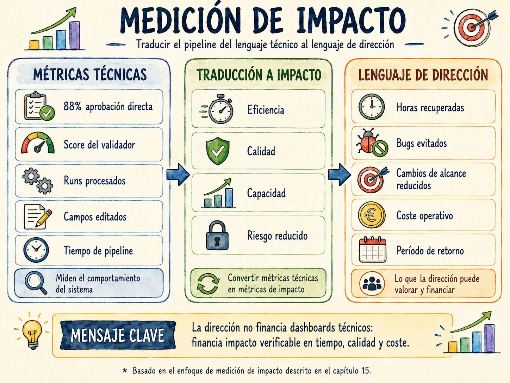

# Capítulo 15. Medición del impacto y ROI

---

Tres semanas después de la última retrospectiva que aparece en el capítulo anterior, David Sanz tiene una reunión con la dirección de Meridian. Le piden que justifique la continuidad del proyecto del pipeline para el año siguiente. No quieren dashboards técnicos ni gráficas de tasa de aprobación directa. Quieren saber una cosa: ¿cuánto vale esto en euros?

David llama a Carlos. Carlos abre el cuaderno donde lleva anotados los tiempos desde el primer día.

Lo que tienen es suficiente para construir un argumento sólido. Pero construirlo bien requiere más que sumar horas ahorradas. Requiere traducir métricas técnicas al lenguaje de la dirección, separar el impacto medible del impacto real pero difícil de cuantificar, y ser honestos sobre lo que el sistema no ha resuelto todavía.

Este capítulo describe cómo hacerlo.

---

*En este capítulo aprenderás:*

- *Por qué las métricas técnicas del pipeline no son suficientes para justificar la inversión ante la dirección, y cómo traducirlas al lenguaje del negocio.*
- *El modelo de medición de Meridian: qué midieron, cómo lo midieron y qué números resultaron al cabo de doce meses.*
- *Cómo construir el argumento de ROI sin inflar los números ni ignorar los costes reales.*
- *Las métricas que importan en cada fase de la implantación: qué medir en el mes uno, en el mes seis y en el mes doce.*
- *Lo que el pipeline no resuelve, y cómo comunicarlo con honestidad sin debilitar el argumento.*

---

## Por qué las métricas técnicas no bastan

Carlos lleva meses mirando la tasa de aprobación directa. Es una métrica útil para el gobierno del sistema, como se vio en el capítulo anterior, pero no le dice nada a un director financiero. «El 88% de los artefactos se aprueban sin ediciones» no conecta con ninguna categoría del presupuesto de la organización.

El problema es de traducción. Las métricas del pipeline miden el comportamiento del sistema. Lo que necesita la dirección son métricas de impacto: qué ha cambiado en el negocio como consecuencia de que el sistema funcione.

Hay tres tipos de impacto que el pipeline produce y que se pueden medir:

**Impacto en eficiencia.** El trabajo que antes tardaba X ahora tarda Y. La diferencia es tiempo recuperado que el equipo puede dedicar a trabajo de mayor valor. Este impacto es el más fácil de medir y el más inmediato: aparece en las primeras semanas.

**Impacto en calidad.** Los problemas que antes llegaban al sprint o a producción ahora se detectan antes. Esto se mide en reducción de defectos, en reducción de cambios de alcance mid-sprint y en reducción del tiempo de gestión de cambios. Este impacto tarda más en aparecer y es más difícil de atribuir únicamente al pipeline, pero es el que más valor aporta a largo plazo.

**Impacto en capacidad.** El equipo puede asumir más trabajo con los mismos recursos porque el trabajo mecánico se ha automatizado. Este impacto es el más difícil de medir porque requiere un contrafactual: ¿cuánto trabajo adicional habría requerido contratar a alguien más sin el pipeline? Se cuantifica de forma conservadora o se comunica de forma cualitativa.

> 💡 **Idea clave**
>
> El argumento de ROI más sólido no es el que tiene los números más grandes. Es el que tiene los números más creíbles. Una estimación conservadora que el equipo directivo puede verificar vale más que una proyección optimista que nadie se cree.

---

## La línea base: medir antes de empezar

Cualquier argumento de impacto necesita un punto de partida. Sin línea base, no hay comparación posible. En el capítulo 13 se describió la medición de línea base como el primer paso de la Fase 0 de adopción; aquí se desarrolla con el detalle que necesita el argumento de ROI.

En Meridian, Carlos midió durante cuatro semanas antes de activar el pipeline. Utilizó un método sencillo: cronometró sus propias tareas durante una semana representativa y pidió a los otros tres analistas que hicieran lo mismo durante la semana siguiente.

Los resultados de esa medición inicial, que aparecieron en el capítulo 1 como la auditoría que nadie hace, se convirtieron en la referencia contra la que se mide todo lo demás:

| Actividad | Tiempo medio por requisito | Tipo |
|---|---|---|
| Redactar el documento funcional en Word | 85 minutos | Mecánico |
| Crear épica, historia y tareas en Jira | 65 minutos | Mecánico |
| Generar test cases manualmente | 45 minutos | Mecánico |
| Revisar y corregir en el refinamiento | 40 minutos | Mecánico |
| Workshops y análisis con el negocio | 55 minutos | Valor |
| Validación funcional con el equipo técnico | 35 minutos | Valor |
| **Total por requisito** | **325 minutos** | |
| **Porcentaje de trabajo mecánico** | **62,5%** | |

Con cuatro analistas procesando una media de doce requisitos por sprint y veintidós sprints al año, el volumen anual era de aproximadamente 1.056 requisitos. A 45 €/hora y con el 62,5% del tiempo dedicado a trabajo mecánico, la cifra de trabajo mecánico anual en Meridian rondaba los 128.000 euros.

A esto se añadía el coste de los bugs por ambigüedad funcional. En el año anterior a la implantación, el equipo había registrado 34 bugs en producción cuya causa raíz era un requisito mal definido. El coste medio de corrección de un bug en producción —incluyendo análisis, corrección, pruebas de regresión y despliegue— era de 2.800 euros en Meridian, dato que el responsable técnico calculó mirando el historial de Jira. Total: 95.200 euros.

La línea base total era de aproximadamente 223.000 euros anuales en costes directamente atribuibles a la ineficiencia del proceso de análisis funcional. Es el número que aparecía en el capítulo 1 como «algo más de 250.000 euros», redondeado de forma conservadora incluyendo también el coste de los cambios de alcance mid-sprint.

> 🛠️ **En la práctica**
>
> La medición de línea base genera resistencia cuando el equipo percibe que es una evaluación de su rendimiento individual. El encuadre correcto es el opuesto: «estamos midiendo el proceso, no a las personas». Carlos lo planteó así en Meridian y los analistas participaron sin reservas. Si alguien se niega a cronometrar sus tareas, usar datos históricos de Jira: las fechas de creación de los issues, los comentarios de refinamiento y los registros de tiempo en los tickets de bugs son suficientes para construir una estimación razonable.

---

## El modelo de medición a doce meses

Con la línea base establecida, el modelo de medición de Meridian siguió tres requisitos de diseño: que las métricas fueran verificables por alguien externo al equipo, que se midieran de forma continua en lugar de puntual, y que separaran el impacto atribuible al pipeline del impacto atribuible a otros factores como la mejora general del equipo o cambios en el tipo de proyectos.

### Dimensión 1: Eficiencia en la creación de artefactos

Esta es la dimensión más directa y la que produce los primeros resultados visibles.

**Qué se midió:** el tiempo desde que el analista abre la plantilla YAML hasta que los artefactos están aprobados en Jira. Carlos usó los timestamps de los archivos de estado del orquestador —los que genera el script `state.py` del capítulo 12— para automatizar esta medición sin depender de cronómetros manuales.

**Cómo evolucionó en Meridian:**

| Período | Tiempo medio por requisito | Reducción vs. línea base |
|---|---|---:|
| Línea base (antes del pipeline) | 195 min (trabajo mecánico) | — |
| Mes 1–2 (calibración) | 155 min | −21% |
| Mes 3–4 (piloto maduro) | 105 min | −46% |
| Mes 5–6 (expansión al equipo) | 82 min | −58% |
| Mes 7–12 (régimen estable) | 74 min | −62% |

La reducción del 62% es consistente con lo que el capítulo 3 prometía como objetivo del sistema. En términos monetarios, sobre 1.056 requisitos anuales y a 45 €/hora, la reducción equivale a aproximadamente 67.000 euros de trabajo mecánico recuperado por año.

> ⚠️ **Error frecuente**
>
> Contabilizar el tiempo ahorrado como beneficio directo asume que ese tiempo se convierte automáticamente en valor. No lo hace. El analista no trabaja un 62% menos: trabaja el mismo número de horas en cosas más valiosas. El argumento correcto no es «ahorramos 67.000 euros en salarios» sino «liberamos el equivalente a 1.490 horas anuales de trabajo de análisis para dedicarlas a workshops, validación y mejora de calidad funcional». La diferencia de encuadre es importante para la dirección: uno suena a reducción de plantilla; el otro suena a mejora de capacidad.

### Dimensión 2: Calidad funcional y reducción de defectos

Esta dimensión tarda más en aparecer pero es la que más impacta en el argumento de negocio porque los costes de los defectos son mucho más altos que los costes de eficiencia.

**Qué se midió:** bugs en producción con causa raíz funcional, cambios de alcance en sprint, y tiempo de gestión de cambios en requisitos validados.

**Bugs por ambigüedad funcional:**

En el año previo a la implantación, Meridian había registrado 34 bugs con causa raíz funcional. En el primer año completo con el pipeline, esa cifra cayó a 18. Una reducción del 47%, consistente con el dato que aparecía en el capítulo 14.

El cálculo conservador es directo: 16 bugs evitados × 2.800 €/bug = 44.800 euros de coste evitado en el primer año.

Lo que complica el argumento —y hay que comunicarlo con honestidad— es que no todos esos 16 bugs son atribuibles exclusivamente al pipeline. El equipo también mejoró su proceso de refinamiento, Lucía introdujo pruebas exploratorias adicionales, y el equipo técnico mejoró sus prácticas de code review. Una estimación razonable es que el pipeline contribuyó al 60-70% de la mejora, es decir, entre 27.000 y 31.000 euros de coste evitado atribuibles directamente al sistema.

**Cambios de alcance mid-sprint:**

En la línea base, el 23% de las historias recibían algún cambio de alcance una vez comprometidas en el sprint. Al mes doce, ese porcentaje había caído al 9%. La diferencia —14 puntos porcentuales sobre una media de 36 historias por sprint y 22 sprints al año— equivale aproximadamente a 110 historias al año que antes se modificaban mid-sprint y que ahora llegan estables.

El coste de un cambio de alcance mid-sprint en Meridian incluía la reunión de realineación (45 minutos de media con cuatro personas), el rediseño parcial (2 horas de media del desarrollador asignado) y el retrabajo de QA (1 hora de media). A 45 €/hora, cada cambio evitado vale aproximadamente 169 euros. Multiplicado por 110 cambios evitados al año: 18.600 euros.

**Gestión de cambios en requisitos validados:**

El caso de REQ-023 del capítulo 11 —el cambio de rango de 365 a 90 días gestionado en 22 minutos frente a las dos horas que habría llevado el proceso manual— es el ejemplo más concreto. En el primer año, el sistema procesó 31 cambios de requisitos que habrían requerido análisis de impacto manual. El tiempo medio de análisis manual en Meridian antes del pipeline era de 1,8 horas por cambio. Con el sistema, 22 minutos de media. Diferencia: 1,6 horas × 31 cambios × 45 €/hora = 2.232 euros. Un número pequeño en el total, pero especialmente visible para la dirección porque el análisis de impacto era la tarea que más interrupciones generaba en el trabajo del analista.

### Dimensión 3: Impacto en las ceremonias Agile

Este impacto es real pero más difícil de cuantificar directamente. Los datos de Meridian son los más significativos del libro para audiencias de gestión porque tocan la productividad del equipo completo, no solo de los analistas.

**Planning poker:** como se describió en el capítulo 8, el tiempo de estimación por historia cayó de 20 a 8 minutos. Con 36 historias por sprint y 22 sprints al año, eso representa 99 horas anuales de reunión recuperadas en el equipo de desarrollo. A 45 €/hora con una media de seis personas en la sesión: 26.730 euros de coste de reunión evitado por año.

**Refinamiento:** el momento de inflexión que describió el capítulo 13 —el sprint en el que las historias llegaron con los criterios ya formados y el refinamiento pasó de ser una sesión de extracción de información a una conversación sobre el problema de negocio— no tiene un número limpio asociado. Lo que sí tiene son dos indicadores indirectos: la duración media de las sesiones de refinamiento cayó de 95 a 68 minutos, y el número de preguntas sin responder al final del refinamiento cayó de 4,2 a 0,9 por sesión. La reducción de duración equivale a 9,9 horas anuales menos de refinamiento por sprint, con cuatro personas: 1.782 euros. El número es pequeño, pero el impacto cualitativo —que el equipo llega al sprint con confianza en lugar de con dudas— es difícil de poner en una tabla.

### Dimensión 4: Cobertura de testing y calidad del producto

Lucía aportó los datos de QA al argumento de ROI de Meridian. Antes del pipeline, la cobertura media de criterios de aceptación por test case era de 1,4 test cases por criterio. Con el pipeline generando sistemáticamente casos positivos, negativos y de contorno, esa cobertura subió a 2,9 test cases por criterio. Como se describió en el capítulo 9, fueron precisamente los casos de contorno los que encontraron más bugs en el primer sprint del piloto.

El dato que Lucía llevó a la reunión con la dirección fue este: en el primer año con el pipeline, el 71% de los bugs encontrados en el entorno de preproducción fueron detectados por test cases generados automáticamente, frente al 43% del año anterior con test cases escritos completamente a mano. La diferencia no es solo de cobertura: es de confianza. El equipo puede cerrar un sprint sabiendo qué se ha probado y por qué.

---

## El modelo de costes

El argumento de ROI no está completo sin la otra cara de la ecuación: cuánto cuesta el sistema. En Meridian, los costes se dividen en tres categorías.

### Coste de implantación (único, no recurrente)

| Concepto | Tiempo | Coste |
|---|---|---:|
| Diseño y desarrollo del pipeline (Parte III del libro) | 3 semanas del responsable técnico | ~5.400 € |
| Configuración de infraestructura (pgvector, API keys, CI/CD) | 3 días | ~1.080 € |
| Formación del equipo (Fase 1 y Fase 2 del Cap. 13) | 2 días del champion + 1 día equipo × 6 personas | ~2.430 € |
| Construcción del dataset de evaluación (20 requisitos) | 2 días del champion | ~720 € |
| **Total implantación** | | **~9.630 €** |

Este coste asume que el responsable técnico forma parte del equipo existente y que su tiempo se redistribuye desde otras tareas durante el período de desarrollo. Si el desarrollo se externaliza, el coste puede variar significativamente.

### Costes operativos recurrentes (mensuales)

| Concepto | Coste mensual |
|---|---:|
| API del LLM (Claude): ~4.000 llamadas/mes en Meridian | ~120 € |
| Indexación RAG (text-embedding-3-large): ~0,04 €/semana | ~0,16 € |
| Infraestructura (pgvector sobre PostgreSQL existente) | 0 € (sin coste adicional) |
| Tiempo del champion (gobierno del sistema): 3-4 h/semana | ~540–720 € |
| Tiempo del responsable técnico: 2-3 h/semana | ~360–540 € |
| **Total mensual (régimen activo, meses 1-9)** | **~1.020–1.380 €** |
| **Total mensual (régimen maduro, mes 10+)** | **~680–980 €** |

El coste que más sorprende a los equipos cuando lo ven por primera vez es el del champion. No es el coste de la API: son las horas de la persona que gobierna el sistema. Ignorar este coste en el argumento de ROI es un error frecuente que socava la credibilidad del análisis cuando alguien en la dirección lo detecta.

> 🛠️ **En la práctica**
>
> En Meridian, el coste de la API del LLM fue inferior a lo esperado porque el pipeline solo llama al modelo cuando un requisito entra en estado `validado`, no en cada guardado. La mayor parte del gasto de API se concentró en los primeros cuatro meses, durante la calibración del sistema y la construcción del repositorio RAG. A partir del mes cinco, con el repositorio indexado y los prompts estabilizados, el coste mensual de API cayó por debajo de 90 euros.

### El período de retorno

Con los datos de Meridian, el cálculo del período de retorno es el siguiente:

**Inversión inicial:** 9.630 €

**Beneficio mensual en régimen estable (mes 7 en adelante):**

| Fuente | Beneficio mensual |
|---|---:|
| Trabajo mecánico recuperado (67.000 €/año) | 5.583 € |
| Bugs evitados (28.000 €/año atribuibles al pipeline) | 2.333 € |
| Cambios de alcance evitados (18.600 €/año) | 1.550 € |
| Planning poker reducido (26.730 €/año) | 2.228 € |
| Gestión de cambios (2.232 €/año) | 186 € |
| **Beneficio bruto mensual** | **11.880 €** |

**Coste operativo mensual en régimen maduro:** ~830 €

**Beneficio neto mensual:** ~11.050 €

**Período de retorno:** la inversión inicial de 9.630 € se recupera durante el segundo mes de funcionamiento en régimen estable, aproximadamente en el mes ocho desde el inicio de la implantación. A partir de ese punto, el sistema produce un beneficio neto de aproximadamente 11.000 euros mensuales.

El ROI al cierre del primer año —contando desde el inicio de la implantación, incluyendo el período de calibración— es del orden del 520%.

> ⚠️ **Error frecuente**
>
> Presentar el ROI del 520% sin contexto genera escepticismo. La dirección tiene experiencia con proyectos que prometían números así y no los cumplieron. El argumento más efectivo no es el porcentaje de ROI sino el período de retorno: «la inversión se recupera en el mes ocho». Ese número es concreto, verificable y tiene una fecha. Es más fácil de creer y más difícil de rebatir.

---

## Las métricas por fase: qué medir y cuándo

No todas las métricas son relevantes en todos los momentos de la implantación. Intentar medir todo desde el primer día genera ruido y dificulta la interpretación. El modelo de Meridian establece qué métricas importan en cada fase.

### Meses 1–3: Métricas de adopción

En esta fase, el objetivo no es demostrar ROI sino demostrar que el sistema se está usando y que produce output de calidad suficiente. Las métricas que importan son:

**Frecuencia de uso.** Porcentaje de requisitos procesados con el pipeline sobre el total de requisitos del período. En Meridian comenzó en el 40% durante las primeras dos semanas de piloto y llegó al 85% al final del mes tres. El objetivo mínimo para considerar que la adopción es viable es superar el 70% de forma sostenida.

**Tasa de aprobación directa.** Como se describió en el capítulo 14, el objetivo para el fin del período de calibración es superar el 70%. Por debajo de ese umbral, el equipo dedica más tiempo a corregir artefactos que a beneficiarse de la automatización.

**Tiempo de ciclo funcional.** La primera señal tangible de impacto: el tiempo desde la reunión de requisitos hasta las historias en Jira. En Meridian pasó de 195 minutos a 155 minutos en el mes dos. Una reducción del 21% puede parecer modesta, pero es visible y verificable, y es suficiente para mantener la motivación del equipo durante el período de calibración.

### Meses 4–6: Métricas de impacto en el proceso

Con el sistema estabilizado y el equipo completo usando el pipeline, las métricas de proceso empiezan a ser significativas.

**Cambios de alcance mid-sprint.** Este es el indicador de calidad funcional más directo que puede ver la dirección sin conocer los detalles del sistema. En Meridian pasó del 23% al 14% al final del mes seis. Una reducción de 9 puntos porcentuales en seis meses es un argumento sólido para la continuidad del proyecto.

**Cobertura de criterios de aceptación.** Porcentaje de historias con al menos dos criterios AC verificables. Debería aproximarse al 100% con el sistema funcionando, y es un indicador de la calidad del input que recibe el equipo de desarrollo.

**Score medio del repositorio.** La auditoría quincenal del capítulo 14 produce este dato. Un score medio por encima de 75 en el repositorio completo indica que la plantilla está siendo respetada y que el glosario está al día.

### Meses 7–12: Métricas de impacto en calidad de producción

Esta es la fase donde los datos empiezan a ser suficientemente robustos para el argumento de ROI ante la dirección.

**Bugs por ambigüedad funcional.** Este es el número que más impacta en las presentaciones a la dirección porque conecta directamente con costes conocidos. Requiere que el equipo tenga el hábito de registrar la causa raíz de los bugs en Jira. Si no existe ese hábito, hay que establecerlo antes de empezar a medir.

**Tasa de aprobación directa al mes doce.** El objetivo es superar el 85%. En Meridian fue del 88%. Este número, puesto en contexto con la línea base del mes uno (que en Meridian fue del 61%), es la historia de madurez del sistema que la dirección puede seguir sin conocer los detalles técnicos.

**NPS interno del sistema.** Una única pregunta en la encuesta trimestral del equipo: «En una escala del 1 al 10, ¿recomendarías este sistema a un analista de otro proyecto?». En Meridian, en el mes doce, la media fue 8,3. Ese número tiene un valor que va más allá del ROI: indica que el sistema ha dejado de ser «la herramienta que Carlos instaló» para ser parte de cómo trabaja el equipo.

---

## La presentación a la dirección

David Sanz usó tres diapositivas para presentar el ROI del pipeline a la dirección de Meridian. No cinco, no diez: tres.

**Diapositiva 1 — El problema con números.**
Una tabla de dos columnas: «Antes» y «Ahora». Cinco filas: tiempo de creación de artefactos por requisito, cambios de alcance mid-sprint, bugs por ambigüedad en producción, tiempo de análisis de impacto de cambios, cobertura de criterios en los test cases. Sin porcentajes: los números absolutos. Antes: 195 min, 23%, 34 bugs, 108 min, 1,4 TCs/AC. Ahora: 74 min, 9%, 18 bugs, 22 min, 2,9 TCs/AC.

**Diapositiva 2 — El coste y el retorno.**
Una tabla simple con la inversión inicial (9.630 €), el coste operativo mensual en régimen maduro (~830 €), el beneficio mensual estimado (~11.880 €) y el período de retorno (mes 8). Una sola frase debajo: «A partir del mes ocho, el sistema genera un beneficio neto de aproximadamente 11.000 euros mensuales.»

**Diapositiva 3 — Lo que el número no captura.**
Esta es la diapositiva que más impacto tuvo en la reunión. Tres viñetas: lo que María García dijo en la retrospectiva («antes el refinamiento era la reunión que más temía»), lo que Lucía dijo sobre la cobertura de tests, y la frase de David Sanz en esa misma retrospectiva («antes el pipeline era la herramienta de Carlos; ahora es parte de cómo trabajamos»). Sin números. Sin porcentajes. Solo las palabras del equipo.

La dirección aprobó el presupuesto para el año siguiente en esa misma reunión.

> 💡 **Idea clave**
>
> Los números convencen a la lógica. Las palabras del equipo convencen a la intuición. En una presentación de ROI, necesitas las dos. Los directivos toman decisiones con ambas, aunque solo admitan usar la primera.

---

## Lo que el pipeline no resuelve, y cómo comunicarlo

Un argumento de ROI honesto incluye las limitaciones. Ignorarlas no hace el argumento más fuerte: lo hace más frágil cuando alguien en la reunión las saca.

**El pipeline no mejora los requisitos mal capturados.** Si el workshop de Event Storming no produce la información correcta, o si el analista no hace las preguntas adecuadas al usuario de negocio, el pipeline genera artefactos bien formados a partir de información incorrecta. El sistema mejora la eficiencia y la consistencia del proceso de definición; no puede compensar la calidad de la captura.

**El pipeline no elimina el trabajo de análisis.** Reduce el tiempo que el analista dedica a trabajo mecánico, no el tiempo total de análisis. Un analista que antes dedicaba 325 minutos por requisito ahora dedica aproximadamente 175 minutos —74 de mecánico y 100 de análisis, workshop y validación—. Presentar el sistema como si eliminara el trabajo de análisis es un error que crea expectativas incorrectas.

**El impacto en bugs tarda en aparecer.** Los primeros dos o tres meses, la reducción de bugs no es visible porque los proyectos en curso se planearon con los requisitos del sistema anterior. El impacto en calidad de producción es un indicador retrasado: aparece cuatro o cinco meses después de que el sistema lleva funcionando de forma estable.

**El ROI varía según el contexto.** Los números de Meridian son representativos de una organización mediana con cuatro analistas funcionales y un volumen de análisis de entre doce y quince requisitos por sprint. En organizaciones más pequeñas, el coste de implantación pesa más y el período de retorno se alarga. En organizaciones más grandes, el impacto escala, pero también lo hacen los costes de gobierno y de mantenimiento del glosario.

---

## Una nota sobre la atribución

Uno de los desafíos metodológicos de cualquier análisis de ROI es la atribución: ¿cuánto de la mejora es atribuible al pipeline y cuánto a otros factores que ocurrieron en el mismo período?

En Meridian, durante el año de implantación del pipeline también ocurrieron otras cosas: Lucía introdujo pruebas exploratorias adicionales, el equipo de desarrollo mejoró sus prácticas de code review, y el Product Owner pasó a participar activamente en los workshops de Event Storming. Todos esos factores contribuyeron a la mejora de calidad.

La aproximación más honesta —y más creíble— es no atribuir el 100% de la mejora al pipeline. En los cálculos de Meridian, Carlos y David aplicaron un factor de atribución del 60-70% para la reducción de bugs y del 80% para las métricas de eficiencia de análisis, donde la causalidad es más directa. El resultado es un argumento de ROI más conservador, pero mucho más difícil de rebatir.

El método de atribución más sencillo que funciona en la práctica es preguntarse: «si apagáramos el pipeline mañana y volviéramos al proceso manual, ¿qué métricas cambiarían y en qué dirección?». Las que cambiarían de forma más directa son las más atribuibles al sistema.

---

## Lo que funciona en la práctica

**Empezar a medir desde el primer día, aunque los primeros datos no sean buenos.** La línea base es el activo más valioso del argumento de ROI. Sin ella, doce meses después solo tendrás anécdotas. Con ella, tendrás una historia con antes y después que cualquier directivo puede seguir.

**Separar la comunicación del ROI de la comunicación técnica.** Las métricas de la tasa de aprobación directa y el score del validador son para el equipo de gobierno. Los bugs evitados, los cambios de alcance reducidos y el período de retorno son para la dirección. Mezclar los dos lenguajes en la misma presentación confunde a la audiencia y debilita el argumento.

**El período de retorno es más efectivo que el porcentaje de ROI.** «El sistema se recupera en el mes ocho» es más concreto y más fácil de creer que «el ROI es del 520%». Los números grandes generan escepticismo; las fechas concretas generan confianza.

**Incluir el coste del champion en el modelo de costes.** Es el coste más fácil de olvidar y el más fácil de detectar por alguien que revise el análisis con atención. Incluirlo demuestra rigor y honestidad, y en el caso de Meridian apenas cambia el resultado: incluso con ese coste, el período de retorno es de ocho meses.

**Actualizar el análisis de ROI cada seis meses.** El primer análisis, al año de la implantación, establece la credibilidad. Los análisis siguientes construyen la narrativa de un sistema que sigue mejorando con el tiempo. En Meridian, el análisis del mes dieciocho mostró que la reducción de bugs había llegado al 52% y que el coste mensual de la API había caído un 30% adicional gracias a la optimización del chunking del RAG.

---

## Tres puntos clave

1. El argumento de ROI más sólido es el más honesto: incluye los costes reales (incluido el tiempo del champion), aplica factores de atribución conservadores y comunica con claridad lo que el sistema no resuelve. Un análisis conservador que nadie puede rebatir vale más que una proyección optimista que alguien puede desmontar en la reunión.

2. La línea base es el activo más valioso de todo el análisis. Sin ella, el argumento de impacto es anecdótico. Medirla durante las semanas previas a la implantación, aunque parezca prematuro, es la decisión que más valor aporta al argumento de ROI doce meses después.

3. Los números convencen a la lógica; las palabras del equipo convencen a la intuición. En una presentación a la dirección, necesitas ambas. Las tres diapositivas de David Sanz —el problema con números, el coste y el retorno, y lo que el número no captura— son el formato que cierra la conversación más rápido.

---

> 💡 **Pregunta de reflexión para tu equipo**
>
> Antes de activar el pipeline en tu organización: ¿tienes una medición del tiempo actual que invierte tu equipo en crear artefactos Jira manualmente? Si no la tienes, esa medición —aunque sea una semana de cronómetro informal— es la primera tarea de la Fase 0. Sin ella, en doce meses tendrás una historia de impacto que nadie podrá verificar.

---

*El capítulo siguiente cierra el libro: una conclusión que recupera el hilo narrativo de Carlos Ruiz, del martes por la tarde con Jira abierto hasta el año en que el pipeline dejó de ser su herramienta y se convirtió en la forma de trabajar de todo el equipo.*
