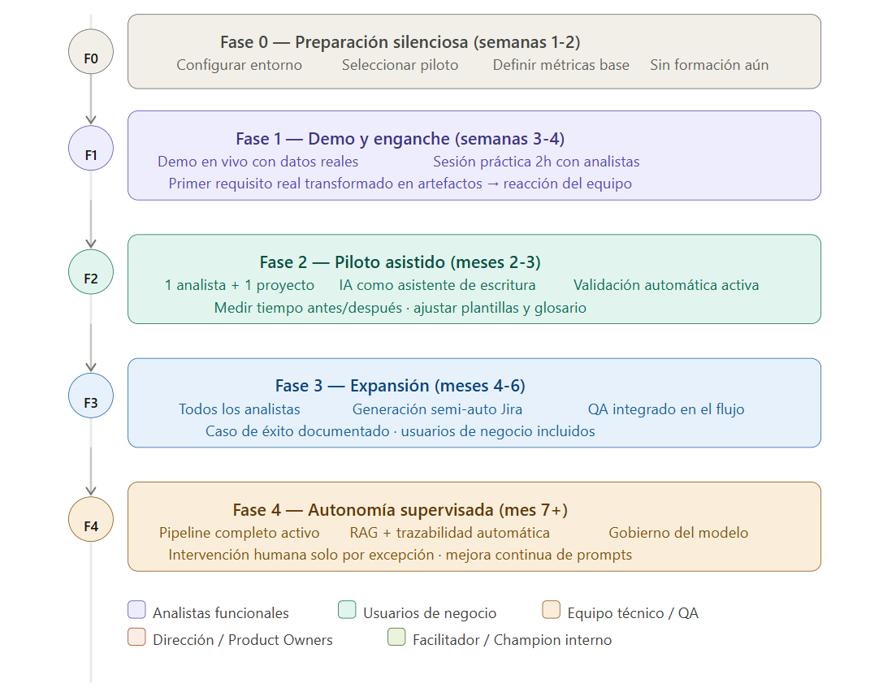

# Punto 12 — Plan de formación y adopción

Todo el trabajo técnico vale cero si el equipo no lo usa. La adopción es el problema más difícil de este tipo de transformaciones, no la tecnología.

---

## El problema real de la adopción

La resistencia a este tipo de cambios no es irracional. Los **analistas funcionales** tienen razones legítimas para desconfiar: sienten que la herramienta va a juzgar su trabajo, temen que la automatización haga su rol prescindible, y han visto antes proyectos de "transformación digital" que generaron trabajo extra sin beneficio visible.

Los **usuarios de negocio** tienen sus propias resistencias: no quieren aprender un nuevo sistema, ya tienen demasiadas reuniones, y sospechan que el nuevo proceso va a ralentizar la recogida de requisitos.

La estrategia de adopción tiene que resolver ambas resistencias de forma diferente porque son personas distintas con motivaciones distintas.

---

## Principios que guían el plan

- **Valor visible antes que proceso correcto.** El equipo necesita ver un beneficio concreto en las primeras dos semanas. Si las primeras semanas son de configuración y formación sin output tangible, la resistencia se instala.
- **El analista como protagonista, no como receptor.** El analista no es el usuario final de la herramienta de IA: es el experto que la supervisa y mejora. Ese reencuadre cambia completamente la dinámica de adopción.
- **El usuario de negocio no debe notar el cambio.** El proceso con el usuario de negocio debe parecer una ligera evolución del anterior, no una revolución. Los cambios profundos ocurren entre bastidores.
- **Métricas desde el día uno.** Sin métricas no hay argumento para continuar cuando aparezcan las primeras fricciones. Las métricas también motivan al equipo cuando muestran mejora real.

---

## Arquitectura del plan de adopción

```
Fase 0  →  Preparación silenciosa   (semanas 1-2)
Fase 1  →  Demo y enganche           (semanas 3-4)
Fase 2  →  Piloto asistido           (meses 2-3)
Fase 3  →  Expansión                 (meses 4-6)
Fase 4  →  Autonomía supervisada     (mes 7 en adelante)
```



---

## Fase 0 — Preparación silenciosa (semanas 1-2)

Esta fase ocurre sin comunicar nada al equipo todavía. El objetivo es tener todo listo para que la demo de la Fase 1 sea impactante con datos reales del propio proyecto.

### Selección del proyecto piloto

El piloto no debe ser el proyecto más grande ni el más estratégico. Debe ser el que tenga:

- Un analista receptivo al cambio.
- Un módulo funcional acotado con entre 10 y 20 requisitos.
- Un backlog con algunos problemas conocidos de ambigüedad o inconsistencia que el sistema pueda resolver de forma visible.

### Construcción del dataset de demostración

Antes de cualquier formación, el responsable técnico toma tres o cuatro requisitos reales del proyecto piloto, los transforma al formato YAML y los pasa por el pipeline completo. El resultado —historias Jira, tareas técnicas y test cases generados con el vocabulario real del proyecto— es el material de la demo. Nada convence más que ver el propio trabajo transformado.

### Definición de métricas base

Antes de empezar, medir durante dos semanas el estado actual:

| Métrica | Cómo medirla |
|---|---|
| Tiempo promedio desde reunión de requisitos hasta historias en Jira | Últimos 5 proyectos o sprints |
| Número de historias que llegan al sprint con cambios de alcance | Historial de comentarios en Jira |
| Bugs clasificados como "ambigüedad funcional" en los últimos 3 meses | Filtrar por etiqueta o campo de causa raíz |
| Porcentaje de historias con criterios de aceptación documentados | Auditar una muestra de 30 historias recientes |
| Cobertura de test cases respecto a criterios de aceptación | Consulta en Xray o Zephyr si disponible |
| Tiempo medio de creación manual de artefactos por requisito | Pedir al analista que cronométre su próximo requisito |

### Selección del champion interno

El champion es la persona que más rápido va a adoptar el sistema y que tiene credibilidad con el resto del equipo. No tiene por qué ser el analista más senior. Suele ser el más curioso tecnológicamente o el que más ha sufrido los problemas que el sistema resuelve.

Esta persona recibe formación técnica completa antes que nadie y se convierte en el referente interno durante los primeros meses.

---

## Fase 1 — Demo y enganche (semanas 3-4)

El objetivo de esta fase es una sola cosa: que el equipo **quiera usar el sistema**. No que lo entienda completamente. No que confíe plenamente en él. Solo que quiera probarlo.

### La sesión de demo (90 minutos)

Estructura diseñada para maximizar el impacto emocional antes de explicar nada técnico:

#### 1. Apertura con el dolor conocido (10 min)

Empezar con una pregunta directa: *"¿Cuánto tiempo tardáis en pasar de una reunión de requisitos a las historias en Jira?"* Dejar que el equipo responda. Luego preguntar: *"¿Cuántas veces habéis llegado al sprint con una historia que tuvo que cambiar porque el requisito era ambiguo?"* No añadir nada. El equipo ya ha articulado el problema que el sistema resuelve.

#### 2. La transformación en directo (30 min)

Tomar uno de los requisitos reales preparados en la Fase 0 —uno que el propio equipo reconozca— y ejecutar el pipeline en directo. No simular: ejecutarlo de verdad con la herramienta en pantalla. En menos de tres minutos aparecen las historias, las tareas técnicas y los test cases. El silencio que sigue a ese momento vale más que cualquier presentación.

#### 3. La conversación honesta (20 min)

No vender el sistema como perfecto. Mostrar los errores que comete, los campos que a veces genera con información incompleta, los casos donde el glosario no está bien definido y la IA usa un término incorrecto. Esta honestidad construye más confianza que una demo perfecta.

#### 4. El rol del analista en el nuevo proceso (20 min)

Este es el momento más importante de la sesión. Explicar con claridad:

- La IA hace el trabajo **mecánico** (rellenar campos, formatear, generar la estructura).
- El analista hace el trabajo de **valor** (entender el negocio, validar que el output es correcto, detectar lo que la IA no puede ver).

Metáfora útil: el copiloto de avión no sustituye al piloto, hace el trabajo de monitorización para que el piloto pueda concentrarse en las decisiones difíciles.

#### 5. Preguntas sin filtro (10 min)

| Pregunta | Respuesta honesta |
|---|---|
| "¿Esto va a reemplazar mi trabajo?" | No. Va a eliminar la parte más aburrida de tu trabajo. La parte que requiere juicio experto sigue siendo tuya. |
| "¿Qué pasa si la IA genera algo incorrecto?" | Por eso existe el paso de aprobación. Nada llega a Jira sin que tú lo hayas revisado. |
| "¿Cuánto tiempo me va a llevar aprender esto?" | La sesión de hoy es suficiente para empezar. En dos semanas lo usarás con fluidez. |
| "¿Y si el negocio no quiere cambiar su forma de dar los requisitos?" | El negocio no cambia nada. La plantilla estructurada la rellena el analista después de la reunión, no el usuario de negocio. |

### La sesión práctica con analistas (120 minutos)

Dos días después de la demo, sesión de manos a la obra solo con los analistas. Sin directivos, sin usuarios de negocio.

```
00:00 - 00:20  Revisión rápida del pipeline
               El champion explica los puntos 4, 5 y 6 con sus palabras
               Objetivo: que el equipo se lo oiga explicar a un igual, no al responsable

00:20 - 00:50  Ejercicio individual
               Cada analista toma un requisito real de su proyecto actual
               Lo rellena en la plantilla YAML con ayuda del facilitador
               Lo pasa por el validador (punto 6)
               Ve los errores que detecta y los corrige

00:50 - 01:20  Ejercicio en parejas
               Una pareja ejecuta el pipeline completo sobre el requisito del ejercicio anterior
               La otra pareja revisa el output y lo aprueba o rechaza con argumentos
               Rotar roles

01:20 - 01:40  Puesta en común
               ¿Qué os ha sorprendido positivamente?
               ¿Qué no funciona como esperabais?
               ¿Qué cambiaríais de la plantilla para vuestro contexto?

01:40 - 02:00  Configuración personal
               Cada analista configura su acceso a la herramienta
               El champion queda como punto de contacto para dudas
               Se acuerda la cadencia de revisión: una sesión semanal de 30 min
               durante el primer mes
```

---

## Fase 2 — Piloto asistido (meses 2-3)

Un analista —el champion— usa el sistema en su proyecto real con plena supervisión. El resto del equipo observa y aprende sin presión.

### Lo que cambia en el proceso del analista piloto

El analista no abandona su flujo de trabajo habitual. Lo **extiende con tres pasos nuevos** que se insertan en momentos naturales del proceso:

1. **Después de la reunión de requisitos** (en lugar de abrir Word): rellena la plantilla YAML en Confluence. El tiempo no cambia: antes tardaba 45 minutos en escribir el documento Word; ahora tarda 40 minutos en rellenar la plantilla estructurada.

2. **Antes de enviar el requisito a revisión**: ejecuta el validador automático. Si hay errores bloqueantes los corrige; si hay advertencias las anota. Esto reemplaza la revisión informal que antes hacía mentalmente.

3. **En lugar de crear manualmente los issues en Jira**: aprueba el JSON generado y lo empuja a Jira. Este paso reemplaza entre 30 y 90 minutos de trabajo mecánico por 5-10 minutos de revisión.

### Protocolo de seguimiento semanal (30 min)

```
1. ¿Qué funcionó bien esta semana? (5 min)
   → Documentar para el caso de éxito

2. ¿Qué no funcionó o generó fricción? (10 min)
   → Categorizar: ¿es un problema de plantilla, de prompt, de glosario
     o de proceso?

3. ¿Qué ajuste concreto hacemos esta semana? (10 min)
   → Un solo ajuste por semana. No acumular.
   → Documentar el ajuste y el motivo.

4. ¿Qué le contamos al resto del equipo? (5 min)
   → Cada semana, una actualización de tres frases en el canal
     del equipo. Sin tecnicismos.
```

### Métricas del piloto (medición semanal)

```
Tiempo de creación de artefactos por requisito:
  Antes: X minutos (medido en Fase 0)
  Durante piloto: Y minutos (el analista cronometra)
  Objetivo: reducción >50% en semana 8

Número de errores detectados por el validador:
  Semana 1: N errores por requisito (línea base del piloto)
  Semana 8: M errores por requisito (debe bajar)
  → Mide la curva de aprendizaje de la escritura estructurada

Porcentaje de artefactos Jira aprobados sin ediciones:
  Semana 1: X% (primer contacto con el output del pipeline)
  Semana 8: Y% (debe superar el 80%)
  → Mide la calidad del pipeline y la madurez de la plantilla

Historias que llegan al sprint sin cambios de alcance:
  Antes: X% (medido en Fase 0)
  Durante piloto: Y% (medido en retrospectiva de sprint)
  → El indicador de negocio más importante
```

---

## Fase 3 — Expansión (meses 4-6)

Con el caso de éxito documentado del piloto, la expansión es mucho más sencilla porque el equipo ya tiene pruebas internas, no promesas de un proveedor externo.

### Incorporación del resto de analistas

No incorporar a todos a la vez. Secuencia recomendada:

- **Semana 1 del mes 4.** El champion presenta el caso de éxito al resto de analistas: 30 minutos, sin presentación formal, solo números reales y anécdotas concretas.
- **Semanas 2-3.** Cada analista tiene una sesión individual de 90 minutos con el champion (no con el facilitador técnico: con el champion, un igual).
- **Semanas 4-6.** Cada analista usa el sistema en un requisito real de su proyecto actual, con el champion disponible por Slack.
- **Mes 5-6.** El sistema es el flujo estándar para todos los analistas.

### Incorporación de los usuarios de negocio

Los usuarios de negocio **no reciben formación sobre el sistema**: reciben una versión ligeramente mejorada del proceso que ya conocen.

```
ANTES:
  Usuario: "Necesitamos poder gestionar las facturas mejor"
  Analista: Toma notas en Word durante la reunión
  [Días después] Analista envía documento Word para revisión
  [Días después] Usuario revisa y pide cambios
  [Días después] Segunda ronda de revisión

AHORA:
  Usuario: "Necesitamos poder gestionar las facturas mejor"
  Analista: Guía la conversación con las preguntas de la plantilla
  [Al final de la reunión] Analista lee en voz alta los criterios
    de aceptación que ha capturado: "¿Es correcto que si introduces
    un rango de más de 365 días el sistema te avise?"
  Usuario: "Sí, eso es exactamente lo que queremos"
  [1-2 horas después] Analista envía resumen estructurado para validación
```

El usuario de negocio percibe que la reunión es más productiva y que el analista hace mejores preguntas. **No sabe que detrás hay una plantilla YAML y un pipeline de IA.**

### Incorporación del equipo técnico y QA

- **Equipo técnico** (60 min): cómo leer los artefactos generados y cómo usar la matriz de trazabilidad para navegar desde un bug hasta el requisito que lo originó.
- **Equipo de QA** (90 min): cómo revisar los test cases generados, qué criterios usar para aprobarlos o rechazarlos, y cómo integrar los scripts Gherkin con su framework de automatización.

---

## Fase 4 — Autonomía supervisada (mes 7 en adelante)

En esta fase el sistema funciona con mínima intervención manual. El foco pasa de la adopción al gobierno y la mejora continua.

### Gobierno del modelo

- **Propietario de prompts.** El champion asume la responsabilidad de mantener y mejorar los prompts. Cada cambio requiere prueba sobre al menos cinco requisitos reales antes de llegar a producción.
- **Comité de calidad mensual.** 45 minutos al mes: revisión de métricas, identificación de tipos de requisito con output de menor calidad, y exactamente un ajuste por mes.
- **Proceso de escalada.** Cuando el pipeline genera algo claramente incorrecto que llega a Jira, se abre un issue de tipo "Fallo de pipeline" que alimenta la agenda del comité mensual.

### Métricas de madurez del sistema

```
Tasa de aprobación directa de artefactos:
  Porcentaje de JSONs aprobados sin ediciones por el analista
  Objetivo mes 7: >80%
  Objetivo mes 12: >90%

Tasa de detección temprana de ambigüedad:
  Porcentaje de requisitos donde el validador detecta al menos
  un problema antes de que llegue al refinamiento
  Objetivo: >70% de los requisitos con algún problema detectado
  antes del pipeline, no después

Tiempo de ciclo funcional:
  Desde reunión de requisitos hasta historias en Jira
  Objetivo mes 7: reducción >60% respecto a la línea base

Bugs por ambigüedad funcional:
  Bugs en producción cuya causa raíz es un requisito mal definido
  Objetivo mes 12: reducción >40% respecto a la línea base

Satisfacción del analista (encuesta trimestral):
  "¿El sistema reduce tu carga de trabajo en tareas repetitivas?"
  "¿El output del pipeline representa bien la intención del requisito?"
  "¿Recomendarías este proceso a otro analista?"
  Escala 1-5. Objetivo: >4 en las tres preguntas en mes 9
```

---

## Materiales de formación

### Para analistas funcionales: guía de referencia rápida (1 página)

```
┌─────────────────────────────────────────────────────────────┐
│ GUÍA RÁPIDA — Pipeline AI Funcional                         │
│ Champion: [nombre] · Dudas: #canal-pipeline-ai              │
├─────────────────────────────────────────────────────────────┤
│ EL FLUJO EN 5 PASOS                                         │
│                                                             │
│ 1. RELLENAR la plantilla YAML tras la reunión               │
│    Campos mínimos: id, titulo, actor, descripcion,          │
│    evento_disparador, criterios_aceptacion (≥1), excepciones│
│                                                             │
│ 2. VALIDAR antes de cambiar estado a 'en-revision'          │
│    python validate.py REQ-XXX.yaml                          │
│    BLOQUEANTEs → corregir antes de continuar                │
│    Solo ADVERTENCIAS → documentar y continuar               │
│                                                             │
│ 3. GENERAR los artefactos (estado = 'validado')             │
│    python generate.py REQ-XXX.yaml   [~30-90 segundos]      │
│                                                             │
│ 4. REVISAR el JSON generado (checklist 2 min)               │
│    □ ¿El actor es correcto?                                 │
│    □ ¿Los criterios reflejan lo que pidió el negocio?       │
│    □ ¿Las tareas técnicas tienen sentido?                   │
│    □ ¿La estimación de story points es razonable?           │
│                                                             │
│ 5. APROBAR para push a Jira                                 │
│    python approve.py [ID-APROBACION]                        │
├─────────────────────────────────────────────────────────────┤
│ CUÁNDO RECHAZAR EL OUTPUT                                   │
│ ✗ El actor no es el correcto o es demasiado genérico        │
│ ✗ Un criterio AC no es verificable                          │
│ ✗ Las tareas técnicas mezclan capas (front + back juntos)   │
│ ✗ La estimación es claramente incorrecta (>13 o <1)         │
│ ✗ Hay términos que no están en el glosario del proyecto     │
├─────────────────────────────────────────────────────────────┤
│ SI ALGO FALLA                                               │
│ 1. Captura el error (screenshot o log)                      │
│ 2. Crea issue en [proyecto-pipeline-ai] con el REQ-ID       │
│ 3. Crea los artefactos manualmente como siempre             │
│    El pipeline es una ayuda, no un bloqueante               │
└─────────────────────────────────────────────────────────────┘
```

### Para usuarios de negocio: guía de "cómo dar buenos requisitos"

Este documento **no menciona IA, YAML ni pipeline**. Es una guía de comunicación.

**Antes de la reunión:**
- Piensa en el problema, no en la solución. *"Perdemos mucho tiempo buscando facturas antiguas"* es mejor que *"Necesitamos un filtro de facturas con fechas"*.
- Piensa en quién va a usar esta funcionalidad y cuándo.

**En la reunión:**
- Te haremos preguntas específicas para entenderte mejor: *"¿Qué pasa si [situación excepcional]?"*, *"¿Cómo sabremos que esto está funcionando correctamente?"*
- Al final de la reunión, leeremos en voz alta lo que entendimos. Si algo no es correcto, es el mejor momento para decirlo.

**Después de la reunión:**
- Recibirás un resumen estructurado en 1-2 días para validar. Una respuesta rápida evita semanas de retraso.

**Un buen requisito responde estas preguntas:**
- ¿Quién lo usa?
- ¿Cuándo lo usa y por qué?
- ¿Qué debe pasar exactamente cuando funciona bien?
- ¿Qué debe pasar si algo falla?
- ¿Cómo sabremos que está bien hecho?

### Para equipo técnico y QA: el contrato de artefactos

**Historias de usuario:**
- El campo *Requisito Origen* siempre tiene el ID del REQ que originó la historia.
- Los criterios de aceptación en formato Dado/Cuando/Entonces son la fuente de verdad para los test cases.
- Las tareas técnicas tienen el campo *capa* (backend, frontend, base_datos, testing, integracion).

**Test Cases (en Xray):**
- Los test cases con label *automatizable* tienen un script Gherkin en el campo *Definition*.
- Los test cases de tipo *contorno* son los valores límite: no saltárselos aunque parezcan obvios.

**Cuando el artefacto parece incorrecto:**
- Comentar en el issue con el prefijo `[PIPELINE-FEEDBACK]` antes de modificarlo.
- Modificar el artefacto en Jira para que el sprint no se bloquee.

---

## Los cinco errores más frecuentes en la adopción

1. **Empezar con el proyecto más importante.** El primer proyecto siempre tiene más fricción de la esperada. Si ese proyecto es crítico, cualquier problema se convierte en argumento para abandonar la iniciativa.

2. **Formar a todos a la vez.** La formación en grupo produce la ilusión de adopción. La adopción funciona persona a persona, con seguimiento individual.

3. **Automatizar antes de que la plantilla esté madura.** Si los resultados del pipeline son pobres porque la plantilla está incompleta, la primera impresión es negativa y muy difícil de recuperar.

4. **No comunicar los resultados internamente.** Los éxitos del piloto deben comunicarse en el canal del equipo, en retrospectivas, en el informe mensual a dirección.

5. **Tratar el pipeline como un producto terminado.** El pipeline va a generar output incorrecto en casos no anticipados. Si el equipo entiende que es una herramienta en evolución, los errores se convierten en contribuciones al sistema.

---

## El argumento para la dirección (3 minutos)

**Situación actual:**
Desde que un usuario de negocio da un requisito hasta que hay historias en Jira listas para el sprint, pasan entre 2 y 5 días de trabajo de análisis. Aproximadamente el 60% de ese tiempo es trabajo mecánico. Además, entre el 20% y el 30% de los bugs en producción tienen como causa raíz un requisito ambiguo o incompleto.

**Lo que se propone:**
Automatizar el 60% del trabajo mecánico con IA para que los analistas dediquen ese tiempo a lo que realmente aporta valor. Añadir una capa de validación automática que detecta ambigüedades antes de que el requisito entre al sprint.

**Impacto esperado en 6 meses:**
- Reducción del 60% en tiempo de creación de artefactos Jira
- Reducción del 40% en bugs por ambigüedad funcional
- Trazabilidad completa sin coste de mantenimiento manual

**El coste:**
- 2 meses de configuración y piloto con un analista
- Sin necesidad de nuevas licencias de software en las fases iniciales
- Sin cambios en el proceso visible para los usuarios de negocio

---

## Plan de comunicación interna

Actualización semanal de tres líneas en el canal del equipo durante los primeros tres meses:

> **Semana 3:** *"Esta semana transformamos el primer requisito real con el pipeline. Tardamos 8 minutos en generar las historias y tareas técnicas que normalmente llevan 2 horas. El output necesita ajustes pero la dirección es prometedora."*

> **Semana 6:** *"Acumulamos 12 requisitos procesados. El tiempo medio de creación de artefactos ha bajado de 95 a 38 minutos. El validador ha detectado 7 ambigüedades que habrían llegado al sprint."*

> **Semana 10:** *"Primer sprint donde todas las historias tenían criterios de aceptación documentados desde el inicio. El equipo de QA reporta que el tiempo de análisis de test cases se ha reducido a la mitad."*

---

A continuación: [Punto 13 — Gobierno del modelo.](./113-gobierno.md)

---
