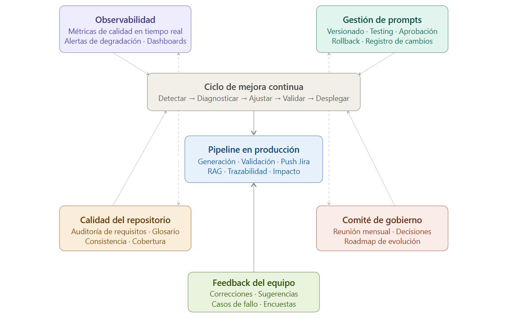

# Punto 13 — Gobierno del modelo

El gobierno del modelo es lo que separa un proyecto de IA que funciona durante tres meses de uno que sigue funcionando en tres años. Sin gobierno, el pipeline se degrada silenciosamente: los prompts quedan desactualizados cuando cambia el stack tecnológico, el glosario se fragmenta cuando rotan los analistas, y nadie detecta que la calidad del output ha bajado hasta que un bug importante llega a producción.

---

## Qué significa gobernar un pipeline de IA funcional

Gobernar este sistema no es lo mismo que gobernar software tradicional. Tiene tres dimensiones que el software convencional no tiene.

**Los prompts son código que se degrada sin cambiar.** Un prompt que hoy genera historias excelentes puede generar historias mediocres en seis meses sin que nadie lo haya tocado, simplemente porque el contexto del proyecto ha cambiado: nuevos actores, nuevas reglas de negocio, nuevos módulos con vocabulario diferente. El gobierno debe detectar esta degradación antes de que sea visible en los artefactos.

**La calidad del output depende de la calidad del input.** Si la plantilla de requisitos se relaja, si el glosario deja de mantenerse, si los analistas empiezan a tomar atajos, el pipeline genera output correcto sintácticamente pero incorrecto funcionalmente. El gobierno debe medir la calidad del input, no solo del output.

**El sistema aprende del uso, pero sin supervisión aprende mal.** Los patrones que el pipeline refuerza son los que aparecen más frecuentemente en el repositorio. Si los requisitos aprobados tienen defectos sistemáticos, esos defectos se convierten en la norma. El gobierno debe garantizar que el repositorio de referencia es de alta calidad.

---

## Arquitectura del sistema de gobierno

### Los cinco pilares del gobierno

El sistema de gobierno se articula en cinco pilares independientes que se revisan con cadencias distintas.

```
PILARES DEL GOBIERNO
│
├── 1. Observabilidad          → Detectar problemas antes de que sean visibles
├── 2. Gestión de prompts      → Evolucionar el pipeline con rigor
├── 3. Calidad del repositorio → Mantener la materia prima en buen estado
├── 4. Estructura de decisión  → Quién decide qué y cuándo
└── 5. Gestión del riesgo      → Qué puede salir mal y cómo prevenirlo
```



---

## Pilar 1 — Observabilidad

La observabilidad es el sistema de instrumentación que registra lo que ocurre en cada ejecución del pipeline. Sin ella, el gobierno es reactivo: solo se detectan problemas cuando alguien se queja. Con ella, el gobierno es proactivo: los problemas se detectan antes de que impacten al equipo.

### Las métricas que importan

No todas las métricas tienen el mismo valor. Estas son las que realmente indican si el sistema funciona bien, agrupadas por lo que miden.

**Métricas de calidad del output** (se miden en cada ejecución):

```python
class MetricasEjecucion:
    """
    Registra las métricas de cada ejecución del pipeline.
    Se persiste en base de datos para análisis de tendencias.
    """

    # Tasa de aprobación directa
    # Porcentaje de JSONs aprobados sin ediciones por el analista
    # Valor objetivo: >80% en mes 6, >90% en mes 12
    # Señal de alarma: caída de más de 10 puntos en dos semanas
    tasa_aprobacion_directa: float

    # Tasa de rechazo
    # Porcentaje de JSONs rechazados completamente (no editados, rechazados)
    # Valor objetivo: <5%
    # Señal de alarma: >10% en cualquier semana
    tasa_rechazo: float

    # Número medio de ediciones por artefacto aprobado
    # Cuenta cuántos campos edita el analista antes de aprobar
    # Valor objetivo: <3 ediciones por historia
    # Señal de alarma: >6 ediciones de media en una semana
    ediciones_por_artefacto: float

    # Campos más editados
    # Qué campos modifica el analista con más frecuencia
    # Diagnóstico directo: si siempre edita el mismo campo,
    # ese campo tiene un problema en el prompt
    campos_mas_editados: dict[str, int]

    # Tiempo de procesamiento del pipeline
    # Cuánto tarda desde el YAML hasta el JSON aprobable
    # Valor objetivo: <120 segundos
    # Señal de alarma: >300 segundos (problema de latencia o rate limit)
    tiempo_procesamiento_segundos: float

    # Score de calidad del validador
    # Puntuación 0-100 que el validador asigna al requisito de entrada
    # Valor objetivo: media >75 en todo el repositorio
    # Señal de alarma: media <60 durante dos semanas consecutivas
    score_calidad_requisito: float
```

**Métricas de impacto en el proceso** (se miden semanalmente):

```python
class MetricasProceso:

    # Tiempo de ciclo funcional
    # Desde reunión de requisitos hasta historias en Jira aprobadas
    # Medido en horas laborables
    # Valor objetivo: reducción >60% respecto a línea base
    tiempo_ciclo_horas: float

    # Tasa de cambio de alcance en sprint
    # Porcentaje de historias que reciben cambios de alcance
    # una vez comprometidas en el sprint
    # Valor objetivo: <10%
    # Señal de alarma: >20% en cualquier sprint
    tasa_cambio_alcance_sprint: float

    # Cobertura de criterios de aceptación
    # Porcentaje de historias con al menos 2 criterios AC verificables
    # Valor objetivo: 100%
    # Señal de alarma: <85%
    cobertura_criterios_ac: float

    # Bugs por ambigüedad funcional
    # Bugs en producción cuya causa raíz es un requisito ambiguo
    # Valor objetivo: reducción >40% en 12 meses respecto a línea base
    bugs_ambiguedad_funcional: int

    # Tasa de detección temprana del validador
    # Porcentaje de requisitos donde el validador detecta al menos
    # un problema antes del pipeline
    # Valor objetivo: >70%
    tasa_deteccion_temprana: float
```

**Métricas de satisfacción del equipo** (se miden mensualmente):

```python
class MetricasSatisfaccion:

    # Encuesta trimestral a analistas (escala 1-5)
    # "¿El pipeline reduce tu carga en tareas repetitivas?"
    # "¿El output representa bien la intención del requisito?"
    # "¿Recomendarías este proceso a otro analista?"
    # Valor objetivo: >4.0 en las tres preguntas en mes 9
    satisfaccion_analistas: dict[str, float]

    # NPS interno del sistema
    # "En una escala del 1 al 10, ¿recomendarías este sistema
    # a un compañero de otro proyecto?"
    # Valor objetivo: >7
    nps_interno: float

    # Frecuencia de uso voluntario
    # Porcentaje de requisitos procesados con el pipeline
    # sobre el total de requisitos del período
    # Valor objetivo: >95% en mes 9
    # Señal de alarma: analistas que evitan el pipeline sistemáticamente
    frecuencia_uso: float
```

### Sistema de alertas automáticas

Las métricas solo tienen valor si se actúa sobre ellas. El sistema de alertas envía notificaciones al champion y al comité de gobierno cuando se detectan anomalías:

```python
import smtplib
from dataclasses import dataclass
from typing import Callable
from datetime import datetime, timedelta
import json

@dataclass
class ReglaAlerta:
    nombre: str
    descripcion: str
    condicion: Callable[[dict], bool]
    severidad: str          # critica | alta | media
    destinatarios: list[str]
    accion_recomendada: str
    cooldown_horas: int     # No re-alertar antes de este tiempo


class SistemaAlertas:
    """
    Evalúa las reglas de alerta sobre las métricas del pipeline
    y notifica al equipo de gobierno cuando se detectan anomalías.
    """

    REGLAS = [
        ReglaAlerta(
            nombre="tasa_aprobacion_critica",
            descripcion="La tasa de aprobación directa ha caído por debajo del 60%",
            condicion=lambda m: m.get("tasa_aprobacion_directa", 1.0) < 0.60,
            severidad="critica",
            destinatarios=["champion", "responsable_tecnico"],
            accion_recomendada=(
                "Revisar los últimos 10 rechazos. Identificar el campo "
                "más editado. Probable problema en el prompt de generación "
                "de historias o en la plantilla de requisitos."
            ),
            cooldown_horas=24
        ),
        ReglaAlerta(
            nombre="tiempo_ciclo_regresion",
            descripcion="El tiempo de ciclo funcional supera el doble del objetivo",
            condicion=lambda m: m.get("tiempo_ciclo_horas", 0) > (
                m.get("objetivo_tiempo_ciclo_horas", 8) * 2
            ),
            severidad="alta",
            destinatarios=["champion", "product_owner"],
            accion_recomendada=(
                "Verificar si hay cuellos de botella en la cola de aprobación. "
                "Revisar si el pipeline tiene problemas de latencia. "
                "Comprobar si los analistas están evitando el sistema."
            ),
            cooldown_horas=48
        ),
        ReglaAlerta(
            nombre="score_calidad_requisitos_bajo",
            descripcion="La calidad media de los requisitos ha caído por debajo de 60",
            condicion=lambda m: m.get("score_calidad_medio", 100) < 60,
            severidad="alta",
            destinatarios=["champion", "analista_lider"],
            accion_recomendada=(
                "Auditar los últimos 20 requisitos del repositorio. "
                "Probable degradación en la adherencia a la plantilla. "
                "Puede requerir sesión de recalibración con los analistas."
            ),
            cooldown_horas=72
        ),
        ReglaAlerta(
            nombre="bugs_ambiguedad_aumento",
            descripcion="Los bugs por ambigüedad funcional han aumentado un 30% respecto al mes anterior",
            condicion=lambda m: (
                m.get("bugs_ambiguedad_mes_actual", 0) >
                m.get("bugs_ambiguedad_mes_anterior", 0) * 1.3
            ),
            severidad="alta",
            destinatarios=["champion", "qa_lead", "product_owner"],
            accion_recomendada=(
                "Analizar los bugs del mes para identificar el módulo "
                "o tipo de requisito que genera más ambigüedad. "
                "Revisar si el validador está detectando esos patrones."
            ),
            cooldown_horas=168  # Una semana
        ),
        ReglaAlerta(
            nombre="glosario_sin_actualizacion",
            descripcion="El glosario no ha sido actualizado en más de 30 días",
            condicion=lambda m: (
                datetime.now() - datetime.fromisoformat(
                    m.get("fecha_ultima_actualizacion_glosario", "2000-01-01")
                )
            ).days > 30,
            severidad="media",
            destinatarios=["champion"],
            accion_recomendada=(
                "Revisar si han aparecido términos nuevos en los últimos "
                "requisitos que no estén en el glosario. "
                "Programar sesión de revisión con el área de negocio."
            ),
            cooldown_horas=168
        )
    ]

    def __init__(self, db_config: dict, notificador):
        self.db_config = db_config
        self.notificador = notificador
        self.alertas_enviadas: dict[str, datetime] = {}

    def evaluar_todas(self, metricas_actuales: dict):
        """
        Evalúa todas las reglas de alerta sobre las métricas actuales.
        Respeta el cooldown para no saturar al equipo con notificaciones.
        """
        for regla in self.REGLAS:
            try:
                if not regla.condicion(metricas_actuales):
                    continue

                # Verificar cooldown
                ultima = self.alertas_enviadas.get(regla.nombre)
                if ultima:
                    tiempo_desde_ultima = datetime.now() - ultima
                    if tiempo_desde_ultima < timedelta(hours=regla.cooldown_horas):
                        continue

                # Enviar alerta
                self.notificador.enviar(
                    severidad=regla.severidad,
                    titulo=f"⚠ Alerta de gobierno: {regla.nombre}",
                    descripcion=regla.descripcion,
                    accion=regla.accion_recomendada,
                    destinatarios=regla.destinatarios,
                    metricas_relevantes=metricas_actuales
                )

                self.alertas_enviadas[regla.nombre] = datetime.now()

            except Exception as e:
                print(f"Error evaluando regla {regla.nombre}: {e}")

    def generar_dashboard_semanal(self, metricas_semana: dict) -> str:
        """
        Genera el resumen semanal de métricas para el equipo de gobierno.
        Formato Markdown para publicar en Confluence o Slack.
        """
        m = metricas_semana

        def semaforo(valor, objetivo, invertido=False):
            if invertido:
                ok = valor <= objetivo * 1.1
                warn = valor <= objetivo * 1.5
            else:
                ok = valor >= objetivo * 0.9
                warn = valor >= objetivo * 0.7
            return "🟢" if ok else "🟡" if warn else "🔴"

        return f"""
## Dashboard de gobierno — Semana {m.get('semana', 'N/A')}

### Calidad del output
| Métrica | Valor | Objetivo | Estado |
|---|---|---|---|
| Tasa aprobación directa | {m.get('tasa_aprobacion_directa', 0):.0%} | >80% | {semaforo(m.get('tasa_aprobacion_directa', 0), 0.80)} |
| Ediciones por artefacto | {m.get('ediciones_por_artefacto', 0):.1f} | <3 | {semaforo(m.get('ediciones_por_artefacto', 0), 3, invertido=True)} |
| Score calidad requisitos | {m.get('score_calidad_medio', 0):.0f}/100 | >75 | {semaforo(m.get('score_calidad_medio', 0), 75)} |
| Tiempo ciclo (horas) | {m.get('tiempo_ciclo_horas', 0):.1f}h | <{m.get('objetivo_ciclo', 8)}h | {semaforo(m.get('tiempo_ciclo_horas', 99), m.get('objetivo_ciclo', 8), invertido=True)} |

### Impacto en el proceso
| Métrica | Valor | Objetivo | Estado |
|---|---|---|---|
| Cambios de alcance en sprint | {m.get('tasa_cambio_alcance', 0):.0%} | <10% | {semaforo(m.get('tasa_cambio_alcance', 1), 0.10, invertido=True)} |
| Bugs por ambigüedad | {m.get('bugs_ambiguedad_mes', 0)} | <{m.get('objetivo_bugs', 5)} | {semaforo(m.get('bugs_ambiguedad_mes', 99), m.get('objetivo_bugs', 5), invertido=True)} |
| Cobertura de AC | {m.get('cobertura_ac', 0):.0%} | 100% | {semaforo(m.get('cobertura_ac', 0), 1.0)} |

### Campo más editado esta semana
**{m.get('campo_mas_editado', 'N/A')}** ({m.get('ediciones_campo_top', 0)} ediciones)
→ Revisar si el prompt de este campo necesita ajuste.

### Tendencia de aprobación (últimas 4 semanas)
{' → '.join([f"{v:.0%}" for v in m.get('tendencia_aprobacion', [])])}

### Alertas activas
{chr(10).join([f"- ⚠ {a}" for a in m.get('alertas_activas', ['Ninguna'])])}
        """.strip()
```

---

## Pilar 2 — Gestión de prompts

Los prompts son el corazón del pipeline. Gestionarlos con el mismo rigor que el código fuente es lo que garantiza que el sistema evoluciona de forma controlada.

### Versionado de prompts

Cada prompt del pipeline vive en el repositorio Git junto a los requisitos. La estructura de carpetas es:

```
pipeline/
├── prompts/
│   ├── v1.0/
│   │   ├── system_base.txt
│   │   ├── p1_epica.txt
│   │   ├── p2_historia.txt
│   │   ├── p3_tareas.txt
│   │   ├── p4_subtareas.txt
│   │   ├── p5_validacion_estructural.txt
│   │   ├── p6_validacion_semantica.txt
│   │   ├── p7_test_cases_positivos.txt
│   │   ├── p8_test_cases_negativos.txt
│   │   └── p9_test_cases_contorno.txt
│   ├── v1.1/                          ← versión actual en producción
│   │   └── ...
│   └── v1.2-draft/                    ← versión en desarrollo
│       └── ...
│
├── tests/
│   ├── dataset_evaluacion/            ← 20 requisitos de referencia
│   │   ├── REQ-TEST-001.yaml          ← requisito de prueba
│   │   ├── REQ-TEST-001.expected.json ← output esperado
│   │   └── ...
│   └── evaluar_prompts.py             ← script de evaluación
│
└── changelog_prompts.md               ← historial de cambios
```

### Proceso de cambio de un prompt

Ningún prompt cambia en producción sin pasar por este proceso de cuatro pasos. La regla es que un cambio de prompt es equivalente a un cambio de código: necesita revisión, testing y aprobación.

```python
class GestorVersionadoPrompts:
    """
    Gestiona el ciclo de vida de los prompts del pipeline.
    Garantiza que ningún cambio llega a producción sin validación.
    """

    def __init__(self, repo_path: str, evaluador):
        self.repo_path = repo_path
        self.evaluador = evaluador

    def proponer_cambio(
        self,
        prompt_id: str,
        texto_nuevo: str,
        motivo: str,
        autor: str
    ) -> str:
        """
        Paso 1: Proponer un cambio en un prompt.
        Crea una rama draft y registra la propuesta.
        Retorna el ID de la propuesta.
        """
        propuesta_id = f"PROMPT-{datetime.now().strftime('%Y%m%d-%H%M')}"

        # Guardar el nuevo prompt en la carpeta draft
        ruta_draft = f"{self.repo_path}/prompts/draft-{propuesta_id}/"
        # ... crear directorio y archivo ...

        # Registrar en el changelog
        self._registrar_propuesta(
            propuesta_id=propuesta_id,
            prompt_id=prompt_id,
            motivo=motivo,
            autor=autor,
            estado="propuesto"
        )

        return propuesta_id

    def evaluar_propuesta(
        self,
        propuesta_id: str,
        version_actual: str,
        version_propuesta: str
    ) -> dict:
        """
        Paso 2: Evaluar el nuevo prompt contra el dataset de referencia.
        Compara el output del prompt actual vs el propuesto
        sobre los 20 requisitos de prueba.
        Retorna el informe comparativo.
        """
        resultados_actual = self.evaluador.evaluar_version(
            version=version_actual,
            dataset_path=f"{self.repo_path}/tests/dataset_evaluacion/"
        )

        resultados_nuevo = self.evaluador.evaluar_version(
            version=version_propuesta,
            dataset_path=f"{self.repo_path}/tests/dataset_evaluacion/"
        )

        comparacion = {
            "propuesta_id": propuesta_id,
            "metricas": {}
        }

        # Comparar métricas clave
        for metrica in [
            "tasa_aprobacion_simulada",
            "score_calidad_medio",
            "campos_correctos_pct",
            "criterios_ac_verificables_pct"
        ]:
            actual = resultados_actual.get(metrica, 0)
            nuevo = resultados_nuevo.get(metrica, 0)
            diferencia = nuevo - actual

            comparacion["metricas"][metrica] = {
                "actual": actual,
                "nuevo": nuevo,
                "diferencia": diferencia,
                "mejora": diferencia > 0
            }

        # Veredicto automático
        mejoras = sum(
            1 for m in comparacion["metricas"].values()
            if m["mejora"]
        )
        total = len(comparacion["metricas"])

        comparacion["veredicto_automatico"] = (
            "RECOMENDAR_APROBACION"
            if mejoras >= total * 0.75 else
            "RECOMENDAR_RECHAZO"
            if mejoras < total * 0.25 else
            "REQUIERE_REVISION_HUMANA"
        )

        comparacion["casos_regresion"] = self._detectar_regresiones(
            resultados_actual, resultados_nuevo
        )

        return comparacion

    def _detectar_regresiones(
        self,
        resultados_actual: dict,
        resultados_nuevo: dict
    ) -> list[dict]:
        """
        Identifica casos específicos donde el nuevo prompt
        genera output peor que el actual.
        Estos casos son los más importantes para revisar manualmente.
        """
        regresiones = []

        for req_id in resultados_actual.get("por_requisito", {}):
            score_actual = resultados_actual["por_requisito"][req_id].get("score", 0)
            score_nuevo = resultados_nuevo.get(
                "por_requisito", {}
            ).get(req_id, {}).get("score", 0)

            if score_nuevo < score_actual * 0.85:
                regresiones.append({
                    "requisito_id": req_id,
                    "score_actual": score_actual,
                    "score_nuevo": score_nuevo,
                    "degradacion_pct": round(
                        (score_actual - score_nuevo) / score_actual * 100
                    )
                })

        return sorted(
            regresiones,
            key=lambda x: x["degradacion_pct"],
            reverse=True
        )

    def aprobar_y_desplegar(
        self,
        propuesta_id: str,
        aprobado_por: str,
        notas: str = ""
    ) -> bool:
        """
        Paso 3 y 4: Aprobación humana y despliegue.
        Solo el champion o el responsable técnico pueden aprobar.
        El despliegue actualiza la versión activa en producción.
        """
        # Registrar la aprobación
        self._registrar_aprobacion(
            propuesta_id=propuesta_id,
            aprobado_por=aprobado_por,
            notas=notas
        )

        # Copiar los prompts aprobados a la versión activa
        # ... lógica de despliegue ...

        # Actualizar el changelog
        self._actualizar_changelog(propuesta_id, aprobado_por)

        # Notificar al equipo
        print(
            f"Prompt {propuesta_id} desplegado en producción "
            f"por {aprobado_por}."
        )

        return True
```

### Evaluador automático de prompts

El evaluador compara el output de dos versiones de prompt sobre un dataset fijo de requisitos de referencia. Este dataset nunca cambia: son los 20 requisitos más representativos del proyecto, elegidos para cubrir los casos más frecuentes y los más problemáticos.

```python
class EvaluadorPrompts:
    """
    Evalúa la calidad de una versión de prompts sobre
    el dataset de referencia. Produce métricas comparables
    entre versiones para guiar las decisiones de cambio.
    """

    def __init__(self, pipeline, openai_client):
        self.pipeline = pipeline
        self.openai = openai_client

    def evaluar_version(self, version: str, dataset_path: str) -> dict:
        """
        Ejecuta el pipeline con la versión indicada sobre todos
        los requisitos del dataset y calcula métricas de calidad.
        """
        import os
        import yaml

        resultados_por_req = {}
        scores = []

        for archivo in os.listdir(dataset_path):
            if not archivo.endswith(".yaml"):
                continue
            if "expected" in archivo:
                continue

            req_id = archivo.replace(".yaml", "")
            ruta_req = f"{dataset_path}/{archivo}"
            ruta_esperado = f"{dataset_path}/{req_id}.expected.json"

            # Ejecutar pipeline con esta versión de prompts
            output_generado = self.pipeline.ejecutar(
                yaml_path=ruta_req,
                version_prompts=version
            )

            # Cargar output esperado
            with open(ruta_esperado) as f:
                output_esperado = json.load(f)

            # Calcular score de similitud entre generado y esperado
            score = self._calcular_score(
                generado=output_generado,
                esperado=output_esperado
            )

            resultados_por_req[req_id] = {
                "score": score,
                "generado": output_generado,
                "esperado": output_esperado
            }
            scores.append(score)

        return {
            "version": version,
            "score_medio": sum(scores) / len(scores) if scores else 0,
            "score_minimo": min(scores) if scores else 0,
            "score_maximo": max(scores) if scores else 0,
            "requisitos_evaluados": len(scores),
            "por_requisito": resultados_por_req
        }

    def _calcular_score(self, generado: dict, esperado: dict) -> float:
        """
        Calcula un score 0-100 comparando el output generado
        con el output esperado campo a campo.
        Usa el LLM para comparaciones semánticas donde
        la igualdad exacta no es el criterio correcto.
        """
        pesos = {
            "actor_correcto":           15,
            "criterios_ac_completos":   25,
            "criterios_ac_verificables":20,
            "tareas_por_capa":          15,
            "estimacion_razonable":     10,
            "terminologia_correcta":    10,
            "excepciones_cubiertas":     5
        }

        puntos = 0
        total_peso = sum(pesos.values())

        # Actor correcto
        if generado.get("historia", {}).get("actor") == \
           esperado.get("historia", {}).get("actor"):
            puntos += pesos["actor_correcto"]

        # Criterios de aceptación completos
        n_ac_generados = len(
            generado.get("historia", {}).get("acceptance_criteria", [])
        )
        n_ac_esperados = len(
            esperado.get("historia", {}).get("acceptance_criteria", [])
        )
        if n_ac_esperados > 0:
            ratio_ac = min(n_ac_generados / n_ac_esperados, 1.0)
            puntos += pesos["criterios_ac_completos"] * ratio_ac

        # Criterios verificables (evaluación semántica con LLM)
        criterios_generados = generado.get(
            "historia", {}
        ).get("acceptance_criteria", [])

        verificables = sum(
            1 for ac in criterios_generados
            if self._es_verificable(ac.get("entonces", ""))
        )
        if criterios_generados:
            ratio_verificables = verificables / len(criterios_generados)
            puntos += pesos["criterios_ac_verificables"] * ratio_verificables

        # Tareas por capa (debe haber al menos backend, frontend, testing)
        capas_generadas = {t.get("capa") for t in generado.get("tareas", [])}
        capas_esperadas = {t.get("capa") for t in esperado.get("tareas", [])}
        if capas_esperadas:
            ratio_capas = len(capas_generadas & capas_esperadas) / len(capas_esperadas)
            puntos += pesos["tareas_por_capa"] * ratio_capas

        # Estimación razonable (±3 story points del esperado)
        sp_generado = generado.get("historia", {}).get("story_points", 0)
        sp_esperado = esperado.get("historia", {}).get("story_points", 0)
        if abs(sp_generado - sp_esperado) <= 3:
            puntos += pesos["estimacion_razonable"]

        return round(puntos / total_peso * 100, 1)

    def _es_verificable(self, entonces: str) -> bool:
        """
        Determina si un criterio 'entonces' es verificable
        usando el LLM como juez semántico.
        """
        prompt = f"""
¿Es este criterio de aceptación verificable mediante una prueba concreta?
Un criterio es verificable si puede responderse PASS o FAIL
sin ambigüedad mediante una prueba específica.

Criterio: "{entonces}"

Responde solo: SI o NO
        """
        response = self.openai.chat.completions.create(
            model="claude-sonnet-4-20250514",
            max_tokens=5,
            messages=[{"role": "user", "content": prompt}]
        )
        return "SI" in response.choices[0].message.content.upper()
```

---

## Pilar 3 — Calidad del repositorio

El repositorio de requisitos es la materia prima del pipeline. Su calidad determina la calidad del output. Un repositorio que se degrada silenciosamente produce un pipeline que funciona pero que genera artefactos de menor calidad con el tiempo.

### Auditoría automática del repositorio

```python
class AuditorRepositorio:
    """
    Ejecuta auditorías periódicas sobre el repositorio de requisitos
    para detectar degradación de calidad antes de que impacte al pipeline.
    """

    def __init__(self, repositorio_path: str, validador, glosario):
        self.repositorio_path = repositorio_path
        self.validador = validador
        self.glosario = glosario

    def auditar_completo(self) -> dict:
        """
        Audita todos los requisitos validados del repositorio.
        Se ejecuta automáticamente cada lunes a las 8:00.
        """
        import os
        import yaml

        resultados = {
            "fecha_auditoria": datetime.now().isoformat(),
            "total_requisitos": 0,
            "requisitos_con_problemas": [],
            "problemas_mas_frecuentes": {},
            "score_medio_repositorio": 0,
            "tendencia": "",
            "requisitos_a_revisar": []
        }

        scores = []

        for root, dirs, files in os.walk(self.repositorio_path):
            for archivo in files:
                if not archivo.endswith(".yaml"):
                    continue

                ruta = os.path.join(root, archivo)

                try:
                    with open(ruta) as f:
                        req = yaml.safe_load(f)

                    # Solo auditar requisitos en estado validado
                    if req.get("estado") not in ("validado", "en-revision"):
                        continue

                    resultados["total_requisitos"] += 1

                    # Ejecutar validación
                    informe = self.validador.ejecutar_completo(req)
                    score = informe.get("puntuacion_global", {}).get("valor", 0)
                    scores.append(score)

                    # Registrar problemas
                    problemas = informe.get("problemas_por_prioridad", {})
                    todos_problemas = (
                        problemas.get("bloqueantes", []) +
                        problemas.get("advertencias", [])
                    )

                    if todos_problemas:
                        resultados["requisitos_con_problemas"].append({
                            "id": req.get("id"),
                            "score": score,
                            "num_problemas": len(todos_problemas),
                            "problema_principal": (
                                todos_problemas[0].get("problema", "")
                                if todos_problemas else ""
                            )
                        })

                    # Contabilizar tipos de problema
                    for p in todos_problemas:
                        campo = p.get("campo", "desconocido")
                        resultados["problemas_mas_frecuentes"][campo] = (
                            resultados["problemas_mas_frecuentes"].get(campo, 0) + 1
                        )

                    # Requisitos que necesitan revisión urgente
                    if score < 60:
                        resultados["requisitos_a_revisar"].append({
                            "id": req.get("id"),
                            "score": score,
                            "epica": req.get("epica"),
                            "analista": req.get("analista", ""),
                            "urgencia": ("alta" if score < 40 else "media")
                        })

                except Exception as e:
                    print(f"Error auditando {ruta}: {e}")

        # Calcular score medio
        if scores:
            resultados["score_medio_repositorio"] = round(
                sum(scores) / len(scores), 1
            )

        # Ordenar problemas por frecuencia
        resultados["problemas_mas_frecuentes"] = dict(
            sorted(
                resultados["problemas_mas_frecuentes"].items(),
                key=lambda x: x[1],
                reverse=True
            )
        )

        # Ordenar requisitos a revisar por urgencia
        resultados["requisitos_a_revisar"].sort(key=lambda x: x["score"])

        return resultados

    def generar_informe_auditoria(self, resultado: dict) -> str:
        """Genera el informe en Markdown para publicar en Confluence."""

        top_problemas = list(resultado["problemas_mas_frecuentes"].items())[:5]

        md = f"""
# Auditoría del repositorio de requisitos
**Fecha:** {resultado['fecha_auditoria']}

## Resumen

| Métrica | Valor |
|---|---|
| Total requisitos auditados | {resultado['total_requisitos']} |
| Requisitos con problemas | {len(resultado['requisitos_con_problemas'])} |
| Score medio del repositorio | {resultado['score_medio_repositorio']}/100 |
| Requisitos que requieren revisión urgente | {len(resultado['requisitos_a_revisar'])} |

## Problemas más frecuentes

| Campo | Frecuencia |
|---|---|
{chr(10).join(f"| {campo} | {freq} requisitos |" for campo, freq in top_problemas)}

## Requisitos que requieren revisión

| ID | Score | Épica | Urgencia |
|---|---|---|---|
{chr(10).join(
    f"| {r['id']} | {r['score']}/100 | {r['epica']} | {r['urgencia']} |"
    for r in resultado['requisitos_a_revisar'][:10]
)}

## Recomendación

{"⚠ El score medio ha caído por debajo de 70. Se recomienda sesión de recalibración con los analistas." if resultado['score_medio_repositorio'] < 70 else "✓ El repositorio mantiene un nivel de calidad aceptable. Continuar con la cadencia habitual de revisión."}
        """.strip()

        return md
```

---

## Pilar 4 — Estructura de decisión

El gobierno necesita una estructura clara de quién decide qué. Sin ella, las decisiones se demoran o se toman sin el nivel correcto de autoridad.

### Roles y responsabilidades

```
ROL: Champion del pipeline
QUIÉN: El analista más experimentado con el sistema
RESPONSABILIDADES:
  → Proponer y evaluar cambios de prompts
  → Responder dudas del equipo (SLA: 4 horas laborables)
  → Ejecutar la auditoría semanal de métricas
  → Preparar la agenda del comité mensual
  → Mantener el glosario actualizado
AUTORIDAD:
  → Puede aprobar cambios de prompts de bajo riesgo (mejoras menores)
  → No puede cambiar la arquitectura del pipeline
  → No puede modificar el proceso de aprobación humana
TIEMPO ESTIMADO: 3-4 horas por semana

ROL: Responsable técnico
QUIÉN: El desarrollador o arquitecto que construyó el pipeline
RESPONSABILIDADES:
  → Aprobar cambios de prompts de alto riesgo
  → Mantener la infraestructura del pipeline
  → Resolver incidencias técnicas
  → Evolucionar la arquitectura RAG y el vector store
AUTORIDAD:
  → Puede aprobar cualquier cambio técnico
  → Puede escalar al comité si el cambio afecta al proceso
TIEMPO ESTIMADO: 2-3 horas por semana en régimen de crucero

ROL: Comité de gobierno
QUIÉN: Champion + Responsable técnico + Analista líder + Product Owner
RESPONSABILIDADES:
  → Revisar métricas mensuales
  → Aprobar cambios de proceso (no solo técnicos)
  → Decidir sobre la evolución del roadmap
  → Resolver conflictos entre calidad y velocidad
AUTORIDAD:
  → Máxima autoridad sobre el sistema
  → Puede decidir pausar el pipeline si la calidad cae
CADENCIA: Reunión mensual de 45 minutos

ROL: Propietario del glosario
QUIÉN: El analista líder funcional
RESPONSABILIDADES:
  → Aprobar nuevos términos y cambios de definición
  → Convocar sesiones de alineación terminológica con negocio
  → Revisar el glosario al inicio de cada nueva épica
AUTORIDAD:
  → Decisión final sobre el vocabulario del proyecto
TIEMPO ESTIMADO: 1-2 horas por semana
```

### Matriz de decisión

Esta tabla elimina la ambigüedad sobre quién aprueba cada tipo de decisión:

| Tipo de decisión | Champion | Resp. técnico | Comité |
|---|---|---|---|
| Corrección ortográfica en prompt | ✓ Solo | | |
| Mejora menor de un campo específico | ✓ Propone | ✓ Aprueba | |
| Cambio en lógica de validación | ✓ Propone | ✓ Aprueba | |
| Nuevo tipo de artefacto en el pipeline | ✓ Propone | ✓ Revisa | ✓ Aprueba |
| Cambio en proceso de aprobación humana | ✓ Propone | ✓ Revisa | ✓ Aprueba |
| Pausa del pipeline en producción | | ✓ Puede pausar | ✓ Debe validar |
| Cambio de modelo LLM | ✓ Propone | ✓ Evalúa | ✓ Aprueba |
| Nuevo término en el glosario | Propietario glosario | | |
| Cambio de definición en glosario | Propietario + negocio | | |

### La reunión mensual del comité (45 minutos)

La reunión tiene un guión fijo para que sea eficiente y no derive en discusiones abiertas:

```
AGENDA FIJA — Comité de gobierno del pipeline
Duración: 45 minutos / Cadencia: primer lunes de cada mes

[00:00 - 00:10] Revisión de métricas del mes
  El champion presenta el dashboard mensual.
  Foco en tendencias, no en valores puntuales.
  Pregunta clave: ¿qué ha mejorado y qué ha empeorado?

[00:10 - 00:20] Revisión de incidencias del mes
  Incidencias abiertas en [proyecto-pipeline-ai].
  Clasificar en: resueltas, en progreso, pendientes de decisión.
  Las pendientes de decisión son el único punto de debate.

[00:20 - 00:30] Propuestas de cambio pendientes
  El champion presenta los cambios de prompts o proceso
  que necesitan aprobación del comité.
  Cada propuesta tiene máximo 3 minutos de presentación.
  Decisión inmediata: aprobar, rechazar o posponer con fecha.

[00:30 - 00:40] Un tema de fondo (rotativo)
  Cada mes, un tema estratégico diferente:
  Mes 1: Evolución del glosario
  Mes 2: Calidad del repositorio
  Mes 3: Satisfacción del equipo (encuesta)
  Mes 4: Roadmap de nuevas funcionalidades
  Mes 5: Revisión de métricas de impacto en producción
  Mes 6: Balance semestral

[00:40 - 00:45] Acuerdos y próximos pasos
  Exactamente tres frases:
  1. Qué se ha decidido hoy
  2. Quién hace qué antes de la próxima reunión
  3. Qué tema de fondo toca el mes que viene
```

---

## Pilar 5 — Gestión del riesgo

El gobierno necesita anticipar qué puede salir mal y tener respuestas preparadas antes de que ocurra.

### Catálogo de riesgos y planes de mitigación

```python
CATALOGO_RIESGOS = [
    {
        "id": "R-01",
        "riesgo": "Degradación silenciosa de la calidad del output",
        "probabilidad": "alta",
        "impacto": "alto",
        "descripcion": (
            "Los prompts generan output de menor calidad con el tiempo "
            "sin que nadie lo detecte porque el deterioro es gradual."
        ),
        "señales_tempranas": [
            "Aumento gradual de las ediciones por artefacto",
            "Aumento del tiempo en la cola de aprobación",
            "Comentarios informales del equipo sobre calidad"
        ],
        "mitigacion_preventiva": (
            "Dashboard semanal de métricas con alertas automáticas. "
            "Dataset de evaluación fijo para detectar regresiones. "
            "Auditoría mensual del repositorio."
        ),
        "plan_de_contingencia": (
            "Si la tasa de aprobación cae por debajo del 60%: "
            "1. Activar rollback al prompt anterior. "
            "2. Convocar reunión de emergencia del comité en 48h. "
            "3. Mantener el pipeline en modo asistido (sin push automático) "
            "hasta resolver la causa raíz."
        )
    },
    {
        "id": "R-02",
        "riesgo": "Dependencia de un único proveedor de LLM",
        "probabilidad": "media",
        "impacto": "alto",
        "descripcion": (
            "El pipeline depende de la API de un único proveedor. "
            "Un corte de servicio, cambio de precios o cambio de modelo "
            "puede paralizar el pipeline sin aviso."
        ),
        "señales_tempranas": [
            "Comunicaciones del proveedor sobre deprecación de modelos",
            "Aumento significativo de precios por token",
            "Degradación de rendimiento o disponibilidad"
        ],
        "mitigacion_preventiva": (
            "Abstraer el cliente LLM para permitir cambio de proveedor "
            "sin modificar los prompts. "
            "Mantener acceso a al menos dos proveedores alternativos "
            "(Claude, GPT-4o, Gemini). "
            "Monitorizar comunicaciones de cambios de los proveedores."
        ),
        "plan_de_contingencia": (
            "Si el proveedor principal no está disponible: "
            "1. Cambiar la variable de entorno LLM_PROVIDER al alternativo. "
            "2. Ejecutar el dataset de evaluación para verificar calidad. "
            "3. Si la calidad es aceptable (>75%), continuar con el alternativo. "
            "4. Notificar al equipo del cambio temporal."
        )
    },
    {
        "id": "R-03",
        "riesgo": "Pérdida del champion",
        "probabilidad": "media",
        "impacto": "alto",
        "descripcion": (
            "El champion deja el proyecto o la organización y el "
            "conocimiento del sistema queda concentrado en una sola persona."
        ),
        "señales_tempranas": [
            "El champion anuncia su salida",
            "Período de baja o vacaciones extendidas",
            "Reasignación a otro proyecto"
        ],
        "mitigacion_preventiva": (
            "Documentar todo el conocimiento del sistema en Confluence, "
            "no en la cabeza del champion. "
            "Formar a un champion secundario desde el mes 4. "
            "El champion secundario participa en todas las reuniones "
            "del comité como observador."
        ),
        "plan_de_contingencia": (
            "Si el champion deja el proyecto: "
            "1. El champion secundario asume el rol inmediatamente. "
            "2. El responsable técnico aumenta su disponibilidad a 5h/semana "
            "durante el primer mes de transición. "
            "3. El comité revisa la documentación y la actualiza si es necesario."
        )
    },
    {
        "id": "R-04",
        "riesgo": "Rechazo del equipo por sobrecarga percibida",
        "probabilidad": "media",
        "impacto": "medio",
        "descripcion": (
            "Los analistas perciben que el nuevo proceso les exige más "
            "trabajo del que les ahorra, especialmente en las primeras semanas."
        ),
        "señales_tempranas": [
            "Frecuencia de uso del pipeline por debajo del 70%",
            "Comentarios negativos en la encuesta mensual",
            "Analistas que crean issues en Jira manualmente sin pasar por el pipeline"
        ],
        "mitigacion_preventiva": (
            "Medir el tiempo antes y después de forma rigurosa "
            "para tener datos objetivos que rebatan la percepción. "
            "Sesión mensual de feedback donde los analistas pueden "
            "proponer simplificaciones a la plantilla. "
            "Eliminar cualquier campo de la plantilla que no aporte "
            "valor demostrable al output."
        ),
        "plan_de_contingencia": (
            "Si la frecuencia de uso cae por debajo del 70%: "
            "1. Entrevistas individuales con los analistas que evitan el sistema. "
            "2. Identificar los tres principales puntos de fricción. "
            "3. Convocar taller de rediseño de la plantilla con los analistas. "
            "4. Implementar los cambios acordados en menos de dos semanas."
        )
    },
    {
        "id": "R-05",
        "riesgo": "Artefacto incorrecto llega a producción sin detección",
        "probabilidad": "baja",
        "impacto": "alto",
        "descripcion": (
            "Un artefacto generado con errores pasa el gate de aprobación "
            "humana y llega a Jira. El equipo lo implementa. El bug "
            "llega a producción."
        ),
        "señales_tempranas": [
            "Bug en producción cuya causa raíz es un criterio AC incorrecto",
            "Historia implementada de forma diferente a lo esperado por negocio",
            "Test case que verifica un comportamiento que no era el requerido"
        ],
        "mitigacion_preventiva": (
            "El checklist de revisión del analista antes de aprobar. "
            "La sesión de refinamiento como segunda barrera de detección. "
            "Los criterios de aceptación leídos en voz alta en el sprint planning."
        ),
        "plan_de_contingencia": (
            "Si se detecta un artefacto incorrecto en producción: "
            "1. Abrir incidencia PIPELINE-FALLO con el requisito origen. "
            "2. Analizar cómo pasó el gate de aprobación humana. "
            "3. Si es fallo del prompt: proponer cambio siguiendo el proceso R-01. "
            "4. Si es fallo humano: reforzar el checklist de revisión. "
            "5. Documentar el caso en el dataset de evaluación para que "
            "no se repita."
        )
    }
]
```

---

## El changelog del sistema

Todo el historial de cambios del pipeline se documenta en un archivo Markdown en el repositorio. Este documento es la memoria del sistema y es lo que permite a alguien nuevo entender por qué el sistema funciona como funciona.

```markdown
# Changelog del pipeline AI funcional

## v1.2.0 — 2025-06-02
**Tipo de cambio:** Mejora de prompts (aprobado por: Carlos Ruiz)
**Motivo:** La tasa de aprobación directa cayó del 84% al 71% en mayo.
El análisis de los rechazos mostró que el 60% eran por criterios AC
que no tenían el campo 'datos_ejemplo' completado.

**Cambio aplicado:**
- Prompt p2_historia.txt: añadida instrucción explícita para generar
  datos_ejemplo concretos en cada criterio AC cuando el requisito
  tiene datos_entrada definidos.

**Resultado de la evaluación:**
- Score medio en dataset de referencia: 81 → 88
- Sin regresiones detectadas
- Casos mejorados: REQ-TEST-007, REQ-TEST-015, REQ-TEST-019

---

## v1.1.2 — 2025-05-15
**Tipo de cambio:** Corrección menor (aprobado por: María López)
**Motivo:** El prompt de generación de tareas técnicas usaba el término
"backend" y "back-end" de forma inconsistente. Jira creaba dos etiquetas
distintas para el mismo concepto.

**Cambio aplicado:**
- Normalizado a "backend" en todos los prompts de tareas técnicas.

**Resultado:** Sin impacto en scores. Mejora de consistencia de etiquetas en Jira.

---

## v1.1.0 — 2025-04-01
**Tipo de cambio:** Nueva funcionalidad (aprobado por: comité)
**Motivo:** El equipo de QA solicitó que los test cases generados
incluyeran el campo 'automatizable' y, cuando sea true, el selector
CSS del elemento principal de la prueba.

**Cambio aplicado:**
- Prompt p7_test_cases_positivos.txt: añadido campo 'automatizable'
  y 'notas_automatizacion' con instrucciones para el analista.
- Prompt p8_test_cases_negativos.txt: mismo cambio.

**Resultado de la evaluación:**
- Score medio: sin cambio significativo (79 → 80)
- Nuevo campo 'automatizable' correcto en 17/20 casos del dataset
- Casos problemáticos documentados en REQ-TEST-003 y REQ-TEST-011
  (requisitos de integración sin elementos de UI claros)
```

---

## El modelo de madurez del gobierno

El gobierno no se implanta de golpe. Evoluciona en paralelo con las fases de adopción. Esta es la progresión natural:

**Meses 1-3 (Gobierno mínimo viable).** Solo el champion revisa las métricas básicas cada semana. No hay comité formal. El responsable técnico resuelve los problemas técnicos según aparecen. El objetivo es que el sistema funcione, no que sea perfecto.

**Meses 4-6 (Gobierno estructurado).** Se activa el comité mensual. El dashboard de métricas está operativo. El proceso de cambio de prompts está documentado, aunque no siempre se sigue. La auditoría del repositorio se hace manualmente.

**Meses 7-9 (Gobierno automatizado).** Las alertas automáticas están activas. La auditoría del repositorio es automática y semanal. El evaluador de prompts corre automáticamente en cada propuesta de cambio. El comité mensual tiene datos objetivos para todas sus decisiones.

**Mes 10 en adelante (Gobierno maduro).** El sistema se gobierna casi solo: las alertas detectan los problemas, el evaluador valida los cambios, el comité decide sobre los casos excepcionales. El tiempo de gobierno del champion baja de 4 horas semanales a 2. El responsable técnico interviene solo cuando hay cambios de arquitectura.

---

> Con el gobierno del modelo completamente definido, se cubre desde la captura de requisitos hasta el gobierno del sistema en producción, pasando por la arquitectura técnica completa del pipeline.

